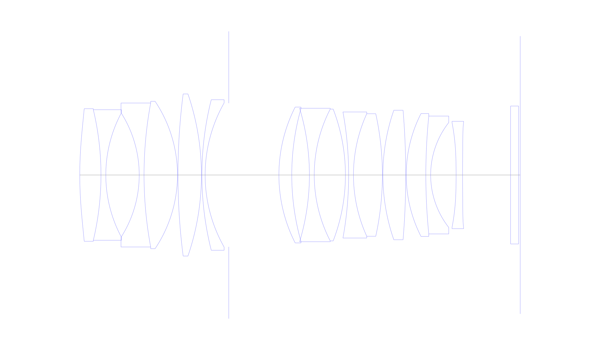
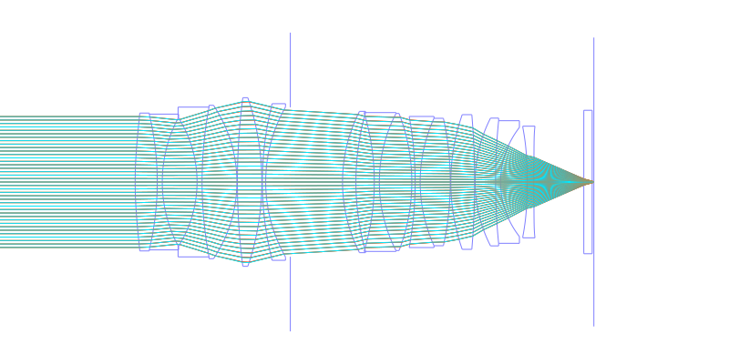
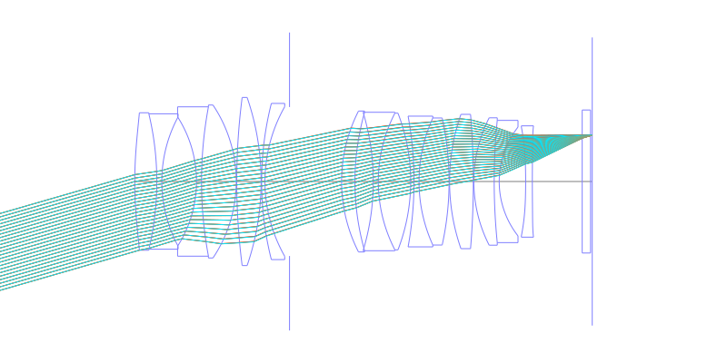
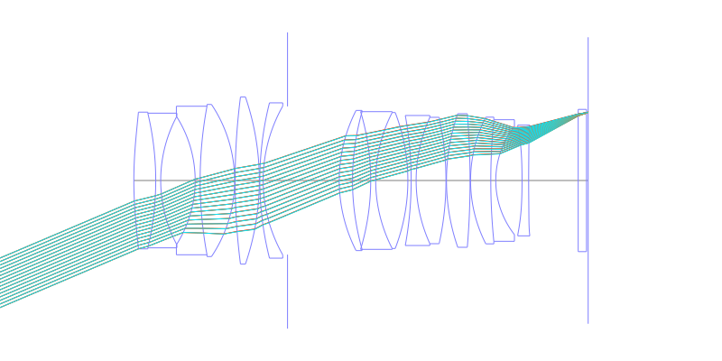
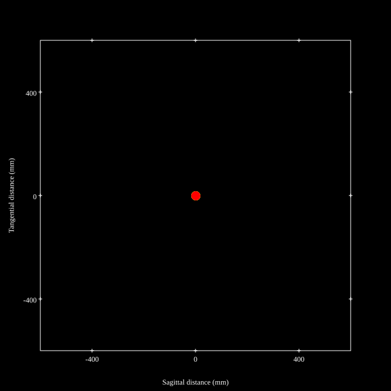
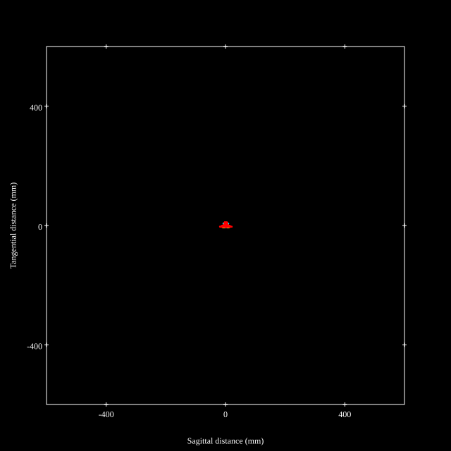
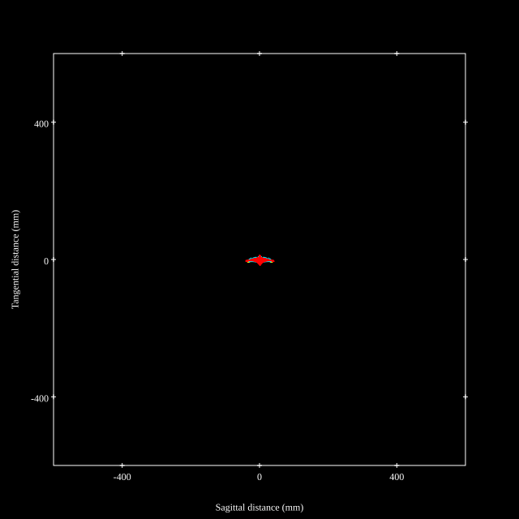
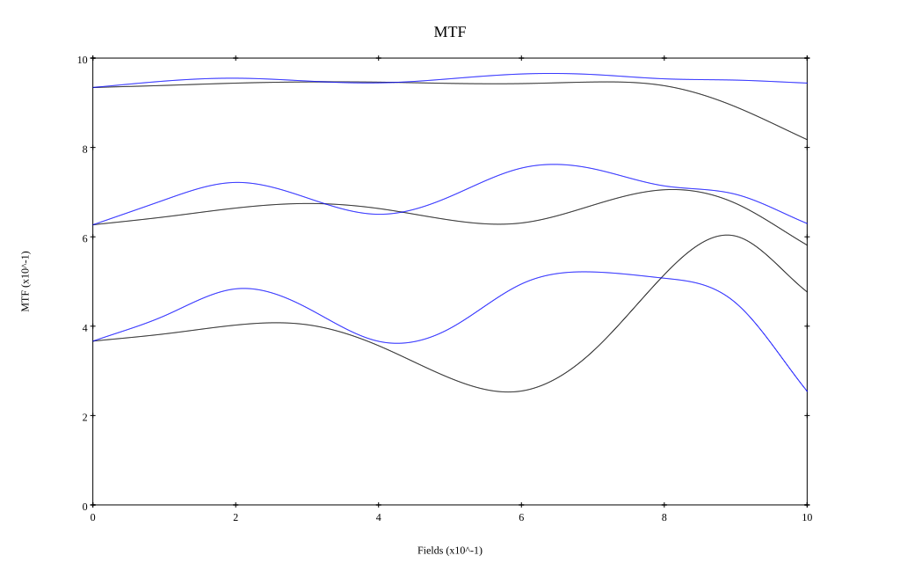
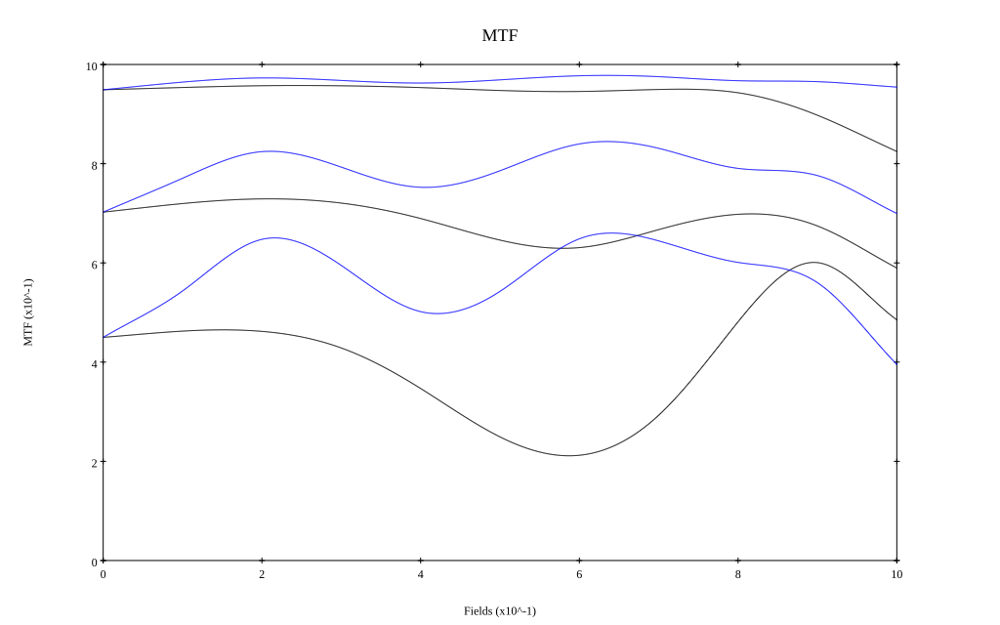

# Song Raw FE 50mm f/1.2
## Patent Information
| Country | Patent Number | Example | Year of Application | Inventors | Organisation | Link |
| ---     | ---           | ---     | ---                 | ---       | ---          | ---  |
|CN | CN119148346A | EX 1 | 2024 | CHANG YUWEN | SHENZHEN SONGRUO PHOTOGRAPHY EQUIPMENT CO LTD  | [link](https://worldwide.espacenet.com/patent/search?q=pn%3DCN119148346A) |
## Surface Data
Note that where glass types are shown the refractive index and abbe number is as per assigned glass type

| ID  | Radius | Thickness | Diameter | nd  | vd  | Glass Make | Glass |
| --- | ---    | ---       | ---      | --- | --- | ---        | ---   |
| 1 | 118.78 | 6.6 | 41.233 | 1.8061 | 40.73 | Hoya | M-NBFD130 |
| 2 | -87.61 | 1.5 | 40.611 | 1.48749 | 70.44 | CDGM | H-QK3L |
| 3 | 41.009 | 10.392 | 38.804 |  |  |  |
| 4 | -35.997 | 1.5 | 38.771 | 1.77047 | 29.74 | Hoya | NBFD29 |
| 5 | 122.296 | 10.4 | 44.791 | 1.5928 | 68.34 | CDGM | H-ZPK5 |
| 6 | -41.197 | 0.15 | 45.867 |  |  |  |
| 7 | 197.321 | 7.3 | 50.259 | 2.001 | 29.13 | Hoya | TAFD55-W |
| 8 | -77.813 | 0.15 | 50.427 |  |  |  |
| 9 | 95.683 | 1.0 | 46.84 | 1.64769 | 33.84 | CDGM | H-ZF1 |
| 10 | 45.506 | 7.353 | 44.848 |  |  |  |
| 11 | AS | 15.594 | 44.679 |  |  |  |
| 12 | 46.626 | 4.0 | 42.266 | 1.883 | 40.81 | CDGM | H-ZLAF68B |
| 13 | 76.029 | 5.492 | 41.325 |  |  |  |
| 14 | -72.262 | 1.5 | 41.528 | 1.61293 | 37.0 | CDGM | H-F2 |
| 15 | 44.759 | 9.7 | 41.001 | 1.5928 | 68.34 | CDGM | H-ZPK5 |
| 16 | -56.999 | 1.0 | 40.961 |  |  |  |
| 17 | -109.274 | 1.5 | 39.208 | 1.77047 | 29.74 | Hoya | NBFD29 |
| 18 | 46.003 | 9.0 | 38.11 | 1.5928 | 68.34 | CDGM | H-ZPK5 |
| 19 | -88.756 | 0.15 | 37.927 |  |  |  |
| 20 | 61.323 | 7.112 | 40.281 | 1.92286 | 20.88 | Hoya | E-FDS1-W |
| 21 | -243.144 | 0.15 | 40.028 |  |  |  |
| 22 | 42.029 | 6.1 | 38.208 | 1.883 | 40.81 | CDGM | H-ZLAF68B |
| 23 | 184.079 | 1.5 | 36.661 | 1.84666 | 23.78 | CDGM | H-ZF52GT |
| 24 | 26.468 | 7.921 | 32.633 |  |  |  |
| 25 | -188.696 | 2.0 | 32.681 | 1.8061 | 40.73 | Hoya | M-NBFD130 |
| 26 | 500.0 | 14.935 | 33.384 |  |  |  |
| 27 | 0.0 | 2.5 | 41.948 | 1.5168 | 64.2 | CDGM | H-K9L |
| 28 | 0.0 | 0.505 | 42.893 |  |  |  |
## Aspherical Data
| ID  | k   | P1  | P2  | P3  | P3 | P5 | P6 | P7 | P8 | P9 | P10 |
| --- | --- | --- | --- | --- | --- | --- | --- | --- | --- | --- | --- |
| 1 | 0.0 | 0.0 | -2.12543E-6 | -9.24523E-10 | 2.59673E-12 | -5.52718E-15 | 4.60898E-18 | 0.0 | 0.0 | 0.0 | 0.0 |
| 25 | 0.0 | 0.0 | -7.82175E-6 | -6.442079E-8 | 5.28268E-10 | -1.5112E-12 | 1.59754E-15 | 0.0 | 0.0 | 0.0 | 0.0 |
| 26 | 0.0 | 0.0 | -1.6629E-6 | -5.56053E-8 | 4.94078E-10 | -1.31612E-12 | 1.35237E-15 | 0.0 | 0.0 | 0.0 | 0.0 |
## Layouts

## Spot Diagrams

## Paraxial Parameters
| parameter | value |
| ---       | ---   |
| effective_focal_length |49.018
| back_focal_length | 0.513
| optical_invariant | 8.67
| object_distance | 1.0E10
| image_distance | 0.513
| power | 0.02
| pp1_H | 47.514
| ppk_H' | -48.505
| ffl_F | -1.504
| fno | 1.2
| enp_dist_P | 31.745
| enp_radius | 20.424
| exp_dist_P' | -71.746
| exp_radius | 30.111
| m | -0
| red | -2.040066394791786E8
| n_obj | 1
| n_img | 1
| img_ht | 20.807
| obj_ang | 23
| obj_na | 0
| img_na | -0.385|
## Spot Analysis
| Field | Spot Mean Radius | Spot Max Radius |
| ---   | ---              | ---             |
 | Field(x=0.0, y=0.0) | 7.599 | 16.141|
 | Field(x=0.0, y=0.1) | 6.926 | 19.637|
 | Field(x=0.0, y=0.2) | 6.65 | 18.688|
 | Field(x=0.0, y=0.3) | 6.87 | 18.862|
 | Field(x=0.0, y=0.4) | 7.084 | 24.898|
 | Field(x=0.0, y=0.5) | 6.832 | 20.342|
 | Field(x=0.0, y=0.6) | 6.458 | 19.474|
 | Field(x=0.0, y=0.7) | 6.391 | 21.142|
 | Field(x=0.0, y=0.8) | 7.119 | 25.924|
 | Field(x=0.0, y=0.9) | 8.955 | 32.965|
 | Field(x=0.0, y=1.0) | 11.44 | 41.189|
## Polychromatic Geometric MTF

* 10,30,50 cycles/mm
* Black lines represent sagittal, blue tangential
* To generate above, MTFs for wavelengths 587.5618(d), 486.1327(F), 656.2725(C) were calculated across 10 fields, and then averaged
## Polychromatic Geometric MTF (Weighted)

* 10,30,50 cycles/mm
* Black lines represent sagittal, blue tangential
* To generate above, MTFs for wavelengths 587.5618(d) wt(1.0), 656.2725(C) wt(0.475), 546.074(e) wt(0.98), 486.1327(F) wt(0.49), 435.8343(g) wt(0.15) were calculated across 10 fields, and then combined using weighted average
## Resources
* [OpticalBench Compatible Data File, tab delimited](./songraw-50mm-f1.2.txt)
* [Zemax file](./songraw-50mm-f1.2.zmx)
