# Sony FE 12-24mm F2.8 GM
## Patent Information
| Country | Patent Number | Example | Year of Application | Inventors | Organisation | Link |
| ---     | ---           | ---     | ---                 | ---       | ---          | ---  |
|EU | WO2021/200206 | 2 | 2021 | KATO TAKUYA | Sony Group Corp | [link](https://patents.google.com/patent/WO2021200206A1/en) |
## Surface Data
Note that where glass types are shown the refractive index and abbe number is as per assigned glass type

| ID  | Radius | Thickness | Diameter | nd  | vd  | Glass Make | Glass |
| --- | ---    | ---       | ---      | --- | --- | ---        | ---   |
| 1 | 81.854 | 3.2 | 77.96 | 1.58313 | 59.46 | Hoya | M-BACD12 |
| 2 | 17.0 | 16.4 | 49.69 |  |  |  |
| 3 | 53.509 | 2.1 | 47.55 | 1.76802 | 49.24 | Hoya | M-TAF101 |
| 4 | 24.124 | 10.41 | 36.29 |  |  |  |
| 5 | -378.999 | 1.65 | 35.46 | 1.55032 | 75.5 | Hoya | FCD705 |
| 6 | 56.286 | 4.12 | 33.74 |  |  |  |
| 7 | -123.328 | 1.55 | 33.65 | 1.437 | 95.1 | Hoya | FCD100 |
| 8 | 84.487 | 0.2 | 33.32 |  |  |  |
| 9 | 48.484 | 4.58 | 33.42 | 1.85026 | 32.27 | Ohara | S-LAH71 |
| 10 | -680.725 | d10 | 33.0 |  |  |  |
| 11 | FS | d11 | 22.3 |  |  |  |
| 12 | 30.971 | 1.2 | 24.69 | 1.92119 | 23.96 | Hoya | FDS24 |
| 13 | 17.99 | 6.78 | 23.87 | 1.6727 | 32.17 | Hoya | E-FD5 |
| 14 | -587.713 | d14 | 23.81 |  |  |  |
| 15 | AS | 1.0 | a15 |  |  |  |
| 16 | 53.73 | 1.2 | 23.6 | 1.95375 | 32.32 | Hoya | TAFD45 |
| 17 | 27.989 | 0.25 | 23.08 |  |  |  |
| 18 | 19.431 | 4.45 | 23.91 | 1.59201 | 67.02 | Hoya | M-PCD51 |
| 19 | 48.888 | d19 | 23.53 |  |  |  |
| 20 | 22.515 | 1.3 | 23.26 | 1.95375 | 32.32 | Hoya | TAFD45 |
| 21 | 13.361 | 9.57 | 21.29 | 1.55032 | 75.5 | Hoya | FCD705 |
| 22 | -57.507 | d22 | 20.9 |  |  |  |
| 23 | -54.963 | 4.21 | 19.64 | 1.89286 | 20.36 | Ohara | S-NPH4 |
| 24 | -16.371 | 1.25 | 20.2 | 1.95375 | 32.32 | Hoya | TAFD45 |
| 25 | -54.938 | 0.25 | 21.6 |  |  |  |
| 26 | 55.041 | 6.67 | 22.49 | 1.437 | 95.1 | Hoya | FCD100 |
| 27 | -20.534 | 0.26 | 22.73 |  |  |  |
| 28 | -28.62 | 1.15 | 22.06 | 2.001 | 29.13 | Hoya | TAFD55 |
| 29 | -286.252 | 2.39 | 22.7 |  |  |  |
| 30 | -42.72 | 1.42 | 22.8 | 1.85135 | 40.1 | Hoya | M-TAFD305 |
| 31 | -194.772 | 0.2 | 25.0 |  |  |  |
| 32 | 100.0 | 2.5 | 27.1 | 1.497 | 81.61 | Hoya | FCD1 |
| 33 | -338.071 | d33 | 27.93 |  |  |  |
## Aspherical Data
| ID  | Type | k   | P1 | P2 | P3 | P4 | P5 | P6 |
| --- | --- | --- | --- | --- | --- | --- | --- | --- |
| 1| EVEN | 0.0116003 | 0.0 | -1.65355E-7 | 1.17463E-9 | -3.83525E-13 | 7.63751E-17 | 3.53834E-20 |
| 2| EVEN | -0.667543 | 0.0 | -2.70493E-6 | -1.00491E-8 | 4.57727E-12 | -1.85805E-14 | -5.01144E-18 |
| 3| EVEN | 0.00639569 | 0.0 | -1.90031E-5 | 3.6724E-8 | -3.69202E-11 | 1.47478E-14 | 2.86478E-19 |
| 4| EVEN | 0.147359 | 0.0 | -1.52241E-5 | 4.28831E-8 | 3.97935E-11 | -2.05537E-13 | 4.71911E-16 |
| 18| EVEN | 0.0 | 0.0 | -1.01036E-5 | -3.18092E-8 | -6.54421E-11 | 1.2611E-13 | 0  |
| 19| EVEN | 0.0 | 0.0 | -4.54563E-6 | -2.7747E-8 | -6.43216E-11 | 3.71318E-13 | 0  |
| 30| EVEN | 0.0 | 0.0 | -5.01451E-5 | 7.60009E-8 | -1.12942E-10 | -1.79084E-12 | 0  |
| 31| EVEN | 0.0 | 0.0 | -2.10249E-5 | 1.44746E-7 | -2.43205E-10 | -1.87381E-13 | 0  |
## Variables
| Variable | 12mm f2.8 | 24mm f2.8 |
| --- | --- | --- |
| Focal length |12.37 |23.29 |
| F-Number |2.91 |2.91 |
| Angle of View |120.4 |85.71 |
| d10 | 19.75 | 1.3 |
| d11 | 10.16 | 3.0 |
| d14 | 9.31 | 7.34 |
| a15 | 16.23 | 23.63 |
| d19 | 3.2 | 2.0 |
| d22 | 2.97 | 4.17 |
| d33 | 15.5 | 31.21 |
# 12mm f2.8
## Layouts
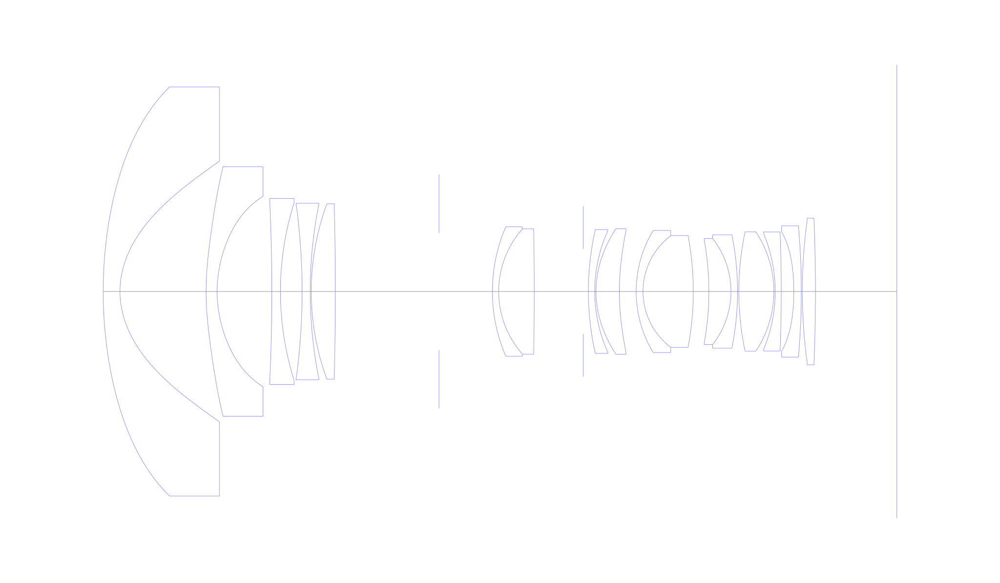
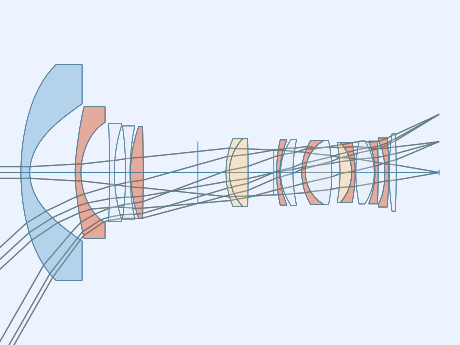
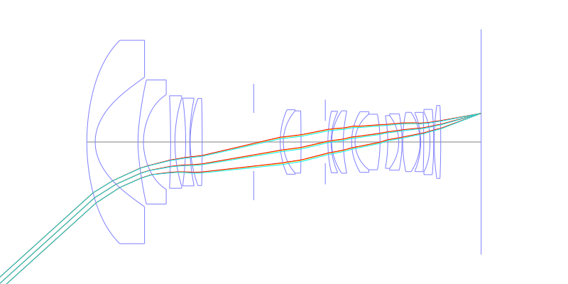
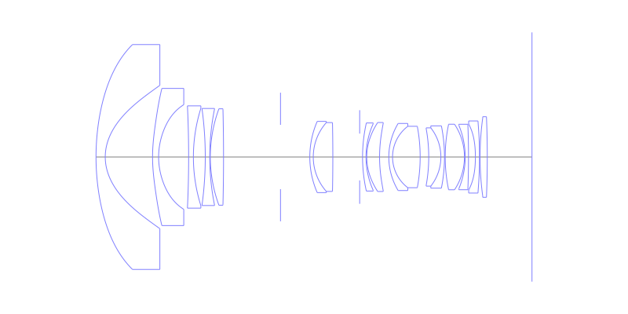
## Spot Diagrams
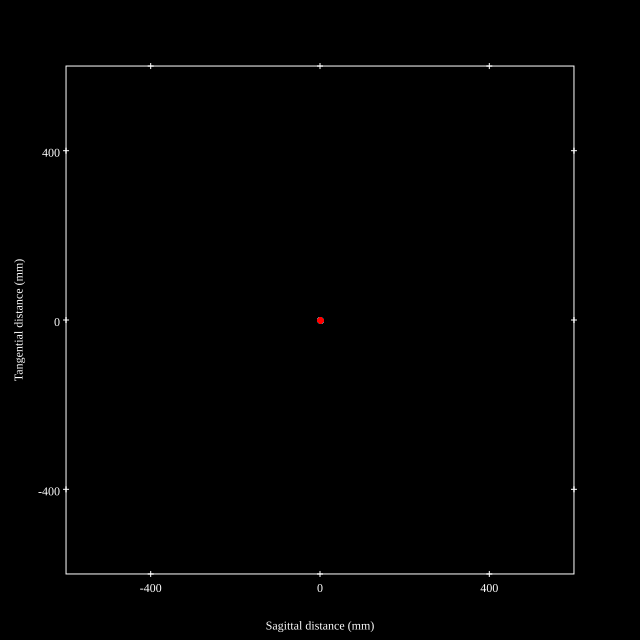
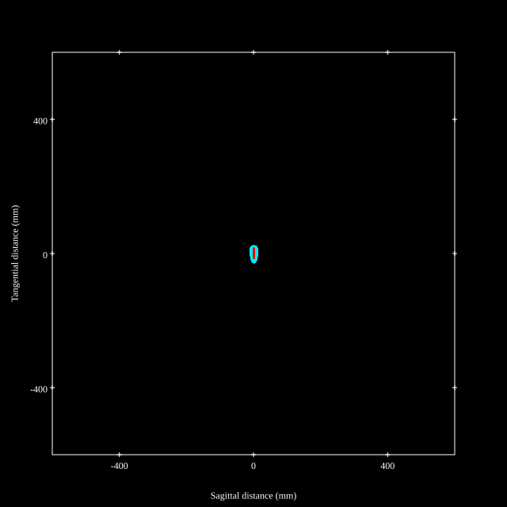
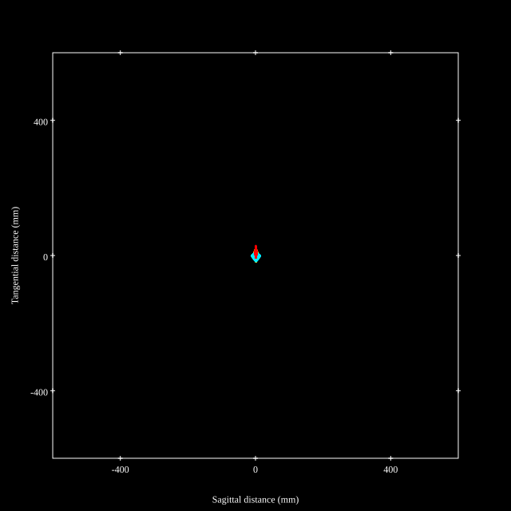
## Paraxial Parameters
| parameter | value |
| ---       | ---   |
| effective_focal_length |12.367
| back_focal_length | 15.552
| optical_invariant | 3.711
| object_distance | 1.0E10
| image_distance | 15.552
| power | 0.081
| pp1_H | 32.279
| ppk_H' | 3.185
| ffl_F | 19.912
| fno | 2.909
| enp_dist_P | 23.574
| enp_radius | 2.126
| exp_dist_P' | -26.165
| exp_radius | 7.179
| m | -0
| red | -8.086183573351061E8
| n_obj | 1
| n_img | 1
| img_ht | 21.594
| obj_ang | 60.2
| obj_na | 0
| img_na | -0.169|
## Spot Analysis
| Field | Spot Mean Radius | Spot Max Radius |
| ---   | ---              | ---             |
 | Field(x=0.0, y=0.0) | 3.938 | 5.997|
 | Field(x=0.0, y=0.1) | 3.973 | 6.986|
 | Field(x=0.0, y=0.2) | 4.004 | 8.347|
 | Field(x=0.0, y=0.3) | 4.173 | 10.691|
 | Field(x=0.0, y=0.4) | 5.043 | 13.938|
 | Field(x=0.0, y=0.5) | 6.849 | 17.279|
 | Field(x=0.0, y=0.6) | 8.933 | 20.941|
 | Field(x=0.0, y=0.7) | 11.191 | 26.395|
 | Field(x=0.0, y=0.8) | 13.035 | 31.721|
 | Field(x=0.0, y=0.9) | 11.105 | 21.915|
 | Field(x=0.0, y=1.0) | 10.938 | 30.637|
## Polychromatic Geometric MTF
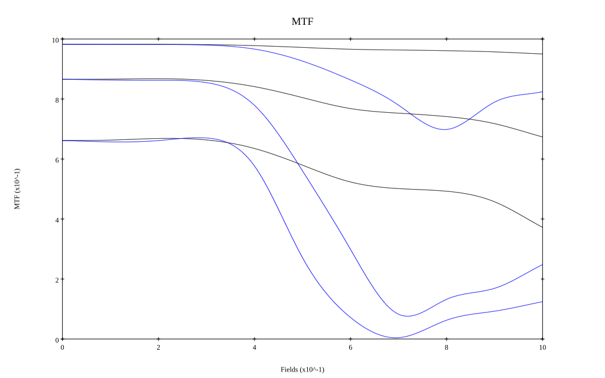
* 10,30,50 cycles/mm
* Black lines represent sagittal, blue tangential
* To generate above, MTFs for wavelengths 587.5618(d), 486.1327(F), 656.2725(C) were calculated across 10 fields, and then averaged
## Polychromatic Geometric MTF (Weighted)
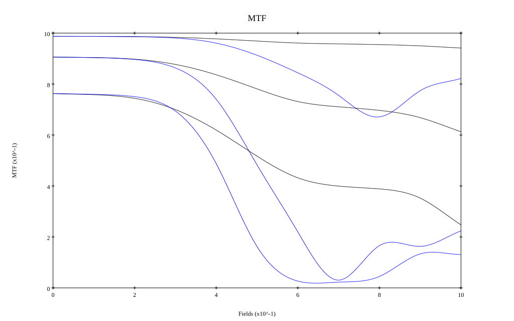
* 10,30,50 cycles/mm
* Black lines represent sagittal, blue tangential
* To generate above, MTFs for wavelengths 587.5618(d) wt(1.0), 656.2725(C) wt(0.475), 546.074(e) wt(0.98), 486.1327(F) wt(0.49), 435.8343(g) wt(0.15) were calculated across 10 fields, and then combined using weighted average
# 24mm f2.8
## Layouts
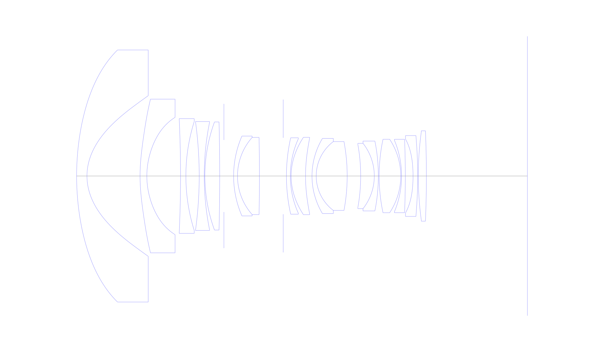
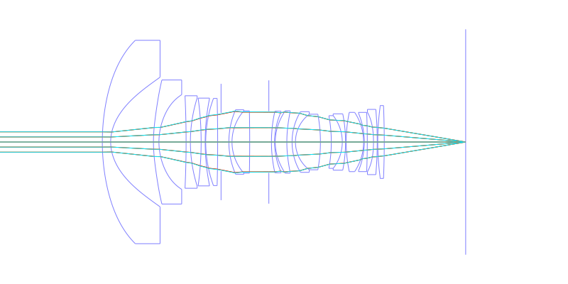
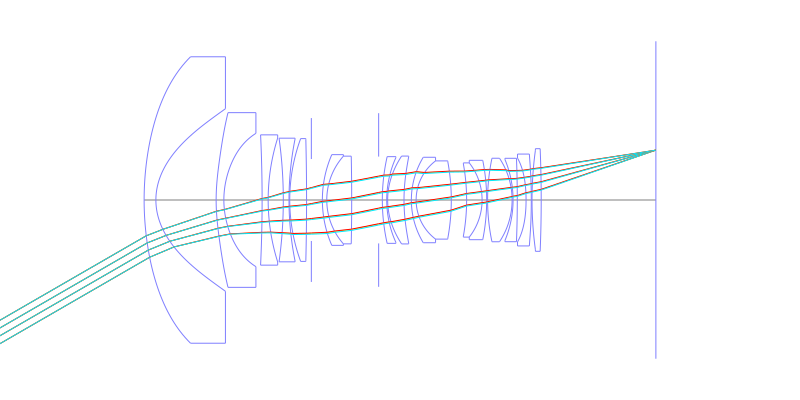
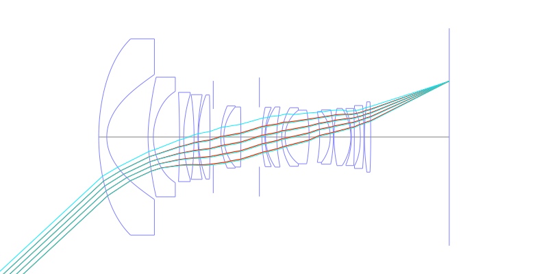
## Spot Diagrams
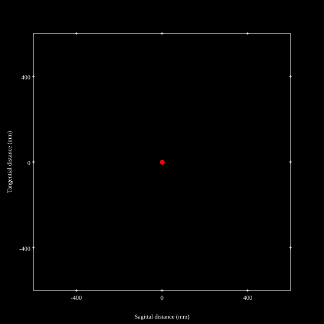

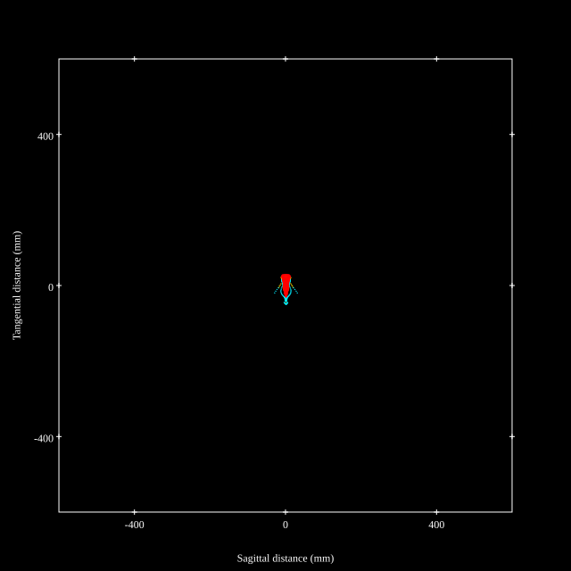
## Paraxial Parameters
| parameter | value |
| ---       | ---   |
| effective_focal_length |23.283
| back_focal_length | 31.241
| optical_invariant | 3.716
| object_distance | 1.0E10
| image_distance | 31.241
| power | 0.043
| pp1_H | 35.715
| ppk_H' | 7.958
| ffl_F | 12.432
| fno | 2.906
| enp_dist_P | 21.927
| enp_radius | 4.005
| exp_dist_P' | -25.822
| exp_radius | 9.822
| m | -0
| red | -4.295024382677866E8
| n_obj | 1
| n_img | 1
| img_ht | 21.602
| obj_ang | 42.855
| obj_na | 0
| img_na | -0.17|
## Spot Analysis
| Field | Spot Mean Radius | Spot Max Radius |
| ---   | ---              | ---             |
 | Field(x=0.0, y=0.0) | 3.335 | 9.306|
 | Field(x=0.0, y=0.1) | 3.145 | 9.386|
 | Field(x=0.0, y=0.2) | 3.506 | 12.404|
 | Field(x=0.0, y=0.3) | 3.974 | 17.397|
 | Field(x=0.0, y=0.4) | 4.343 | 23.267|
 | Field(x=0.0, y=0.5) | 4.93 | 28.329|
 | Field(x=0.0, y=0.6) | 6.675 | 33.065|
 | Field(x=0.0, y=0.7) | 8.934 | 37.195|
 | Field(x=0.0, y=0.8) | 11.073 | 40.575|
 | Field(x=0.0, y=0.9) | 12.754 | 39.123|
 | Field(x=0.0, y=1.0) | 14.776 | 48.121|
## Polychromatic Geometric MTF
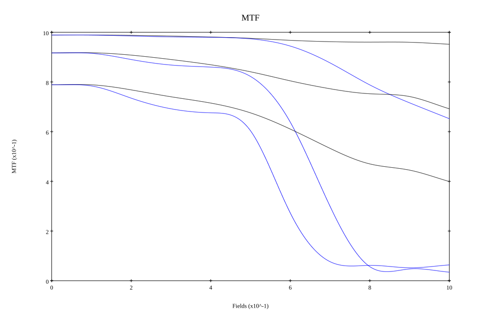
* 10,30,50 cycles/mm
* Black lines represent sagittal, blue tangential
* To generate above, MTFs for wavelengths 587.5618(d), 486.1327(F), 656.2725(C) were calculated across 10 fields, and then averaged
## Polychromatic Geometric MTF (Weighted)
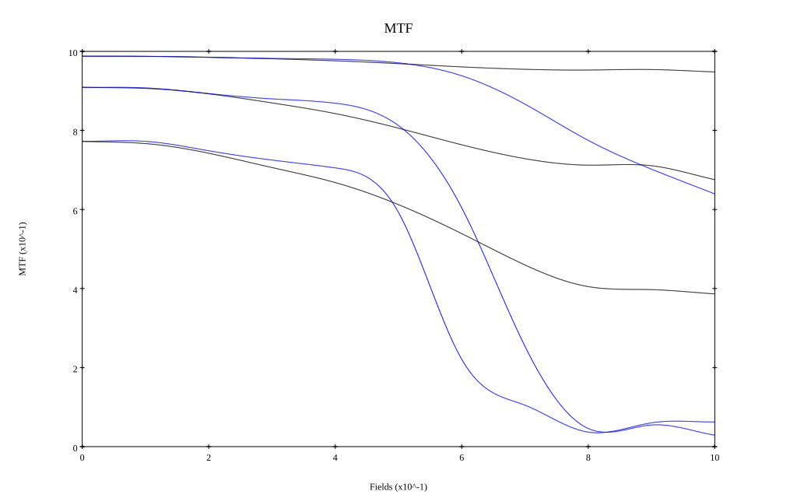
* 10,30,50 cycles/mm
* Black lines represent sagittal, blue tangential
* To generate above, MTFs for wavelengths 587.5618(d) wt(1.0), 656.2725(C) wt(0.475), 546.074(e) wt(0.98), 486.1327(F) wt(0.49), 435.8343(g) wt(0.15) were calculated across 10 fields, and then combined using weighted average
## Resources
* [OpticalBench Compatible Data File, tab delimited](./prescription.txt)
* [Zemax file](./WO2021-200206_Example02P.zmx)

Report / Zemax file generated using [Beam42](https://github.com/BeamFour/Beam42) on 2026-01-31
