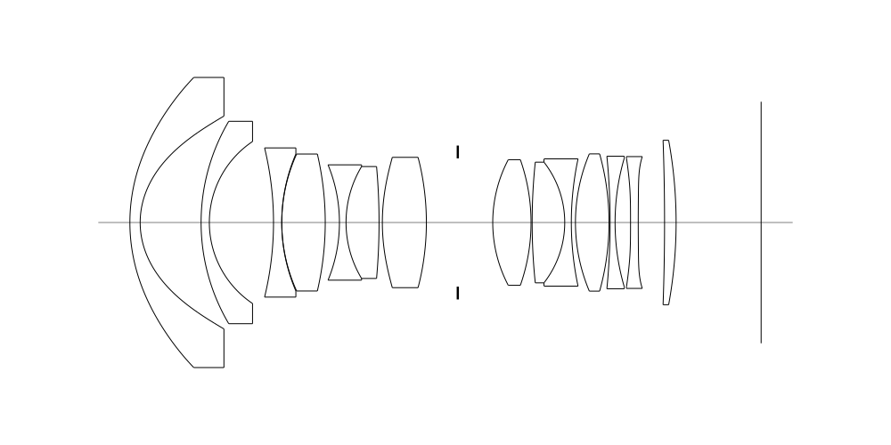
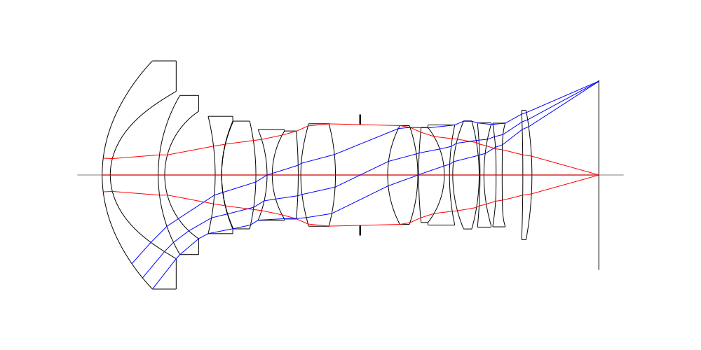
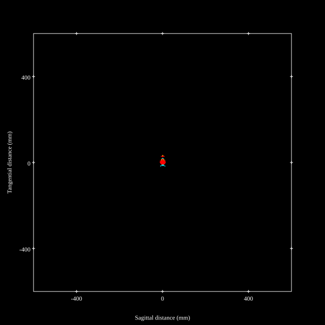
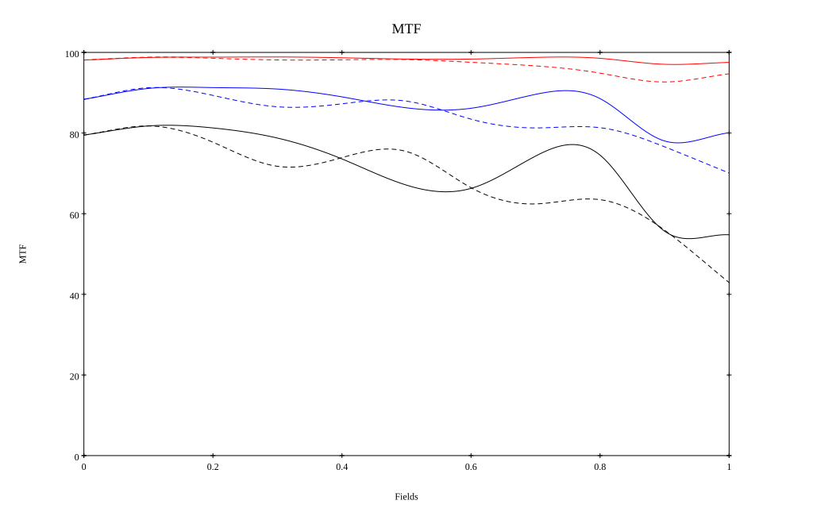
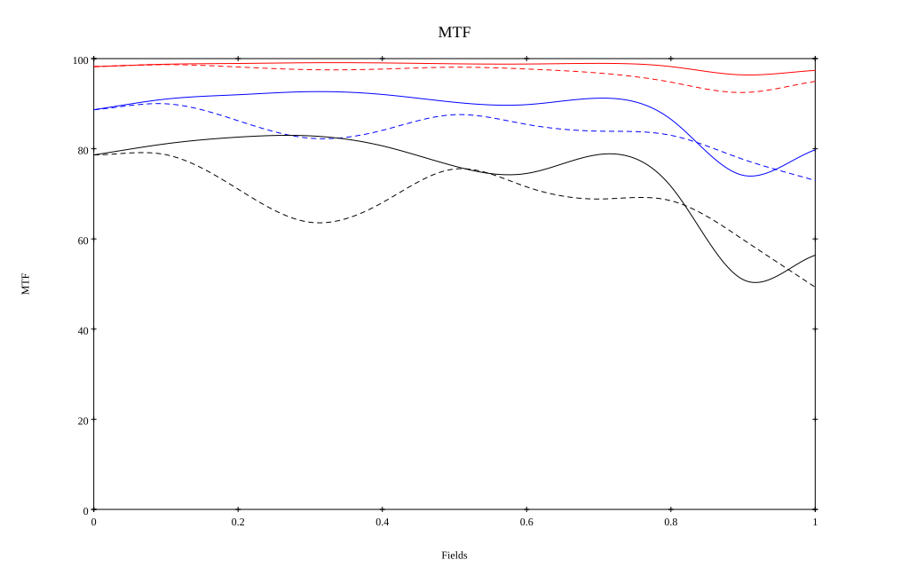

## Surface Data
Note that where glass types are shown the refractive index and abbe number is as per assigned glass type

| ID  | Radius | Thickness | Diameter | nd  | vd  | Glass Make | Glass |
| --- | ---    | ---       | ---      | --- | --- | ---        | ---   |
| 1 | 32.125 | 1.87 | 52.78 | 1.58313 | 59.46 | Hoya | BACD12 |
| 2 | 15.036 | 11.07 | 38.73 |  |  |  |
| 3 | 36.239 | 1.5 | 36.82 | 1.72916 | 54.67 | Hoya | TAC8 |
| 4 | 17.755 | 11.66 | 29.47 |  |  |  |
| 5 | -57.581 | 1.5 | 27.14 | 1.59282 | 68.62 | Hoya | FCD505 |
| 6 | 31.581 | 0.0 | 24.93 |  |  |  |
| 7 | 30.073 | 7.9 | 24.92 | 1.68893 | 31.16 | Hoya | FD8 |
| 8 | -54.912 | 2.58 | 23.19 |  |  |  |
| 9 | -27.601 | 1.2 | 20.98 | 1.90366 | 31.32 | Hoya | TAFD25 |
| 10 | 19.77 | 6.0 | 20.36 | 1.77047 | 29.74 | Hoya | NBFD29 |
| 11 | -114.412 | 0.6 | 20.3 |  |  |  |
| 12 | 36.344 | 8.0 | 22.73 | 1.76802 | 49.24 | Hoya | M-TAF101 |
| 13 | -47.16 | 5.71 | 23.71 |  |  |  |
| 14 | AS | 6.35 | 23.33 |  |  |  |
| 15 | 24.591 | 6.96 | 22.85 | 1.437 | 95.1 | Hoya | FCD100 |
| 16 | -34.569 | 0.2 | 22.04 |  |  |  |
| 17 | 106.589 | 5.92 | 21.96 | 1.497 | 81.61 | Hoya | FCD1 |
| 18 | -17.865 | 1.2 | 21.81 | 1.85451 | 25.15 | Hoya | NBFD25 |
| 19 | 55.538 | 0.75 | 23.16 |  |  |  |
| 20 | 32.194 | 6.1 | 24.97 | 1.92286 | 20.88 | Hoya | E-FDS1 |
| 21 | -46.433 | 0.2 | 24.93 |  |  |  |
| 22 | -123.478 | 0.9 | 24.11 | 1.85451 | 25.15 | Hoya | NBFD25 |
| 23 | 41.916 | 2.81 | 23.4 |  |  |  |
| 24 | -500.0 | 1.4 | 23.43 | 1.85135 | 40.1 | Hoya | M-TAFD305 |
| 25 | 298.71 | 4.78 | 23.98 |  |  |  |
| 26 | -418.53 | 2.1 | 29.3 | 1.61997 | 63.88 | Hoya | PCD40 |
| 27 | -83.351 | 15.44 | 29.92 |  |  |  |
## Aspherical Data
| ID  | Type | k   | P1 | P2 | P3 | P4 | P5 | P6 |
| --- | --- | --- | --- | --- | --- | --- | --- | --- |
| 1| EVEN | 0.0 | 0.0 | -3.2157E-7 | -8.9102E-9 | 7.2086E-12 | -4.2574E-15 | -2.1368E-19 |
| 2| EVEN | -0.594 | 0.0 | 5.9716E-6 | -2.5549E-9 | -4.956E-11 | 8.1327E-14 | -3.5142E-16 |
| 12| EVEN | 0.0 | 0.0 | -6.7796E-6 | -1.9157E-8 | 9.9948E-11 | -9.2684E-13 | 2.2031E-15 |
| 13| EVEN | 0.0 | 0.0 | 2.4694E-6 | -2.2906E-8 | 1.266E-10 | -9.188E-13 | 1.9071E-15 |
| 24| EVEN | 0.0 | 0.0 | -7.4318E-5 | 2.573E-7 | 3.0021E-9 | -2.8311E-11 | 6.5427E-14 |
| 25| EVEN | 0.0 | 0.0 | -3.0668E-5 | 3.5429E-7 | 2.3165E-9 | -2.1595E-11 | 4.6042E-14 |
## Layouts

## Spot Diagrams

## Paraxial Parameters
| parameter | value |
| ---       | ---   |
| effective_focal_length |14.426
| back_focal_length | 15.452
| optical_invariant | 5.928
| object_distance | 1.0E10
| image_distance | 15.452
| power | 0.069
| pp1_H | 31.468
| ppk_H' | 1.026
| ffl_F | 17.041
| fno | 1.853
| enp_dist_P | 21.356
| enp_radius | 3.893
| exp_dist_P' | -32.78
| exp_radius | 13.015
| m | -0
| red | -6.931750024545947E8
| n_obj | 1
| n_img | 1
| img_ht | 21.97
| obj_ang | 56.71
| obj_na | 0
| img_na | -0.27|
## Spot Analysis
| Field | Spot Mean Radius | Spot Max Radius |
| ---   | ---              | ---             |
 | Field(x=0.0, y=0.0) | 4.487 | 22.101|
 | Field(x=0.0, y=0.1) | 3.545 | 21.586|
 | Field(x=0.0, y=0.2) | 3.672 | 20.466|
 | Field(x=0.0, y=0.3) | 3.927 | 22.477|
 | Field(x=0.0, y=0.4) | 4.053 | 24.188|
 | Field(x=0.0, y=0.5) | 4.218 | 25.48|
 | Field(x=0.0, y=0.6) | 4.64 | 28.39|
 | Field(x=0.0, y=0.7) | 4.997 | 36.528|
 | Field(x=0.0, y=0.8) | 6.34 | 49.983|
 | Field(x=0.0, y=0.9) | 8.1 | 54.658|
 | Field(x=0.0, y=1.0) | 6.579 | 37.056|
## Polychromatic Geometric MTF

* 10=red,30=blue,50=black cycles/mm
* Solid lines represent sagittal, dashed lines tangential
* To generate above, MTFs for wavelengths 587.5618(d), 486.1327(F), 656.2725(C) were calculated across 10 fields, and then averaged
## Polychromatic Geometric MTF (Weighted)

* 10=red,30=blue,50=black cycles/mm
* Solid lines represent sagittal, dashed lines tangential
* To generate above, MTFs for wavelengths 587.5618(d) wt(1.0), 656.2725(C) wt(0.475), 546.074(e) wt(0.98), 486.1327(F) wt(0.49), 435.8343(g) wt(0.15) were calculated across 10 fields, and then combined using weighted average
## Resources
* [OpticalBench Compatible Data File, tab delimited](./prescription.txt)
* [Zemax file](./WO2021-199923_Example01P.zmx)

Report / Zemax file generated using [Beam42](https://github.com/BeamFour/Beam42) on 2026-09-09
