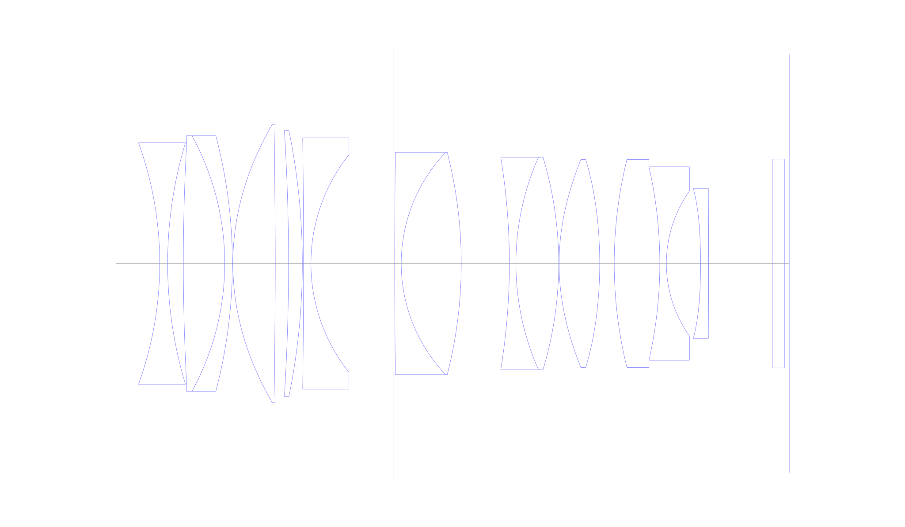
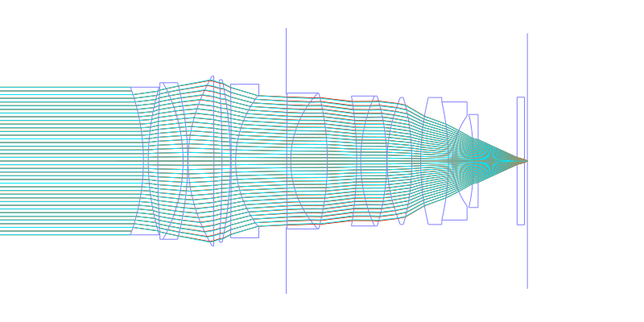
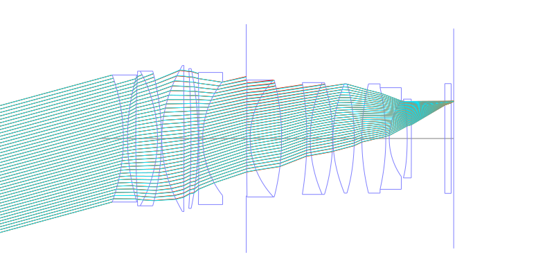
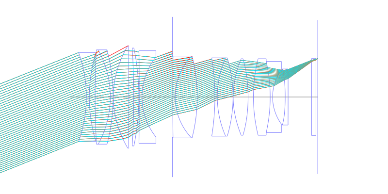
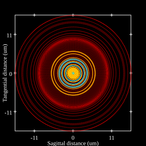
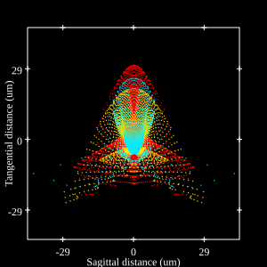
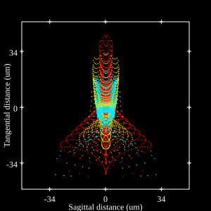
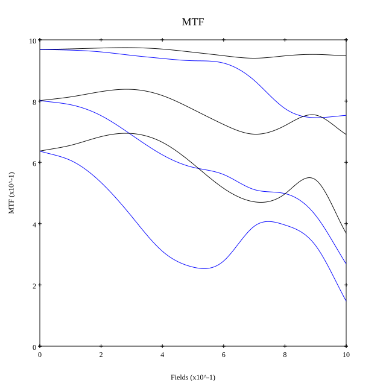
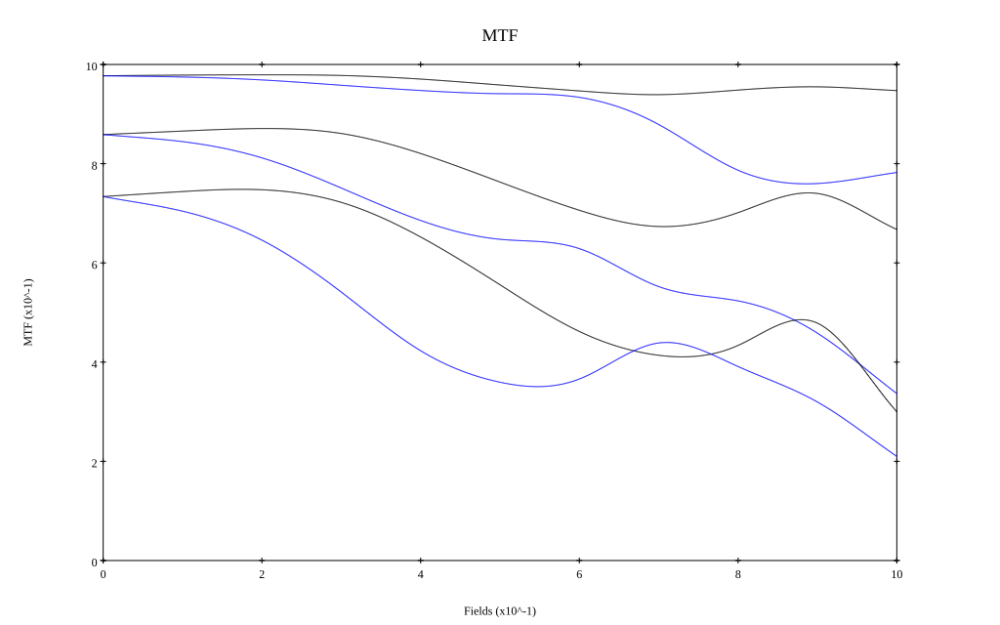

# Sony FE 50mm F1.2 GM
## Patent Information
| Country | Patent Number | Example | Year of Application | Inventors | Organisation | Link |
| ---     | ---           | ---     | ---                 | ---       | ---          | ---  |
|JP | JP2022-140076 | EX 1 | 2021 | Yosuke Utagawa, Masaki Maruyama | Sony Group Corp | [link](https://patents.google.com/patent/JP2022140076A/en) |
## Surface Data
Note that where glass types are shown the refractive index and abbe number is as per assigned glass type

| ID  | Radius | Thickness | Diameter | nd  | vd  | Glass Make | Glass |
| --- | ---    | ---       | ---      | --- | --- | ---        | ---   |
| 1 | -73.4046 | 1.6384 | 50.0 | 1.77047 | 29.74 | Hoya | NBFD29 |
| 2 | 86.7316 | 3.2478 | 50.0 |  |  |  |
| 3 | 463.1362 | 8.541 | 51.0 | 1.91082 | 35.25 | Hoya | TAFD35 |
| 4 | -55.0045 | 1.5819 | 53.0 | 1.73037 | 32.23 | Hoya | NBFD32 |
| 5 | -103.8048 | 0.1 | 53.0 |  |  |  |
| 6 | 52.131 | 8.7586 | 57.5 | 1.9515 | 29.83 | Hoya | M-TAFD405 |
| 7 | -899.0845 | 2.7386 | 57.5 |  |  |  |
| 8 | -438.1637 | 2.8474 | 55.0 | 1.98612 | 16.48 | Hoya | FDS16-W |
| 9 | -137.8435 | 0.25 | 55.0 |  |  |  |
| 10 | -1848.8197 | 1.5254 | 52.0 | 1.5927 | 35.45 | Hoya | FF5 |
| 11 | 36.1871 | 17.1293 | 45.0 |  |  |  |
| 12 | AS | 0.1604 | 45.0 |  |  |  |
| 13 | 1799.6904 | 1.3559 | 46.0 | 1.85451 | 25.15 | Hoya | NBFD25 |
| 14 | 33.41 | 12.3973 | 46.0 | 1.717 | 47.96 | Schott | LAF3 |
| 15 | -92.5787 | 9.9306 | 46.0 |  |  |  |
| 16 | -136.823 | 1.3559 | 44.0 | 1.85451 | 25.15 | Hoya | NBFD25 |
| 17 | 54.22 | 8.826 | 44.0 | 1.6968 | 55.46 | Hoya | LAC14 |
| 18 | -76.3453 | 0.1 | 44.0 |  |  |  |
| 19 | 49.6469 | 8.3761 | 43.0 | 1.59208 | 60.99 | Ohara | L-BAL35P |
| 20 | -90.7873 | 3.0 | 43.0 |  |  |  |
| 21 | 89.7175 | 9.412 | 43.0 | 1.94594 | 17.98 | Hoya | FDS18 |
| 22 | -90.3001 | 1.3559 | 40.0 | 1.5927 | 35.45 | Hoya | FF5 |
| 23 | 25.9835 | 7.0733 | 30.0 |  |  |  |
| 24 | -115.6443 | 1.6384 | 31.0 | 1.85135 | 40.1 | Hoya | M-TAFD305 |
| 25 | -3097.7167 | 13.16 | 31.0 |  |  |  |
| 26 | 0.0 | 2.5 | 43.2 | 1.5168 | 64.2 | Hoya | BSC7 |
| 27 | 0.0 | 1.0 | 43.2 |  |  |  |
## Aspherical Data
| ID  | k   | P1  | P2  | P3  | P3 | P5 | P6 | P7 | P8 | P9 | P10 |
| --- | --- | --- | --- | --- | --- | --- | --- | --- | --- | --- | --- |
| 6 | 0.0 | 0.0 | -5.97602E-7 | -2.33536E-10 | 1.54112E-13 | -1.39653E-16 | 0.0 | 0.0 | 0.0 | 0.0 | 0.0 |
| 7 | 0.0 | 0.0 | 6.845E-7 | -1.50949E-10 | 1.72288E-13 | -1.12191E-16 | 0.0 | 0.0 | 0.0 | 0.0 | 0.0 |
| 19 | 0.0 | 0.0 | -1.54185E-6 | -1.01582E-9 | 3.58078E-13 | -3.24374E-16 | 0.0 | 0.0 | 0.0 | 0.0 | 0.0 |
| 20 | 0.0 | 0.0 | -1.08769E-6 | -1.31196E-9 | 1.78961E-12 | -1.30874E-15 | 0.0 | 0.0 | 0.0 | 0.0 | 0.0 |
| 24 | 0.0 | 0.0 | -3.06291E-6 | -4.89645E-8 | 1.64862E-10 | -1.89914E-13 | 0.0 | 0.0 | 0.0 | 0.0 | 0.0 |
| 25 | 0.0 | 0.0 | 3.17286E-6 | -4.12242E-8 | 1.52687E-10 | -1.31311E-13 | 0.0 | 0.0 | 0.0 | 0.0 | 0.0 |
## Layouts

## Spot Diagrams

## Paraxial Parameters
| parameter | value |
| ---       | ---   |
| effective_focal_length |53.9
| back_focal_length | 1.013
| optical_invariant | 8.89
| object_distance | 1.0E10
| image_distance | 1.013
| power | 0.019
| pp1_H | 35.666
| ppk_H' | -52.887
| ffl_F | -18.234
| fno | 1.21
| enp_dist_P | 35.627
| enp_radius | 22.273
| exp_dist_P' | -52.912
| exp_radius | 22.289
| m | -0
| red | -1.8552901693210542E8
| n_obj | 1
| n_img | 1
| img_ht | 21.515
| obj_ang | 21.76
| obj_na | 0
| img_na | -0.382|
## Spot Analysis
| Field | Spot Mean Radius | Spot Max Radius |
| ---   | ---              | ---             |
 | Field(x=0.0, y=0.0) | 5.98 | 15.452|
 | Field(x=0.0, y=0.1) | 5.947 | 16.756|
 | Field(x=0.0, y=0.2) | 6.043 | 17.197|
 | Field(x=0.0, y=0.3) | 6.547 | 19.938|
 | Field(x=0.0, y=0.4) | 7.034 | 24.698|
 | Field(x=0.0, y=0.5) | 7.349 | 29.794|
 | Field(x=0.0, y=0.6) | 7.949 | 35.134|
 | Field(x=0.0, y=0.7) | 9.983 | 39.246|
 | Field(x=0.0, y=0.8) | 13.503 | 56.965|
 | Field(x=0.0, y=0.9) | 14.304 | 60.732|
 | Field(x=0.0, y=1.0) | 12.943 | 41.855|
## Polychromatic Geometric MTF

* 10,30,50 cycles/mm
* Black lines represent sagittal, blue tangential
* To generate above, MTFs for wavelengths 587.5618(d), 486.1327(F), 656.2725(C) were calculated across 10 fields, and then averaged
## Polychromatic Geometric MTF (Weighted)

* 10,30,50 cycles/mm
* Black lines represent sagittal, blue tangential
* To generate above, MTFs for wavelengths 587.5618(d) wt(1.0), 656.2725(C) wt(0.475), 546.074(e) wt(0.98), 486.1327(F) wt(0.49), 435.8343(g) wt(0.15) were calculated across 10 fields, and then combined using weighted average
## Resources
* [OpticalBench Compatible Data File, tab delimited](./JP2022-140076_Example01.txt)
* [Zemax file](./JP2022-140076_Example01.zmx)
