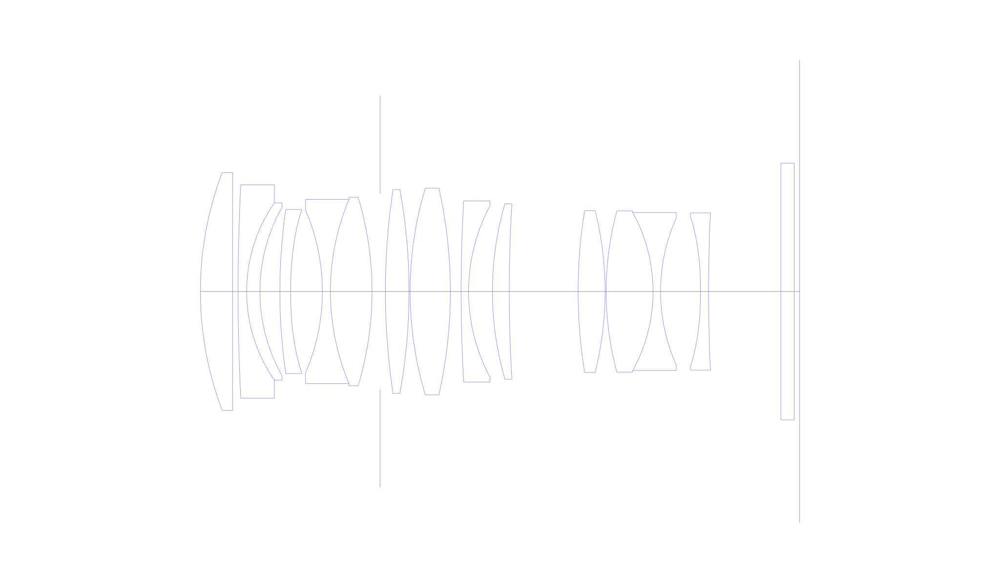
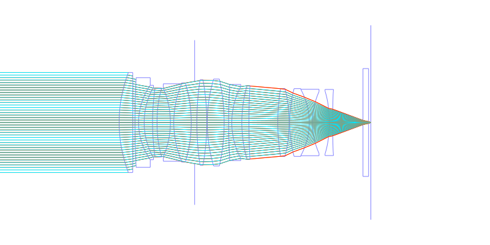
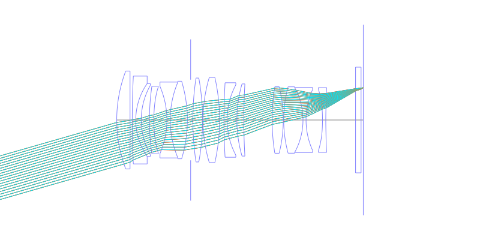
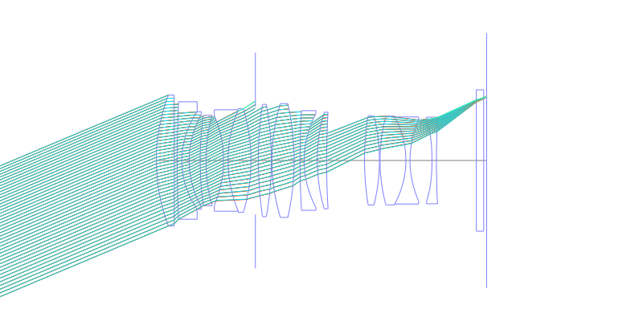
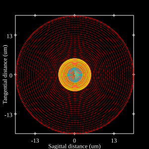
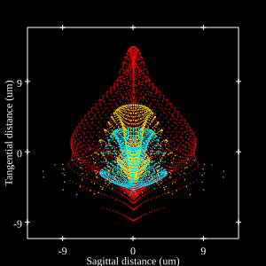
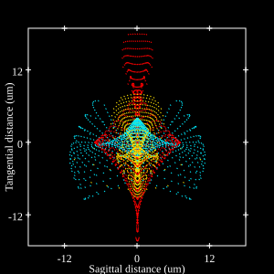

# Sony FE 50mm f1.4 GM
## Patent Information
| Country | Patent Number | Example | Year of Application | Inventors | Organisation | Link |
| ---     | ---           | ---     | ---                 | ---       | ---          | ---  |
|EU | WO2024-166548 | EX 2 | 2023 | YAMAGISHI, Masakazu  | Sony Group Corp  | [link](https://patentscope.wipo.int/search/en/detail.jsf?docId=WO2024166548) |
## Surface Data
Note that where glass types are shown the refractive index and abbe number is as per assigned glass type

| ID  | Radius | Thickness | Diameter | nd  | vd  | Glass Make | Glass |
| --- | ---    | ---       | ---      | --- | --- | ---        | ---   |
| 1 | 62.567 | 6.05 | 44.49 | 1.91082 | 35.25 | Hoya | TAFD35 |
| 2 | 0.0 | 1.0 | 42.91 |  |  |  |
| 3 | 400.0 | 1.6 | 39.89 | 1.567322 | 42.8 | Ohara | S-TIL26 |
| 4 | 29.088 | 2.48 | 33.12 | 2.00272 | 19.32 | Hoya | E-FDS2 |
| 5 | 32.046 | 3.73 | 31.48 |  |  |  |
| 6 | 107.66 | 2.0 | 30.68 | 1.76802 | 49.24 | Hoya | M-TAF101 |
| 7 | 69.599 | 5.94 | 30.21 |  |  |  |
| 8 | -38.262 | 1.5 | 30.39 | 1.7552 | 27.53 | Hoya | E-FD4 |
| 9 | 44.324 | 7.78 | 34.45 | 1.8042 | 46.5 | Hoya | TAF3 |
| 10 | -61.024 | 1.5 | 35.23 |  |  |  |
| 11 | AS | 1.0 | 36.63 |  |  |  |
| 12 | 128.125 | 4.42 | 37.84 | 1.55032 | 75.5 | Hoya | FCD705 |
| 13 | -106.771 | 0.2 | 38.11 |  |  |  |
| 14 | 67.251 | 7.52 | 38.67 | 1.59349 | 67.0 | Hoya | PCD51 |
| 15 | -88.103 | 2.0 | 38.29 |  |  |  |
| 16 | 291.042 | 1.4 | 33.85 | 2.001 | 29.13 | Hoya | TAFD55 |
| 17 | 34.064 | 4.46 | 31.98 |  |  |  |
| 18 | 58.821 | 3.15 | 32.78 | 1.98612 | 16.48 | Hoya | FDS16-W |
| 19 | 277.496 | 12.86 | 32.59 |  |  |  |
| 20 | 93.961 | 5.05 | 30.2 | 1.8042 | 46.5 | Hoya | TAF3 |
| 21 | -62.154 | 0.2 | 29.95 |  |  |  |
| 22 | 57.882 | 8.76 | 30.15 | 1.76385 | 48.5 | Ohara | S-LAH96 |
| 23 | -30.658 | 1.4 | 29.55 | 1.69895 | 30.05 | Hoya | E-FD15 |
| 24 | 33.629 | 7.46 | 27.48 |  |  |  |
| 25 | -83.741 | 1.5 | 27.98 | 1.76802 | 49.24 | Hoya | M-TAF101 |
| 26 | 159.796 | 13.53 | 29.4 |  |  |  |
| 27 | 0.0 | 2.5 | 48.0 | 1.5168 | 64.2 | Hoya | BSC7 |
| 28 | 0.0 | 1.0 | 48.0 |  |  |  |
## Aspherical Data
| ID  | k   | A4  | A6  | A8  | A10 | A12 | A14 | A16 | A18 |
| --- | --- | --- | --- | --- | --- | --- | --- | --- | --- |
| 6 | 0.0 | -1.51087E-7 | 5.91365E-9 | -2.29749E-11 | 0.0 | 0.0 | 0.0 | 0.0 | 0.0 |
| 7 | 0.0 | 5.47676E-6 | 1.21058E-8 | -1.59553E-11 | 0.0 | 0.0 | 0.0 | 0.0 | 0.0 |
| 25 | 0.0 | -4.22663E-5 | 2.83924E-7 | -1.52826E-9 | 5.56346E-12 | -1.14726E-14 | 8.67993E-18 | 0.0 | 0.0 |
| 26 | 0.0 | -3.24208E-5 | 2.66835E-7 | -1.24804E-9 | 4.02462E-12 | -7.07874E-15 | 4.50338E-18 | 0.0 | 0.0 |
## Layouts

## Spot Diagrams

## Paraxial Parameters
| parameter | value |
| ---       | ---   |
| effective_focal_length |51.392
| back_focal_length | 1
| optical_invariant | 7.512
| object_distance | 1.0E10
| image_distance | 1
| power | 0.019
| pp1_H | 30.953
| ppk_H' | 50.391
| ffl_F | -20.439
| fno | 1.44
| enp_dist_P | 28.823
| enp_radius | 17.844
| exp_dist_P' | -52.613
| exp_radius | 18.616
| m | 0
| red | -1.9458408040528503E8
| n_obj | 1
| n_img | 1
| img_ht | 21.635
| obj_ang | 22.83
| obj_na | 0
| img_na | -0.328|
## Spot Analysis
| Field | Spot Mean Radius | Spot Max Radius |
| ---   | ---              | ---             |
 | 0.0 | 8.212 | 19.214|
 | 0.7 | 4.77 | 13.375|
 | 1.0 | 5.833 | 17.299|
## Resources
* [OpticalBench Compatible Data File, tab delimited](./WO2024-166548_Example02.txt)
* [Zemax file](./WO2024-166548_Example02.zmx)
