# Sony FE 70-200 mm F2.8 GM OSS
## Patent Information
| Country | Patent Number | Example | Year of Application | Inventors | Organisation | Link |
| ---     | ---           | ---     | ---                 | ---       | ---          | ---  |
|US | US 2019/0018229 | 1 | 2016 | Naoki Miyagawa, Yonghua Chen | Sony Corp | [link](https://patents.google.com/patent/US20190018229A1/en) |
## Surface Data
Note that where glass types are shown the refractive index and abbe number is as per assigned glass type

| ID  | Radius | Thickness | Diameter | nd  | vd  | Glass Make | Glass |
| --- | ---    | ---       | ---      | --- | --- | ---        | ---   |
| 1 | 580.0 | 2.8 | 72.38 | 1.8042 | 46.5 | Hoya | TAF3D |
| 2 | 168.1056 | 1.2356 | 71.12 |  |  |  |
| 3 | 247.2306 | 7.0 | 72.38 | 1.437 | 95.1 | Hoya | FCD100 |
| 4 | -199.8985 | 0.4 | 72.38 |  |  |  |
| 5 | 63.2082 | 8.3 | 69.89 | 1.437 | 95.1 | Hoya | FCD100 |
| 6 | 185.5895 | 11.6178 | 69.89 |  |  |  |
| 7 | 63.8991 | 2.5 | 62.74 | 1.71736 | 29.5 | Hoya | E-FD1L |
| 8 | 45.8463 | 0.75 | 57.2 |  |  |  |
| 9 | 48.7435 | 9.0 | 59.42 | 1.59282 | 68.62 | Hoya | FCD515 |
| 10 | 205.2494 | d10 | 59.42 |  |  |  |
| 11 | -216.2455 | 1.5 | 36.46 | 1.8042 | 46.5 | Hoya | TAF3D |
| 12 | 38.0084 | 5.7979 | 31.34 |  |  |  |
| 13 | -101.2705 | 1.5 | 37.02 | 1.59282 | 68.62 | Hoya | FCD515 |
| 14 | 39.7503 | 5.35 | 34.28 | 1.80809 | 22.76 | Hoya | FD225 |
| 15 | -2054.9944 | 2.7303 | 34.28 |  |  |  |
| 16 | -56.913 | 1.5 | 35.16 | 1.8042 | 46.5 | Hoya | TAF3D |
| 17 | -183.2298 | d17 | 36.24 |  |  |  |
| 18 | 848.5024 | 2.8 | 37.71 | 1.7433 | 49.22 | Hoya | NBF1 |
| 19 | -109.3368 | 0.2 | 37.71 |  |  |  |
| 20 | 89.2729 | 7.1912 | 38.49 | 1.497 | 81.61 | Hoya | FCD1 |
| 21 | -47.2999 | 1.8 | 38.49 | 1.8061 | 33.27 | Hoya | NBFD15-W |
| 22 | -113.0282 | d22 | 40.63 |  |  |  |
| 23 | AS | 2.0 | 36.156 |  |  |  |
| 24 | 72.5977 | 4.7 | 39.3 | 1.58313 | 59.46 | Hoya | M-BACD12 |
| 25 | 166.4337 | 0.4 | 39.3 |  |  |  |
| 26 | 39.135 | 5.0 | 38.44 | 1.497 | 81.61 | Hoya | FCD1 |
| 27 | 175.4979 | 0.3 | 35.38 |  |  |  |
| 28 | 50.7172 | 1.5 | 39.03 | 2.001 | 29.13 | Hoya | TAFD55-W |
| 29 | 24.1826 | 8.5 | 33.5 | 1.56732 | 42.84 | Hoya | E-FL6 |
| 30 | -112.0366 | d30 | 33.5 |  |  |  |
| 31 | -450.0 | 1.3 | 28.72 | 1.58313 | 59.46 | Hoya | M-BACD12 |
| 32 | 25.8438 | d32 | 24.28 |  |  |  |
| 33 | 38.0555 | 6.3 | 31.13 | 1.51633 | 64.07 | Ohara | L-BSL7 |
| 34 | -67.323 | 1.4 | 31.13 | 1.8061 | 33.27 | Hoya | NBFD15-W |
| 35 | -296.9887 | 5.1373 | 33.27 |  |  |  |
| 36 | 157.7712 | 7.1138 | 30.94 | 1.6727 | 32.17 | Hoya | E-FD5 |
| 37 | -27.3324 | 1.3 | 30.94 | 1.83481 | 42.72 | Hoya | TAFD5G |
| 38 | -41.3523 | 0.4 | 31.67 |  |  |  |
| 39 | -73.0 | 1.4 | 30.94 | 1.72916 | 54.67 | Hoya | TAC8 |
| 40 | 213.516 | 6.5499 | 31.72 |  |  |  |
| 41 | -27.3634 | 1.3 | 30.29 | 1.883 | 40.81 | Hoya | TAFD30 |
| 42 | -64.4511 | 27.9595 | 33.87 |  |  |  |
| 43 | CG | 2.5 | 44.0 | 1.5168 | 64.2 | Hoya | BSC7 |
| 44 | CG | d44 | 44.0 |  |  |  |
## Aspherical Data
| ID  | Type | k   | P1 | P2 | P3 | P4 | P5 |
| --- | --- | --- | --- | --- | --- | --- | --- |
| 24| EVEN | 0.0 | 0.0 | -2.1175E-6 | -2.28633E-10 | 1.66377E-12 | -1.62257E-15 |
| 31| EVEN | 0.0 | 0.0 | 1.06533E-6 | -4.12307E-9 | -2.76793E-11 | 7.79734E-14 |
| 32| EVEN | 0.0 | 0.0 | -6.11153E-6 | -7.64389E-9 | -6.19757E-11 | 9.35929E-14 |
| 33| EVEN | 0.0 | 0.0 | -6.31905E-7 | 2.79472E-9 | -6.29142E-12 | 0  |
## Variables
| Variable | 70mm f2.8 | 200mm f2.8 |
| --- | --- | --- |
| Focal length |72.1013 |193.9863 |
| F-Number |2.8823 |2.8823 |
| Angle of View |34.3414 |12.3054 |
| d10 | 2.516 | 33.5863 |
| d17 | 26.1688 | 2.0 |
| d22 | 15.6457 | 8.7443 |
| d30 | 3.9828 | 2.9627 |
| d32 | 7.6527 | 8.6728 |
| d44 | 1.0 | 1.0 |
# 70mm f2.8
## Layouts
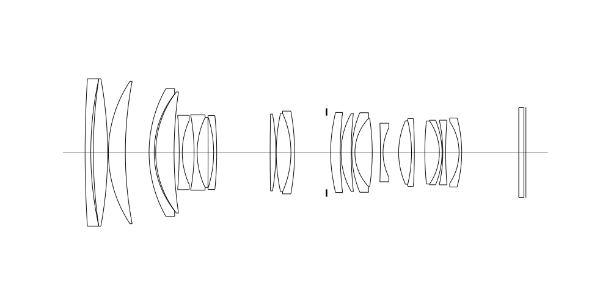
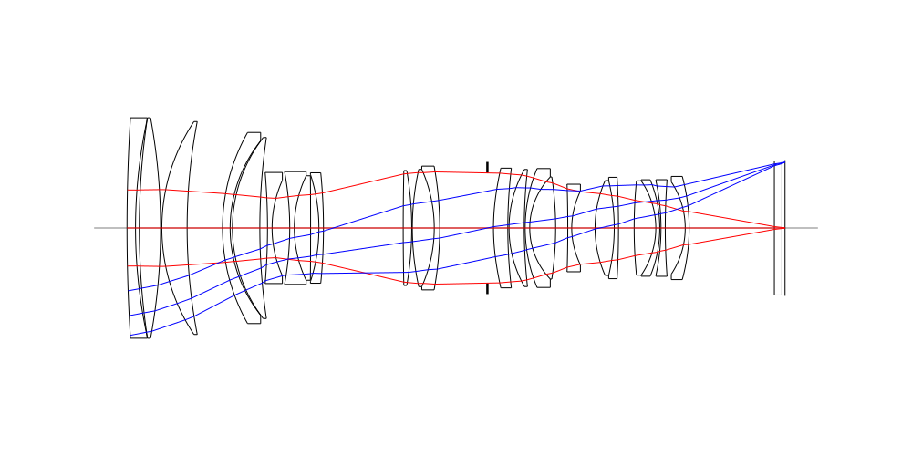
## Spot Diagrams
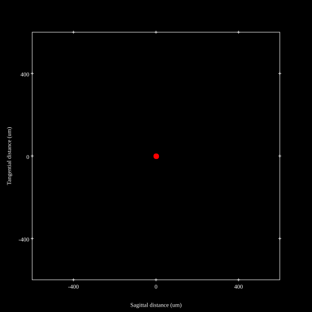
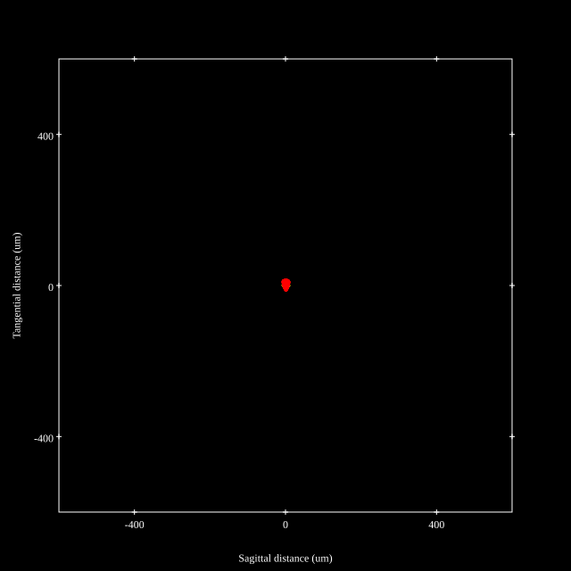
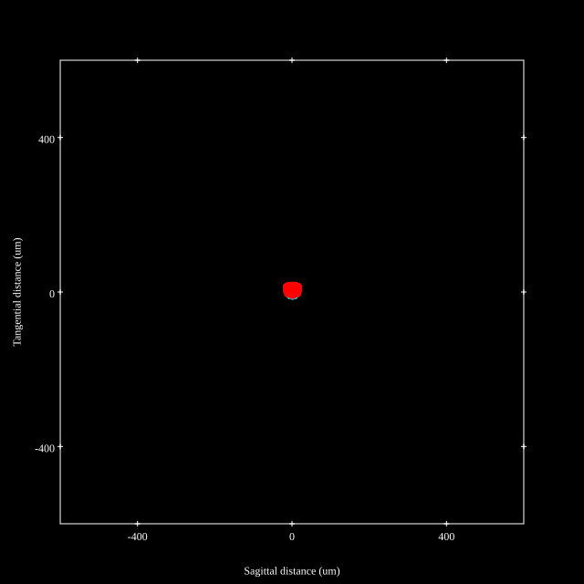
## Paraxial Parameters
| parameter | value |
| ---       | ---   |
| effective_focal_length |72.102
| back_focal_length | 0.997
| optical_invariant | 3.862
| object_distance | 1.0E10
| image_distance | 0.997
| power | 0.014
| pp1_H | 80.619
| ppk_H' | -71.105
| ffl_F | 8.517
| fno | 2.884
| enp_dist_P | 93.965
| enp_radius | 12.498
| exp_dist_P' | -59.847
| exp_radius | 10.546
| m | -0
| red | -1.386928671814458E8
| n_obj | 1
| n_img | 1
| img_ht | 22.279
| obj_ang | 17.171
| obj_na | 0
| img_na | -0.173|
## Spot Analysis
| Field | Spot Mean Radius (µm) | Spot Max Radius (µm) |
| ---   | ---              | ---             |
 | Field(x=0.0, y=0.0) | 5.277 | 11.498|
 | Field(x=0.0, y=0.1) | 5.268 | 12.582|
 | Field(x=0.0, y=0.2) | 5.241 | 13.294|
 | Field(x=0.0, y=0.3) | 5.26 | 13.909|
 | Field(x=0.0, y=0.4) | 5.41 | 14.414|
 | Field(x=0.0, y=0.5) | 5.756 | 14.963|
 | Field(x=0.0, y=0.6) | 6.332 | 15.737|
 | Field(x=0.0, y=0.7) | 7.267 | 17.174|
 | Field(x=0.0, y=0.8) | 8.452 | 19.432|
 | Field(x=0.0, y=0.9) | 10.318 | 23.031|
 | Field(x=0.0, y=1.0) | 13.842 | 28.946|
## Polychromatic Geometric MTF
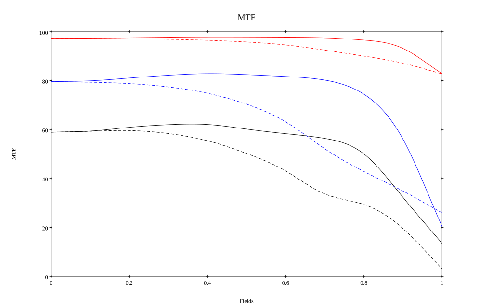
* 10=red,30=blue,50=black cycles/mm
* Solid lines represent sagittal, dashed lines tangential
* To generate above, MTFs for wavelengths 587.5618(d), 486.1327(F), 656.2725(C) were calculated across 10 fields, and then averaged
## Polychromatic Geometric MTF (Weighted)
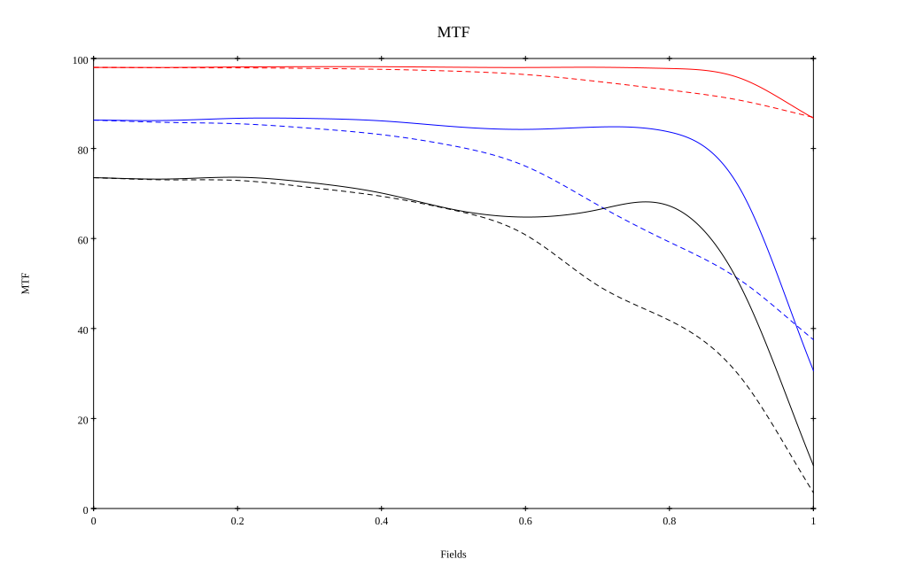
* 10=red,30=blue,50=black cycles/mm
* Solid lines represent sagittal, dashed lines tangential
* To generate above, MTFs for wavelengths 587.5618(d) wt(1.0), 656.2725(C) wt(0.475), 546.074(e) wt(0.98), 486.1327(F) wt(0.49), 435.8343(g) wt(0.15) were calculated across 10 fields, and then combined using weighted average
# 200mm f2.8
## Layouts
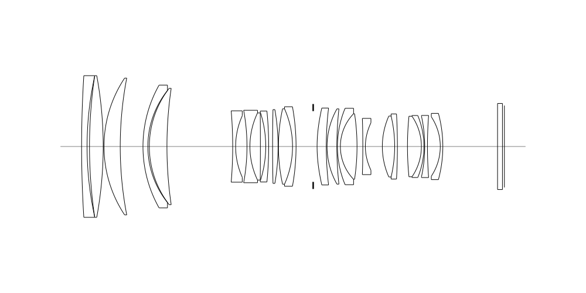
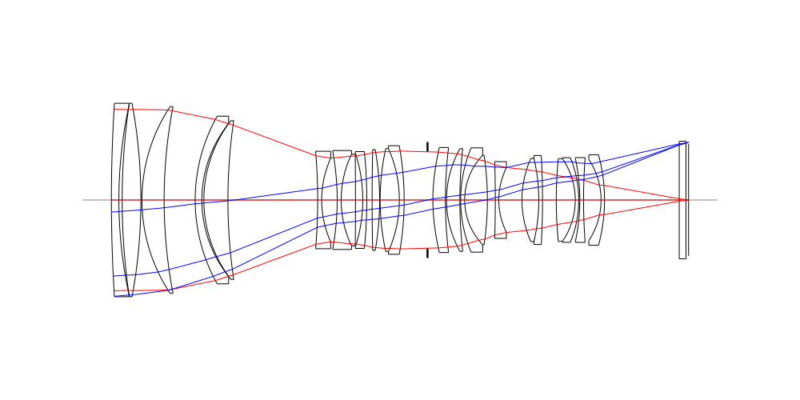
## Spot Diagrams
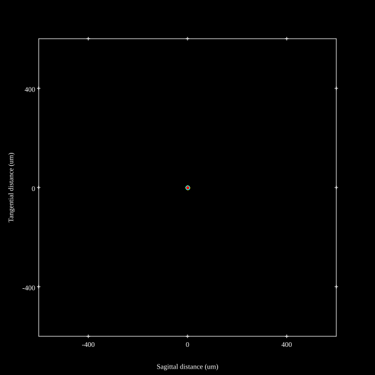

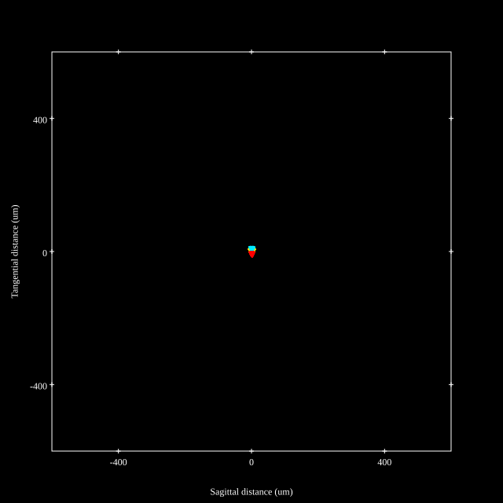
## Paraxial Parameters
| parameter | value |
| ---       | ---   |
| effective_focal_length |193.992
| back_focal_length | 0.967
| optical_invariant | 3.668
| object_distance | 1.0E10
| image_distance | 0.967
| power | 0.005
| pp1_H | -165.796
| ppk_H' | -193.025
| ffl_F | -359.788
| fno | 2.85
| enp_dist_P | 255.422
| enp_radius | 34.031
| exp_dist_P' | -60.237
| exp_radius | 10.731
| m | -0
| red | -5.154859112136701E7
| n_obj | 1
| n_img | 1
| img_ht | 20.912
| obj_ang | 6.153
| obj_na | 0
| img_na | -0.175|
## Spot Analysis
| Field | Spot Mean Radius (µm) | Spot Max Radius (µm) |
| ---   | ---              | ---             |
 | Field(x=0.0, y=0.0) | 2.185 | 7.284|
 | Field(x=0.0, y=0.1) | 2.004 | 7.575|
 | Field(x=0.0, y=0.2) | 2.276 | 7.938|
 | Field(x=0.0, y=0.3) | 2.74 | 8.17|
 | Field(x=0.0, y=0.4) | 3.3 | 8.688|
 | Field(x=0.0, y=0.5) | 3.779 | 9.558|
 | Field(x=0.0, y=0.6) | 4.051 | 10.766|
 | Field(x=0.0, y=0.7) | 4.309 | 12.526|
 | Field(x=0.0, y=0.8) | 4.979 | 13.895|
 | Field(x=0.0, y=0.9) | 6.508 | 14.729|
 | Field(x=0.0, y=1.0) | 8.89 | 17.481|
## Polychromatic Geometric MTF
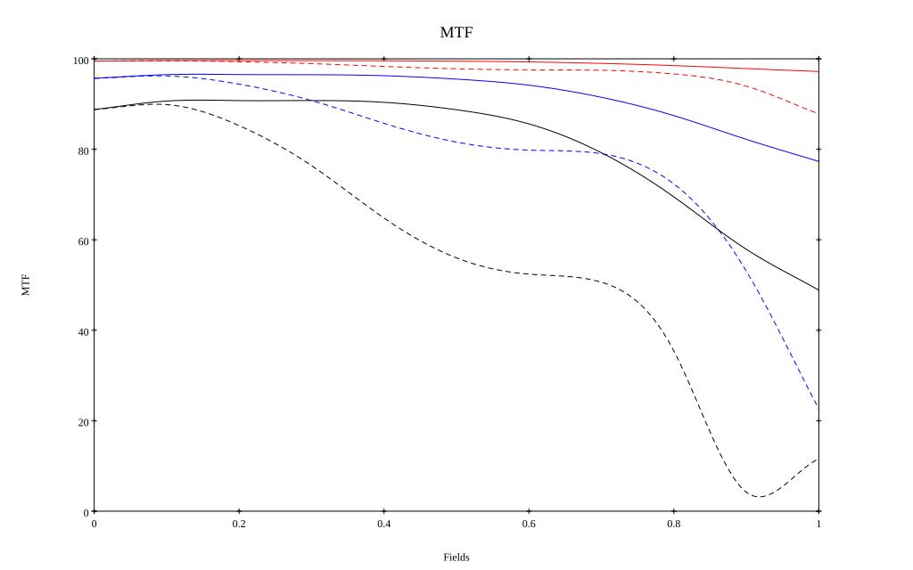
* 10=red,30=blue,50=black cycles/mm
* Solid lines represent sagittal, dashed lines tangential
* To generate above, MTFs for wavelengths 587.5618(d), 486.1327(F), 656.2725(C) were calculated across 10 fields, and then averaged
## Polychromatic Geometric MTF (Weighted)
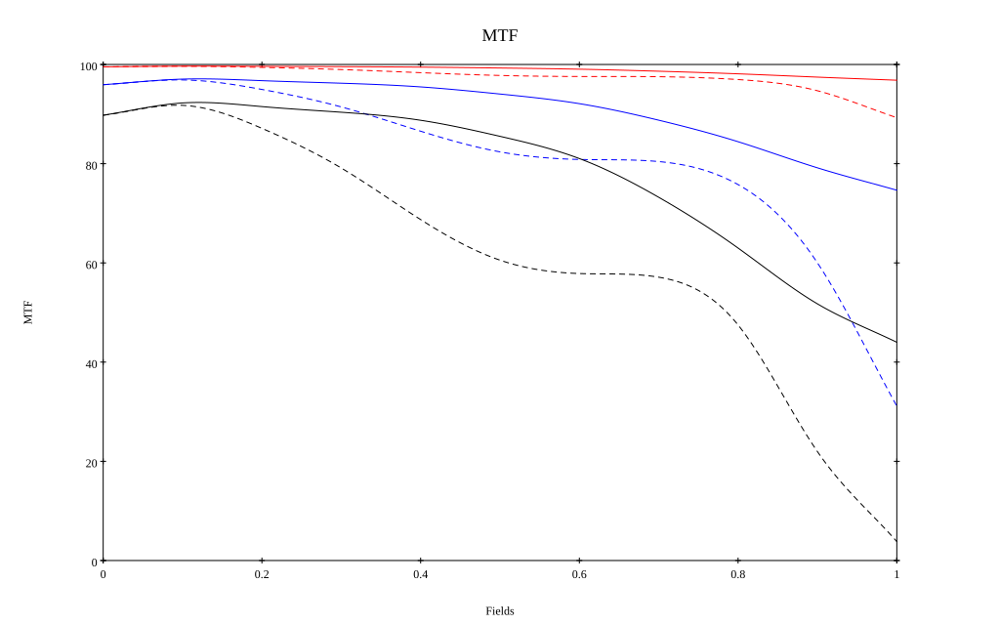
* 10=red,30=blue,50=black cycles/mm
* Solid lines represent sagittal, dashed lines tangential
* To generate above, MTFs for wavelengths 587.5618(d) wt(1.0), 656.2725(C) wt(0.475), 546.074(e) wt(0.98), 486.1327(F) wt(0.49), 435.8343(g) wt(0.15) were calculated across 10 fields, and then combined using weighted average
## Resources
* [OpticalBench Compatible Data File, tab delimited](./prescription.txt)
* [Zemax file](./US20190018229_Example01P.zmx)

Generated from `US20190018229_Example01P.txt`, status **TODO**

Report / Zemax file generated using [Beam42](https://github.com/BeamFour/Beam42) on 2026-10-09
