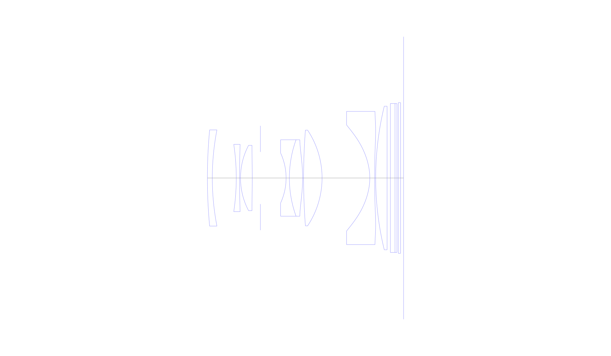
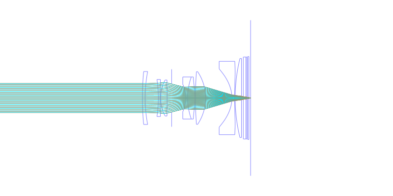
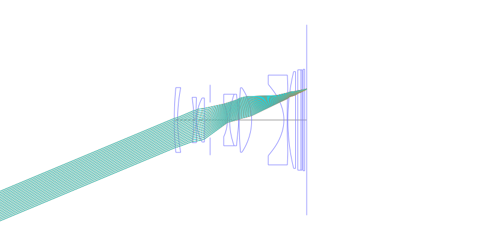
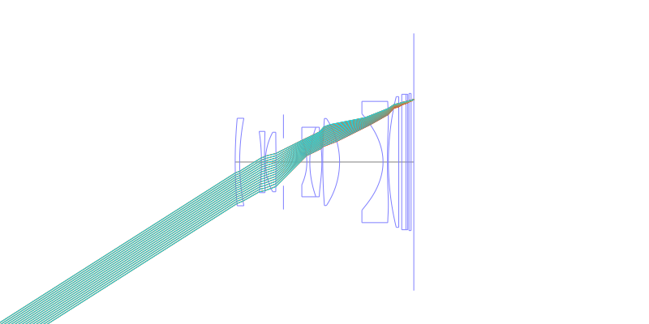
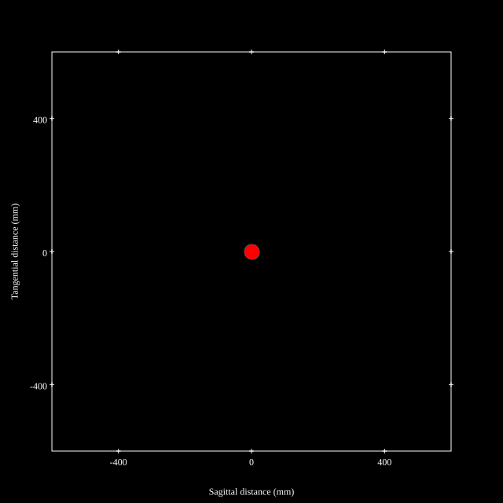
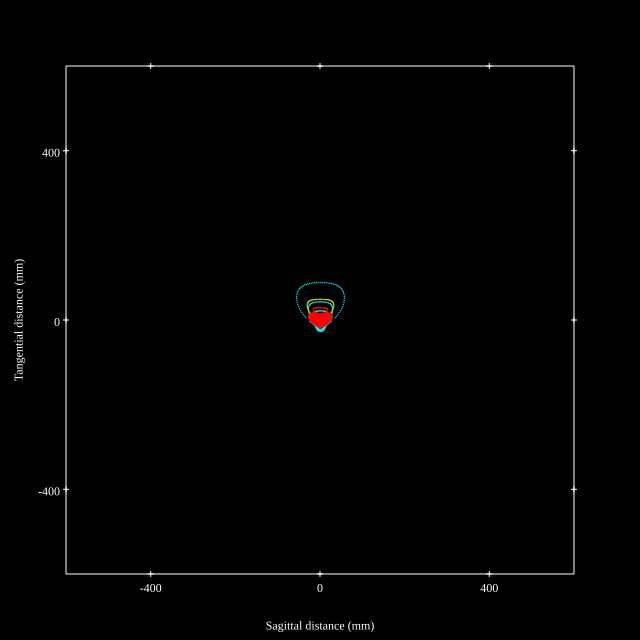
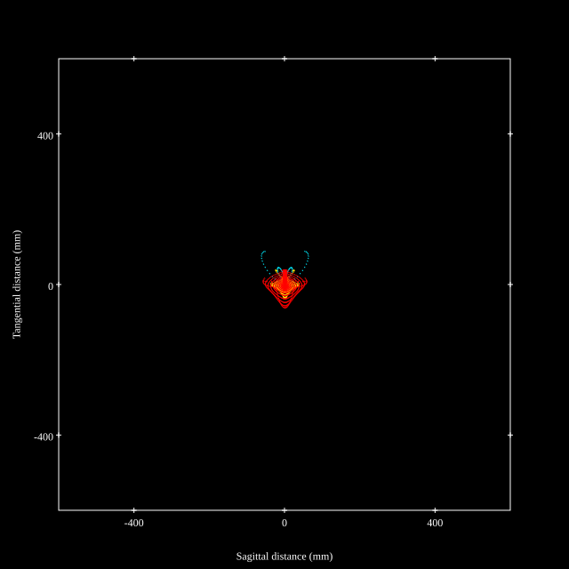
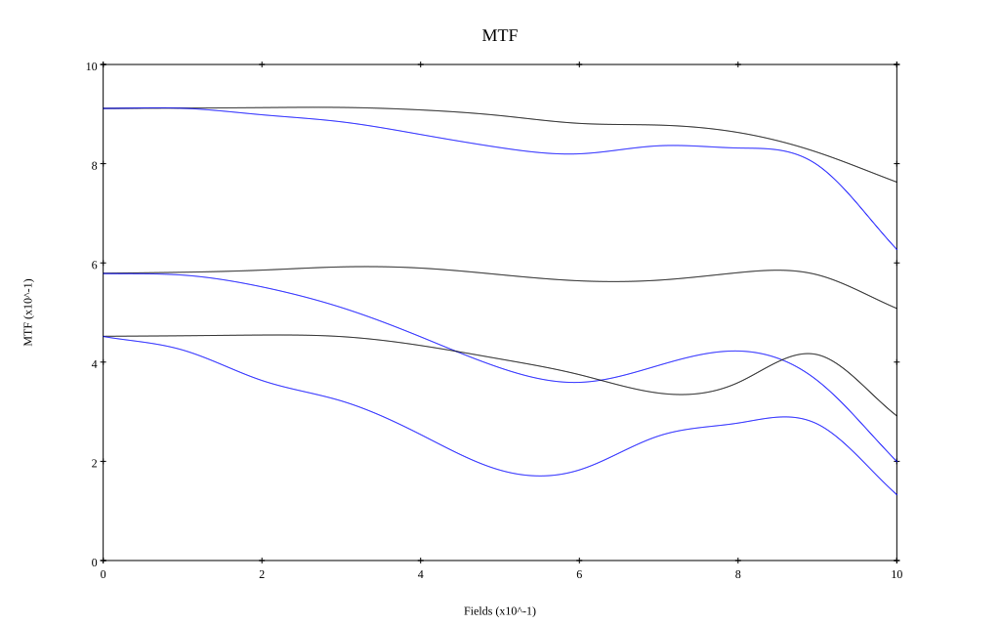
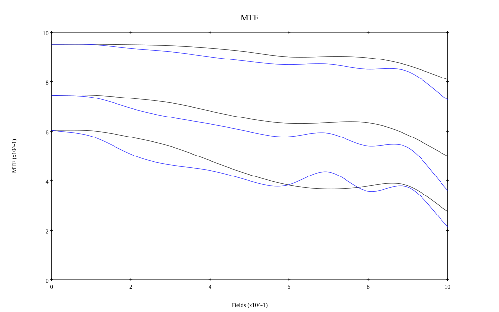

# Sony Zeiss Sonnar 35mm F2.0 for Sony DSC-RX1R
## Patent Information
| Country | Patent Number | Example | Year of Application | Inventors | Organisation | Link |
| ---     | ---           | ---     | ---                 | ---       | ---          | ---  |
|US | US20140071333 | EX 4 | 2012 | Fumikazu Kanetaka, Hisashi Uno | Sony Corp | [link](https://patents.google.com/patent/US20140071333A1/en) |
## Surface Data
Note that where glass types are shown the refractive index and abbe number is as per assigned glass type

| ID  | Radius | Thickness | Diameter | nd  | vd  | Glass Make | Glass |
| --- | ---    | ---       | ---      | --- | --- | ---        | ---   |
| 1 | 159.6 | 1.5 | 29.44 | 1.5168 | 64.2 | Hoya | BSC7 |
| 2 | 77.326 | 7.33 | 29.44 |  |  |  |
| 3 | -69.425 | 1.0 | 20.6 | 1.80518 | 25.46 | Hoya | FD60 |
| 4 | 294.9 | 0.3 | 20.6 |  |  |  |
| 5 | 21.781 | 3.58 | 20.02 | 1.88202 | 37.22 | Hoya | M-TAFD307 |
| 6 | -289.804 | 2.5 | 20.02 |  |  |  |
| 7 | AS | 7.86 | 15.975 |  |  |  |
| 8 | -18.224 | 1.0 | 15.3 | 1.92286 | 20.88 | Hoya | FDS1 |
| 9 | 34.516 | 4.05 | 23.4 | 1.88202 | 37.22 | Hoya | M-TAFD307 |
| 10 | -46.808 | 0.3 | 23.4 |  |  |  |
| 11 | 192.783 | 5.65 | 29.3 | 2.001 | 29.13 | Hoya | TAFD55 |
| 12 | -26.475 | 14.6 | 29.3 |  |  |  |
| 13 | -17.604 | 1.5 | 32.46 | 1.58313 | 59.46 | Hoya | M-BACD12 |
| 14 | 690.328 | 0.3 | 40.8 |  |  |  |
| 15 | 93.242 | 3.48 | 43.98 | 1.90366 | 31.32 | Hoya | TAFD25 |
| 16 | 0.0 | 1.0 | 43.98 |  |  |  |
| 17 | 0.0 | 1.43 | 45.58 | 1.549 | 64.2 |  |
| 18 | 0.0 | 0.59 | 45.58 | 1.519 | 64.2 |  |
| 19 | 0.0 | 0.42 | 45.58 |  |  |  |
| 20 | 0.0 | 0.7 | 46.14 | 1.5168 | 64.2 | Hoya | BSC7 |
| 21 | 0.0 | 0.92 | 46.14 |  |  |  |
## Aspherical Data
| ID  | k   | P1  | P2  | P3  | P3 | P5 | P6 | P7 | P8 | P9 | P10 |
| --- | --- | --- | --- | --- | --- | --- | --- | --- | --- | --- | --- |
| 5 | 0.31491 | 0.0 | -2.287E-6 | -2.312E-9 | 5.026E-10 | -4.1528E-12 | 0.0 | 0.0 | 0.0 | 0.0 | 0.0 |
| 6 | 0.0 | 0.0 | 1.12E-5 | -1.279E-8 | 4.707E-10 | -4.6757E-12 | 0.0 | 0.0 | 0.0 | 0.0 | 0.0 |
| 10 | -25.312 | 0.0 | -5.149E-6 | 1.895E-7 | -5.458E-10 | 1.6124E-12 | 0.0 | 0.0 | 0.0 | 0.0 | 0.0 |
| 13 | -1.1868 | 0.0 | 2.579E-5 | -2.401E-7 | 7.221E-10 | -6.0888E-13 | 0.0 | 0.0 | 0.0 | 0.0 | 0.0 |
| 14 | 0.0 | 0.0 | 2.051E-5 | -1.256E-7 | 2.232E-10 | -1.1277E-13 | 0.0 | 0.0 | 0.0 | 0.0 | 0.0 |
## Layouts

## Spot Diagrams

## Paraxial Parameters
| parameter | value |
| ---       | ---   |
| effective_focal_length |34.021
| back_focal_length | 0.875
| optical_invariant | 5.282
| object_distance | 1.0E10
| image_distance | 0.875
| power | 0.029
| pp1_H | 6.945
| ppk_H' | -33.146
| ffl_F | -27.076
| fno | 2.05
| enp_dist_P | 13.584
| enp_radius | 8.298
| exp_dist_P' | -27.636
| exp_radius | 6.943
| m | -0
| red | -2.939372460885346E8
| n_obj | 1
| n_img | 1
| img_ht | 21.657
| obj_ang | 32.48
| obj_na | 0
| img_na | -0.237|
## Spot Analysis
| Field | Spot Mean Radius | Spot Max Radius |
| ---   | ---              | ---             |
 | Field(x=0.0, y=0.0) | 9.118 | 21.364|
 | Field(x=0.0, y=0.1) | 9.115 | 23.488|
 | Field(x=0.0, y=0.2) | 9.9 | 38.222|
 | Field(x=0.0, y=0.3) | 9.851 | 29.791|
 | Field(x=0.0, y=0.4) | 10.552 | 40.037|
 | Field(x=0.0, y=0.5) | 12.834 | 84.657|
 | Field(x=0.0, y=0.6) | 16.635 | 111.5|
 | Field(x=0.0, y=0.7) | 15.71 | 91.671|
 | Field(x=0.0, y=0.8) | 15.623 | 91.613|
 | Field(x=0.0, y=0.9) | 16.565 | 94.097|
 | Field(x=0.0, y=1.0) | 20.997 | 104.722|
## Geometric MTF

* 10,30,50 cycles/mm
* Black lines represent sagittal, blue tangential
* Wavelengths 587.5618(d), 486.1327(F), 656.2725(C) equal weight
## Geometric MTF (Weighted)

* 10,30,50 cycles/mm
* Black lines represent sagittal, blue tangential
* Wavelengths 587.5618(d), 656.2725(C), 546.074(e), 486.1327(F), 435.8343(g) weighted 1.0,0.475,0.98,0.49,0.15
## Resources
* [OpticalBench Compatible Data File, tab delimited](./US20140071333_Example04P.txt)
* [Zemax file](./US20140071333_Example04P.zmx)
