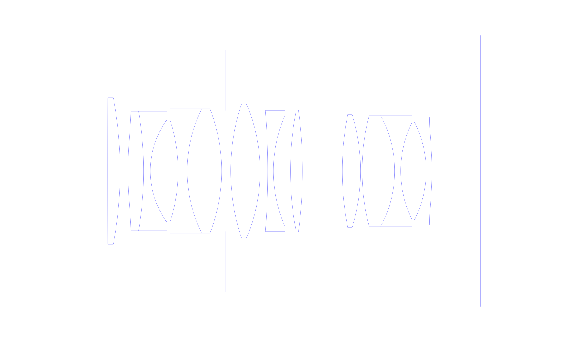
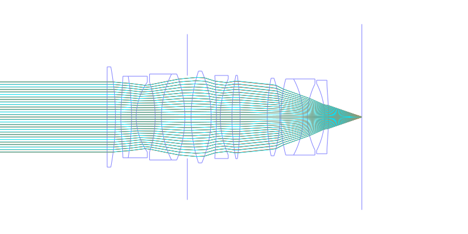
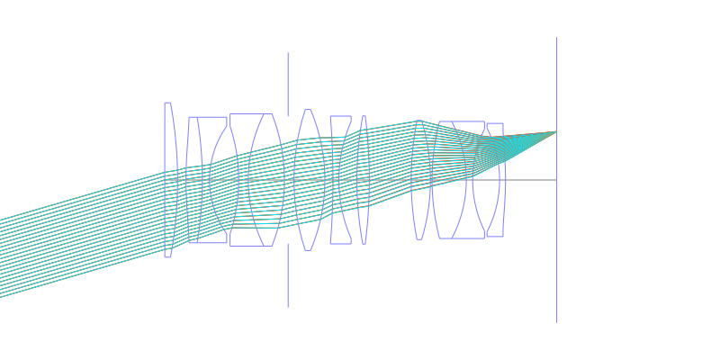
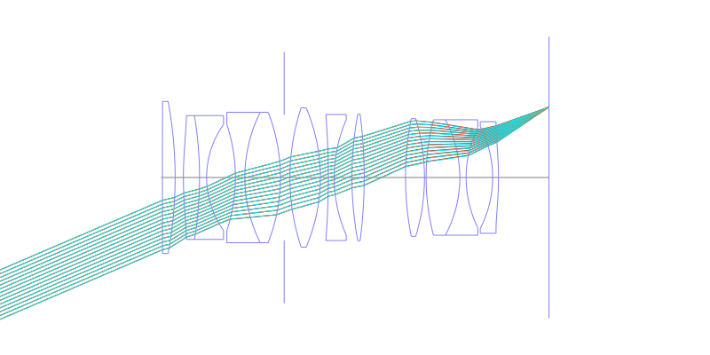
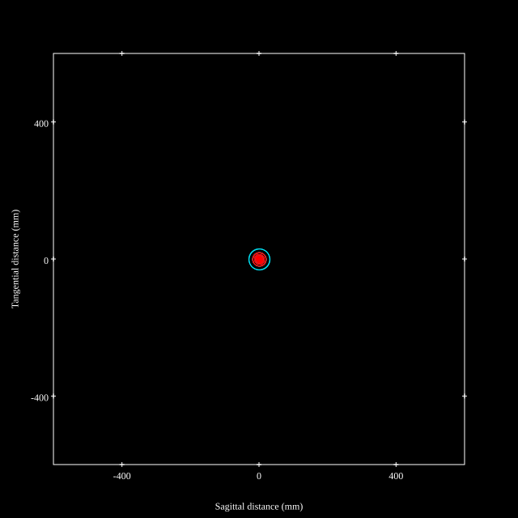
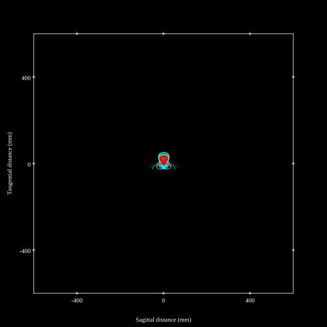
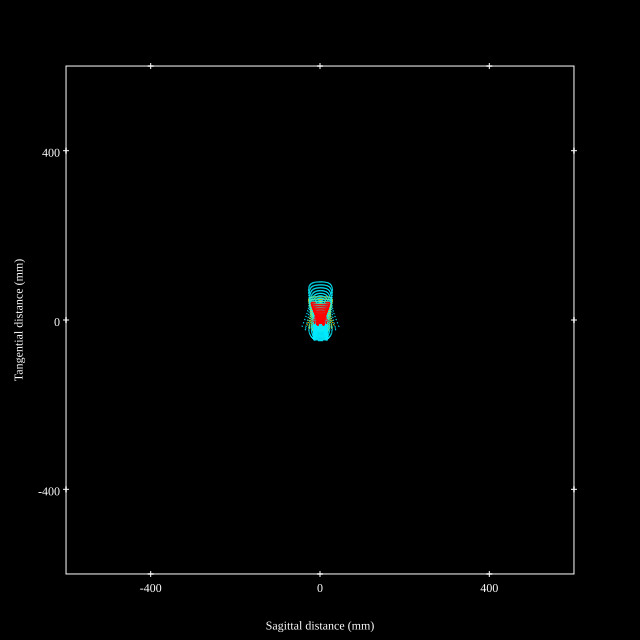
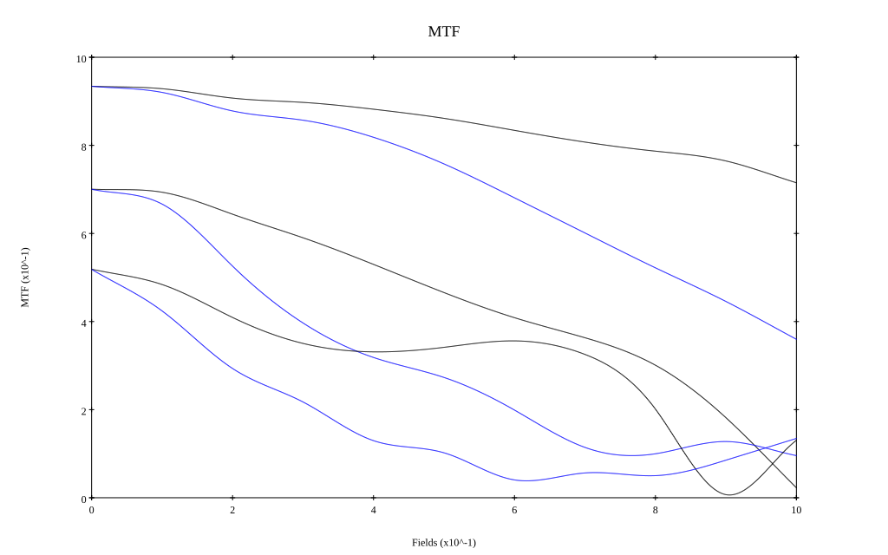
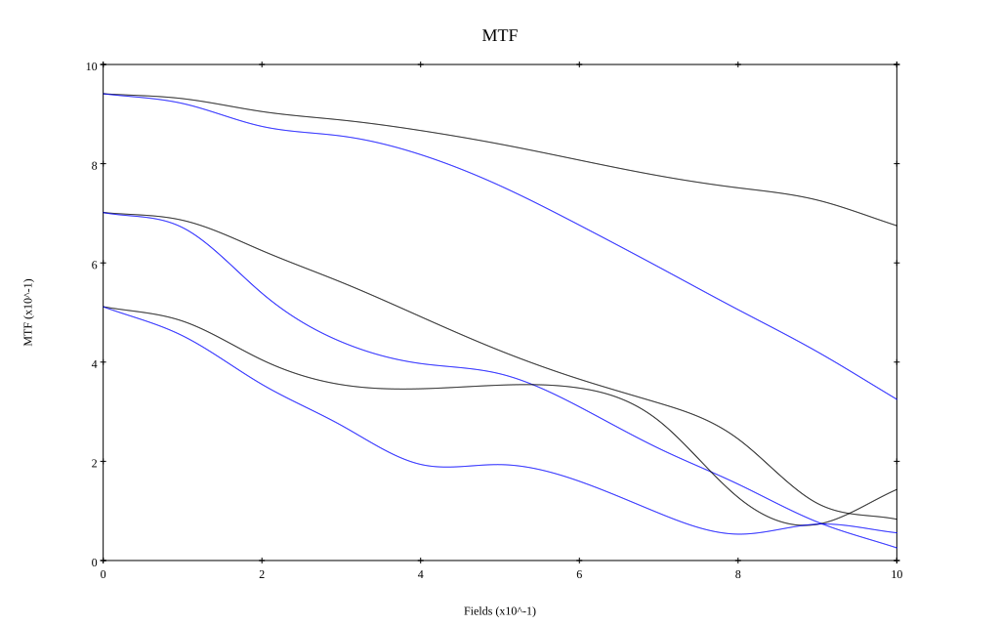

## Surface Data
Note that where glass types are shown the refractive index and abbe number is as per assigned glass type

| ID  | Radius | Thickness | Diameter | nd  | vd  | Glass Make | Glass |
| --- | ---    | ---       | ---      | --- | --- | ---        | ---   |
| 1 | 9999.0 | 3.887 | 46.72 | 1.72342 | 37.99 | Hoya | BAFD8 |
| 2 | -128.215 | 2.552 | 46.72 |  |  |  |
| 3 | 114.514 | 4.946 | 38.02 | 1.85135 | 40.1 | Hoya | M-TAFD305 |
| 4 | -116.373 | 2.178 | 38.02 | 1.5168 | 64.2 | Hoya | BSC7 |
| 5 | 28.12 | 8.835 | 32.56 |  |  |  |
| 6 | -51.934 | 2.897 | 32.56 | 1.71736 | 29.5 | Hoya | E-FD1 |
| 7 | 44.703 | 10.94 | 40.06 | 1.72916 | 54.67 | Hoya | TAC8 |
| 8 | -54.876 | 1.144 | 40.06 |  |  |  |
| 9 | AS | 1.764 | 38.582 |  |  |  |
| 10 | 68.142 | 9.35 | 42.8 | 1.59282 | 68.62 | Hoya | FCD505 |
| 11 | -54.525 | 2.442 | 42.8 |  |  |  |
| 12 | -243.918 | 1.8 | 38.7 | 1.99502 | 29.3 |  |
| 13 | 44.296 | 5.45 | 35.46 |  |  |  |
| 14 | 105.875 | 3.768 | 38.86 | 1.94594 | 17.98 | Hoya | FDS18 |
| 15 | -150.783 | 12.684 | 38.86 |  |  |  |
| 16 | 93.568 | 5.822 | 36.14 | 1.8042 | 46.5 | Hoya | TAF3 |
| 17 | -62.024 | 0.5 | 36.14 |  |  |  |
| 18 | 70.486 | 10.36 | 35.46 | 1.8042 | 46.5 | Hoya | TAF3 |
| 19 | -37.614 | 1.931 | 35.46 | 1.80518 | 25.46 | Hoya | FD60 |
| 20 | 34.944 | 8.141 | 30.84 |  |  |  |
| 21 | -34.288 | 1.8 | 31.36 | 1.58313 | 59.37 | Ohara | S-BAL42 |
| 22 | -96.201 | 15.506 | 34.26 |  |  |  |
## Aspherical Data
| ID  | k   | P1  | P2  | P3  | P3 | P5 | P6 | P7 | P8 | P9 | P10 |
| --- | --- | --- | --- | --- | --- | --- | --- | --- | --- | --- | --- |
| 3 | 0.0 | 0.0 | -4.5136E-6 | -1.7517E-9 | 1.83E-14 | 0.0 | 0.0 | 0.0 | 0.0 | 0.0 | 0.0 |
| 22 | 0.0 | 0.0 | 7.3383E-6 | 1.6537E-9 | 2.1185E-11 | -1.5608E-14 | 0.0 | 0.0 | 0.0 | 0.0 | 0.0 |
## Layouts

## Spot Diagrams

## Paraxial Parameters
| parameter | value |
| ---       | ---   |
| effective_focal_length |50.312
| back_focal_length | 15.522
| optical_invariant | 7.432
| object_distance | 1.0E10
| image_distance | 15.522
| power | 0.02
| pp1_H | 32.42
| ppk_H' | -34.79
| ffl_F | -17.892
| fno | 1.45
| enp_dist_P | 28.614
| enp_radius | 17.349
| exp_dist_P' | -38.893
| exp_radius | 18.769
| m | -0
| red | -1.9875890986579978E8
| n_obj | 1
| n_img | 1
| img_ht | 21.553
| obj_ang | 23.19
| obj_na | 0
| img_na | -0.326|
## Spot Analysis
| Field | Spot Mean Radius | Spot Max Radius |
| ---   | ---              | ---             |
 | Field(x=0.0, y=0.0) | 8.835 | 30.486|
 | Field(x=0.0, y=0.1) | 8.902 | 55.238|
 | Field(x=0.0, y=0.2) | 12.032 | 64.656|
 | Field(x=0.0, y=0.3) | 11.793 | 64.348|
 | Field(x=0.0, y=0.4) | 12.393 | 71.202|
 | Field(x=0.0, y=0.5) | 14.137 | 71.96|
 | Field(x=0.0, y=0.6) | 16.193 | 57.952|
 | Field(x=0.0, y=0.7) | 18.448 | 64.273|
 | Field(x=0.0, y=0.8) | 20.616 | 64.404|
 | Field(x=0.0, y=0.9) | 23.447 | 75.769|
 | Field(x=0.0, y=1.0) | 28.852 | 91.248|
## Geometric MTF

* 10,30,50 cycles/mm
* Black lines represent sagittal, blue tangential
* Wavelengths 587.5618(d), 486.1327(F), 656.2725(C) equal weight
## Geometric MTF (Weighted)

* 10,30,50 cycles/mm
* Black lines represent sagittal, blue tangential
* Wavelengths 587.5618(d), 656.2725(C), 546.074(e), 486.1327(F), 435.8343(g) weighted 1.0,0.475,0.98,0.49,0.15
## Resources
* [OpticalBench Compatible Data File, tab delimited](./WO2017-138250_Example02.txt)
* [Zemax file](./WO2017-138250_Example02.zmx)
