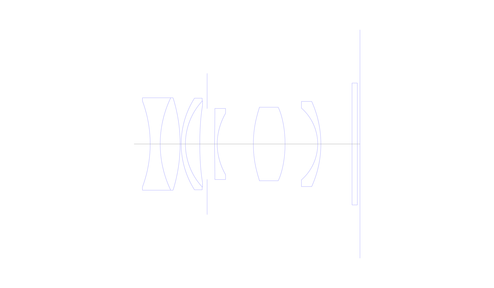
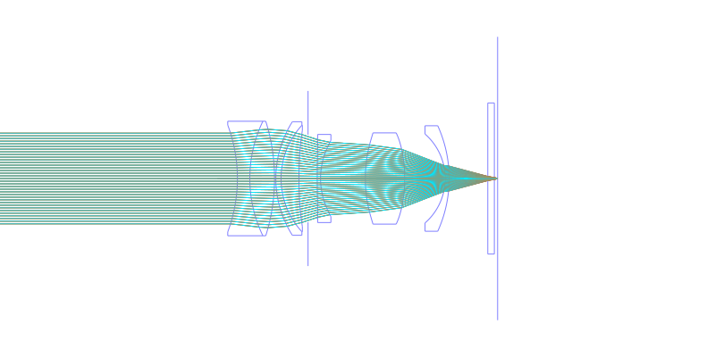
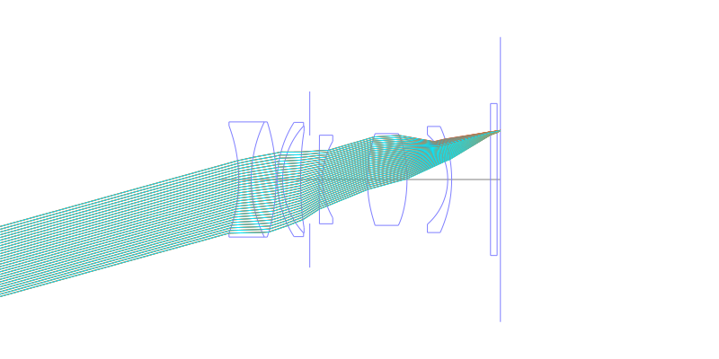
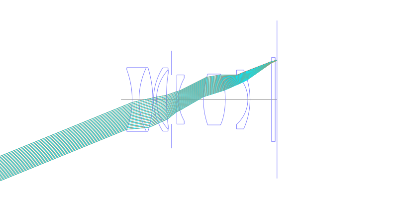
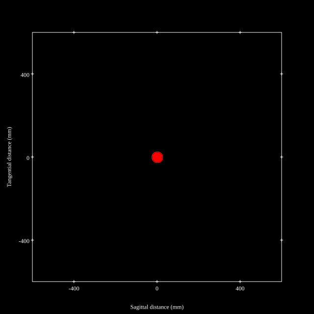
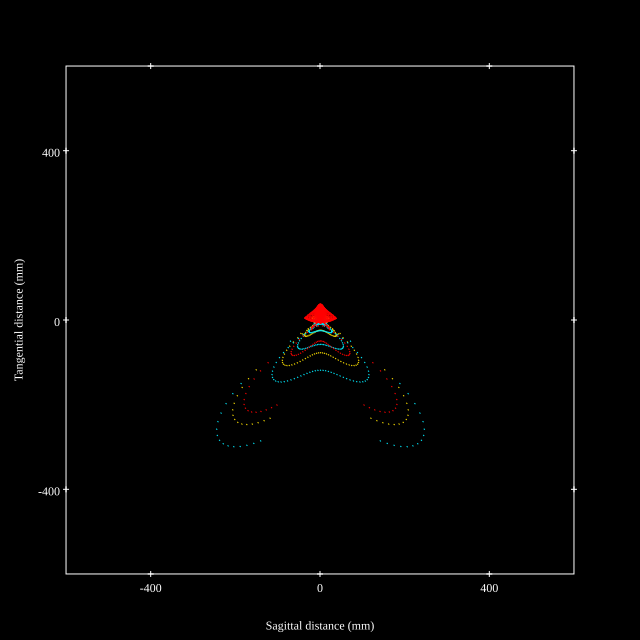
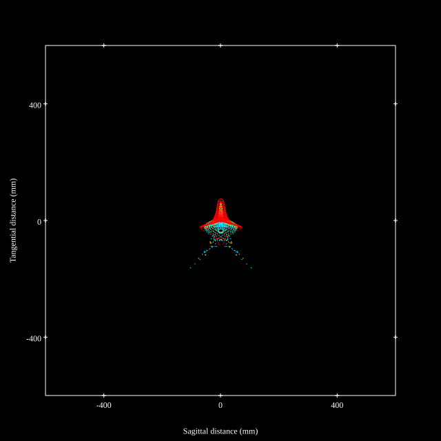
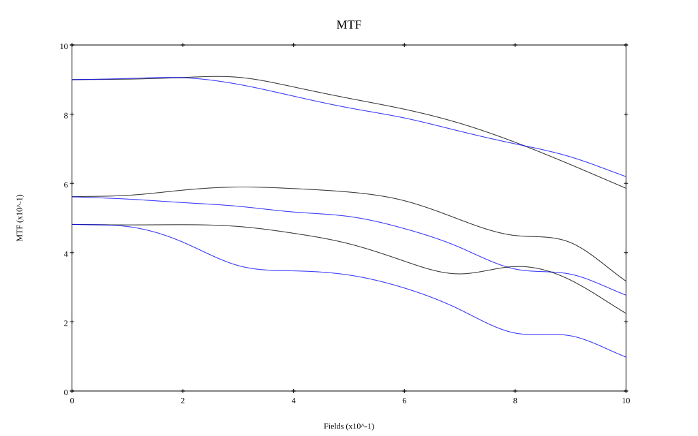
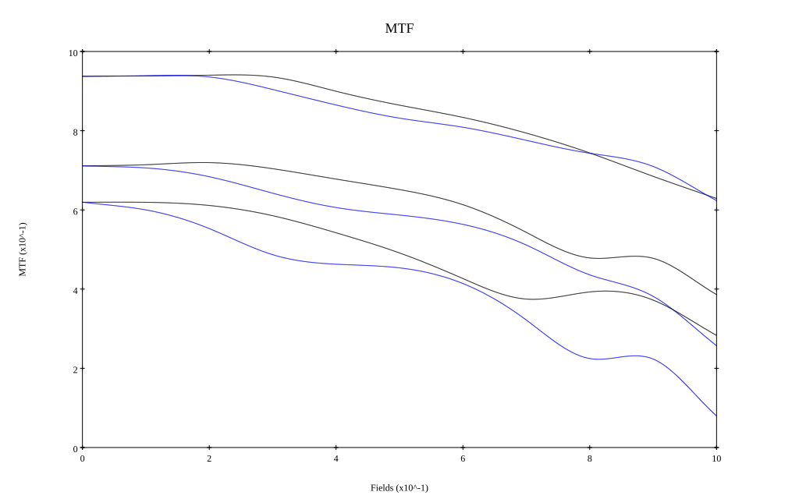

## Surface Data
Note that where glass types are shown the refractive index and abbe number is as per assigned glass type

| ID  | Radius | Thickness | Diameter | nd  | vd  | Glass Make | Glass |
| --- | ---    | ---       | ---      | --- | --- | ---        | ---   |
| 1 | -46.604 | 3.78 | 32.62 | 1.58144 | 40.89 | Hoya | E-FL5 |
| 2 | 40.397 | 7.54 | 34.96 | 1.72916 | 54.67 | Hoya | TAC8 |
| 3 | -58.437 | 0.4 | 34.96 |  |  |  |
| 4 | 32.361 | 1.6 | 34.68 | 1.84666 | 23.78 | Hoya | FDS90 |
| 5 | 23.982 | 5.44 | 32.5 | 1.76802 | 49.24 | Hoya | M-TAF101 |
| 6 | 127.461 | 2.78 | 29.28 |  |  |  |
| 7 | AS | 2.81 | 26.738 |  |  |  |
| 8 | 229.883 | 1.0 | 26.9 | 1.48749 | 70.44 | Hoya | FC5 |
| 9 | 21.728 | 13.67 | 23.23 |  |  |  |
| 10 | 43.205 | 12.0 | 27.86 | 1.59201 | 67.02 | Hoya | M-PCD51 |
| 11 | -44.134 | 12.35 | 27.86 |  |  |  |
| 12 | -18.057 | 1.2 | 27.16 | 1.69895 | 30.05 | Hoya | E-FD15 |
| 13 | -39.016 | 11.78 | 32.22 |  |  |  |
| 14 | 0.0 | 2.0 | 46.14 | 1.5168 | 64.2 | Hoya | BSC7 |
| 15 | 0.0 | 1.0 | 46.14 |  |  |  |
## Aspherical Data
| ID  | k   | P1  | P2  | P3  | P3 | P5 | P6 | P7 | P8 | P9 | P10 |
| --- | --- | --- | --- | --- | --- | --- | --- | --- | --- | --- | --- |
| 6 | 0.0 | 0.0 | 4.72026E-6 | -6.13511E-9 | 3.19538E-11 | -5.08717E-14 | 0.0 | 0.0 | 0.0 | 0.0 | 0.0 |
| 8 | 0.0 | 0.0 | -1.53071E-5 | 5.95902E-8 | -1.03151E-10 | -1.18635E-13 | 0.0 | 0.0 | 0.0 | 0.0 | 0.0 |
| 9 | 0.0 | 0.0 | -1.66843E-5 | 5.20407E-8 | 3.77076E-12 | -6.66338E-13 | 0.0 | 0.0 | 0.0 | 0.0 | 0.0 |
| 10 | 0.0 | 0.0 | 4.5895E-6 | -1.29121E-8 | 7.03681E-11 | -6.07907E-13 | 0.0 | 0.0 | 0.0 | 0.0 | 0.0 |
| 11 | 0.0 | 0.0 | -3.28037E-6 | -2.72677E-8 | 9.31069E-11 | -5.99753E-13 | 0.0 | 0.0 | 0.0 | 0.0 | 0.0 |
## Layouts

## Spot Diagrams

## Paraxial Parameters
| parameter | value |
| ---       | ---   |
| effective_focal_length |53.612
| back_focal_length | 1.039
| optical_invariant | 5.867
| object_distance | 1.0E10
| image_distance | 1.039
| power | 0.019
| pp1_H | 0.123
| ppk_H' | -52.573
| ffl_F | -53.489
| fno | 1.86
| enp_dist_P | 13.867
| enp_radius | 14.412
| exp_dist_P' | -41.595
| exp_radius | 11.471
| m | -0
| red | -1.8652444204547846E8
| n_obj | 1
| n_img | 1
| img_ht | 21.824
| obj_ang | 22.15
| obj_na | 0
| img_na | -0.26|
## Spot Analysis
| Field | Spot Mean Radius | Spot Max Radius |
| ---   | ---              | ---             |
 | Field(x=0.0, y=0.0) | 10.084 | 25.847|
 | Field(x=0.0, y=0.1) | 9.908 | 26.043|
 | Field(x=0.0, y=0.2) | 9.482 | 26.382|
 | Field(x=0.0, y=0.3) | 9.856 | 44.425|
 | Field(x=0.0, y=0.4) | 14.281 | 107.765|
 | Field(x=0.0, y=0.5) | 35.725 | 527.669|
 | Field(x=0.0, y=0.6) | 61.275 | 386.178|
 | Field(x=0.0, y=0.7) | 51.76 | 370.936|
 | Field(x=0.0, y=0.8) | 45.227 | 471.376|
 | Field(x=0.0, y=0.9) | 37.825 | 360.859|
 | Field(x=0.0, y=1.0) | 29.624 | 191.671|
## Geometric MTF

* 10,30,50 cycles/mm
* Black lines represent sagittal, blue tangential
* Wavelengths 587.5618(d), 486.1327(F), 656.2725(C) equal weight
## Geometric MTF (Weighted)

* 10,30,50 cycles/mm
* Black lines represent sagittal, blue tangential
* Wavelengths 587.5618(d), 656.2725(C), 546.074(e), 486.1327(F), 435.8343(g) weighted 1.0,0.475,0.98,0.49,0.15
## Resources
* [OpticalBench Compatible Data File, tab delimited](./US20150092100_Example01.txt)
* [Zemax file](./US20150092100_Example01.zmx)
