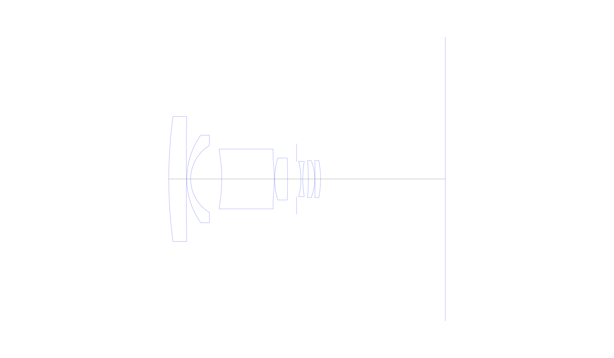
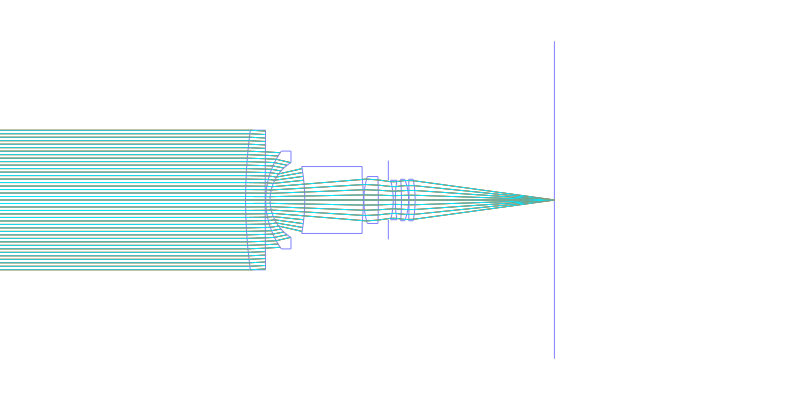
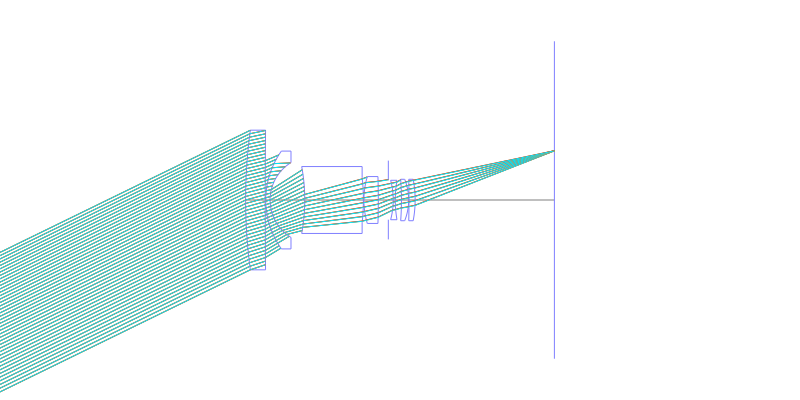
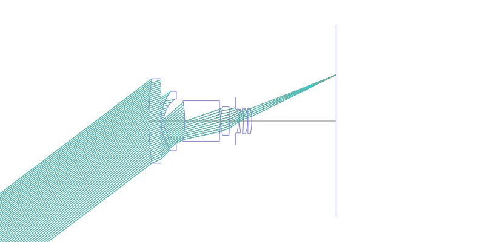
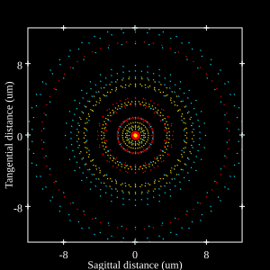
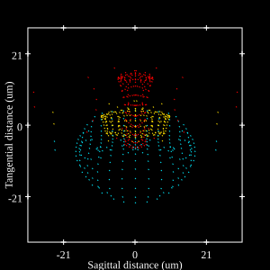
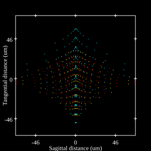

## Surface Data
Note that where glass types are shown the refractive index and abbe number is as per assigned glass type

| ID  | Radius | Thickness | Diameter | nd  | vd  | Glass Make | Glass |
| --- | ---    | ---       | ---      | --- | --- | ---        | ---   |
| 1 | 140.0 | 5.334 | 38.01 | 1.67003 | 47.14 | Hikari | J-BAF10 |
| 2 | 1931.924 | 0.148 | 38.01 |  |  |  |
| 3 | 22.96 | 1.176 | 26.62 | 1.62041 | 60.25 | Hikari | J-SK16 |
| 4 | 11.967 | 9.436 | 20.38 |  |  |  |
| 5 | -50.4 | 15.96 | 18.21 | 1.6516 | 58.57 | Hikari | J-LAK7 |
| 6 | -55.416 | 0.14 | 12.31 |  |  |  |
| 7 | 22.4 | 3.92 | 12.76 | 1.72 | 42.02 | Hoya | LAFL6 |
| 8 | -203.088 | 2.729 | 12.68 |  |  |  |
| 9 | AS | 1.331 | 10.722 |  |  |  |
| 10 | -20.72 | 0.56 | 10.73 | 1.69895 | 30.13 | Hikari | J-SF15 |
| 11 | 31.528 | 1.68 | 10.73 |  |  |  |
| 12 | -75.6 | 1.96 | 11.28 | 1.62041 | 60.25 | Hikari | J-SK16 |
| 13 | -15.207 | 0.084 | 11.28 |  |  |  |
| 14 | -280.0 | 1.68 | 11.28 | 1.62041 | 60.25 | Hikari | J-SK16 |
| 15 | -29.982 | 37.9 | 11.28 |  |  |  |
## Layouts

## Spot Diagrams

## Paraxial Parameters
| parameter | value |
| ---       | ---   |
| effective_focal_length |28.001
| back_focal_length | 37.957
| optical_invariant | 3.031
| object_distance | 1.0E10
| image_distance | 37.9
| power | 0.036
| pp1_H | 31.945
| ppk_H' | -9.955
| ffl_F | 3.944
| fno | 3.5
| enp_dist_P | 21.263
| enp_radius | 4
| exp_dist_P' | -7.314
| exp_radius | 6.467
| m | 0.002
| red | -3.5712853661288774E8
| n_obj | 1
| n_img | 1
| img_ht | 21.216
| obj_ang | 37.15
| obj_na | 0
| img_na | -0.141|
## Spot Analysis
| Field | Spot Mean Radius | Spot Max Radius |
| ---   | ---              | ---             |
 | 0.0 | 6.329 | 12.282|
 | 0.7 | 11.594 | 31.451|
 | 1.0 | 29.96 | 68.332|
## Resources
* [OpticalBench Compatible Data File, tab delimited](./US003506339_Example01.txt)
* [Zemax file](./US003506339_Example01.zmx)
