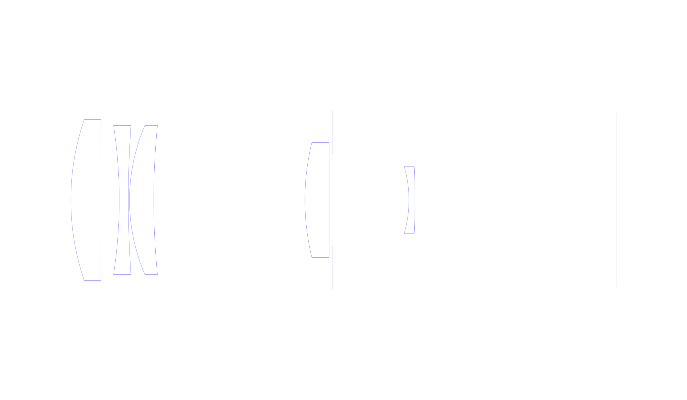
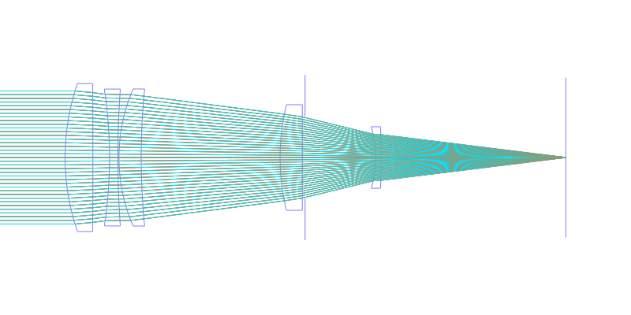
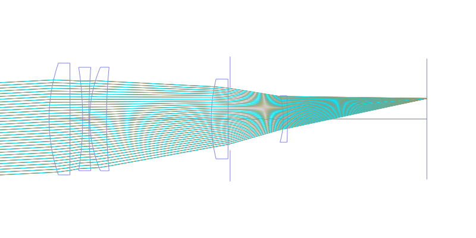
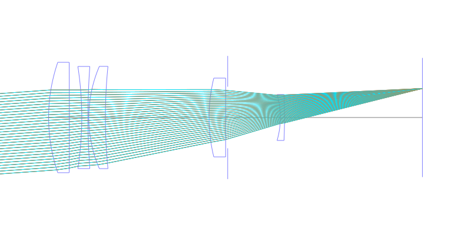
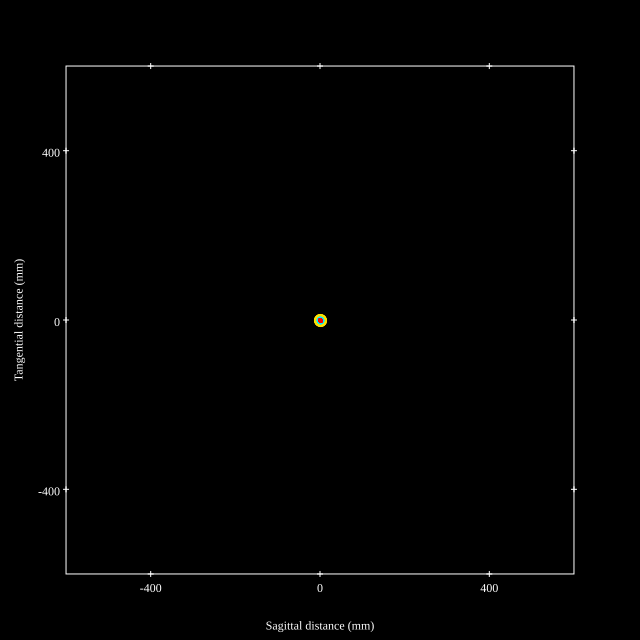
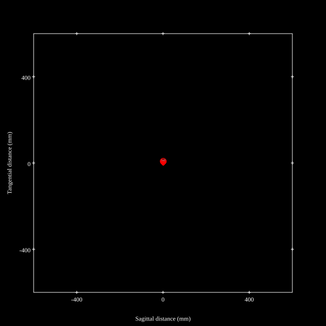
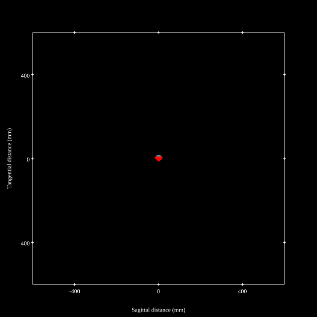
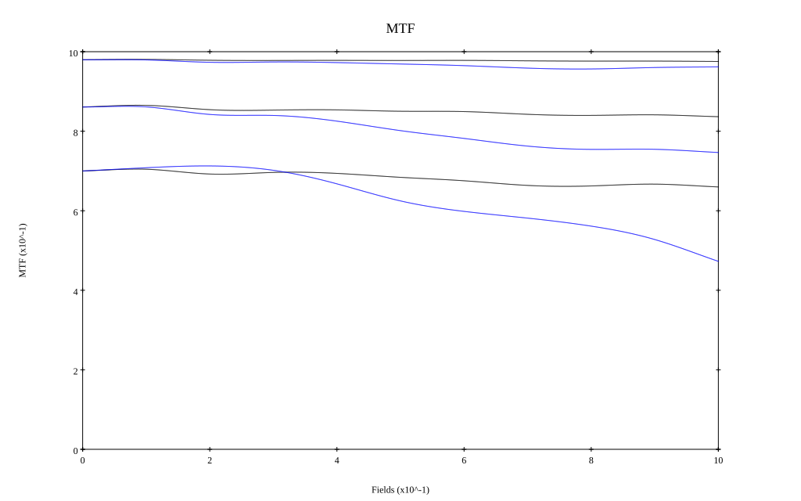
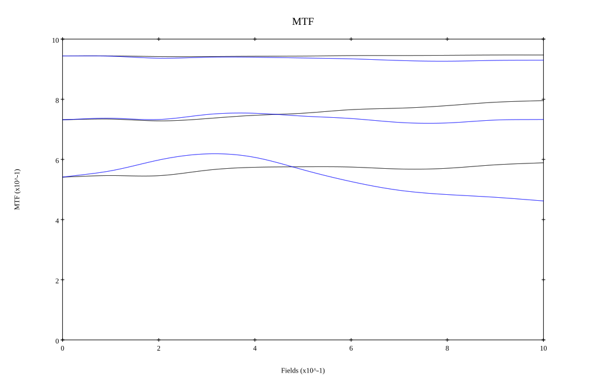

# Asahi Pentax Ultra-Achromatic-Takumar 300mm f5.6
## Patent Information
| Country | Patent Number | Example | Year of Application | Inventors | Organisation | Link |
| ---     | ---           | ---     | ---                 | ---       | ---          | ---  |
|US | US3467462A | 3 | 1965 | Tomokazu Kazamaki, Tohru Matsumoto | Asahi Kogaku Kogyo Co Ltd | [link](https://patents.google.com/patent/US3467462A/en) |
## Surface Data
Note that where glass types are shown the refractive index and abbe number is as per assigned glass type

| ID  | Radius | Thickness | Diameter | nd  | vd  | Glass Make | Glass |
| --- | ---    | ---       | ---      | --- | --- | ---        | ---   |
| 1 | 124.068 | 15.0 | 80.04 | 1.43384 | 95.26 | Hikari | NICF-A |
| 2 | -8546.635 | 9.0 | 80.04 |  |  |  |
| 3 | -244.086 | 4.5 | 74.04 | 1.62096 | 35.95 | Hoya | F11 |
| 4 | 518.557 | 0.6 | 74.04 |  |  |  |
| 5 | 93.99 | 12.0 | 74.16 | 1.43384 | 95.26 | Hikari | NICF-A |
| 6 | 372.25 | 75.0 | 74.16 |  |  |  |
| 7 | 120.699 | 12.0 | 57.12 | 1.56012 | 47.09 | Hoya | FEL3 |
| 8 | 0.0 | 1.5 | 57.12 |  |  |  |
| 9 | AS | 38.1 | 44.654 |  |  |  |
| 10 | -59.701 | 3.0 | 33.3 | 1.58913 | 61.25 | Hoya | BACD5 |
| 11 | -379.058 | 99.781 | 33.3 |  |  |  |
## Layouts

## Spot Diagrams

## Paraxial Parameters
| parameter | value |
| ---       | ---   |
| effective_focal_length |293.05
| back_focal_length | 99.755
| optical_invariant | 2.665
| object_distance | 1.0E10
| image_distance | 99.755
| power | 0.003
| pp1_H | -173.769
| ppk_H' | -193.295
| ffl_F | -466.819
| fno | 3.942
| enp_dist_P | 189.956
| enp_radius | 37.173
| exp_dist_P' | -31.028
| exp_radius | 16.586
| m | -0
| red | -3.412386098843892E7
| n_obj | 1
| n_img | 1
| img_ht | 21.006
| obj_ang | 4.1
| obj_na | 0
| img_na | -0.126|
## Spot Analysis
| Field | Spot Mean Radius | Spot Max Radius |
| ---   | ---              | ---             |
 | Field(x=0.0, y=0.0) | 4.355 | 13.57|
 | Field(x=0.0, y=0.1) | 4.048 | 18.187|
 | Field(x=0.0, y=0.2) | 4.94 | 20.147|
 | Field(x=0.0, y=0.3) | 4.722 | 20.168|
 | Field(x=0.0, y=0.4) | 4.623 | 19.14|
 | Field(x=0.0, y=0.5) | 4.843 | 17.317|
 | Field(x=0.0, y=0.6) | 5.232 | 19.552|
 | Field(x=0.0, y=0.7) | 5.766 | 22.486|
 | Field(x=0.0, y=0.8) | 6.058 | 21.822|
 | Field(x=0.0, y=0.9) | 5.941 | 18.716|
 | Field(x=0.0, y=1.0) | 5.94 | 17.383|
## Polychromatic Geometric MTF

* 10,30,50 cycles/mm
* Black lines represent sagittal, blue tangential
* To generate above, MTFs for wavelengths 587.5618(d), 486.1327(F), 656.2725(C) were calculated across 10 fields, and then averaged
## Polychromatic Geometric MTF (Weighted)

* 10,30,50 cycles/mm
* Black lines represent sagittal, blue tangential
* To generate above, MTFs for wavelengths 587.5618(d) wt(1.0), 656.2725(C) wt(0.475), 546.074(e) wt(0.98), 486.1327(F) wt(0.49), 435.8343(g) wt(0.15) were calculated across 10 fields, and then combined using weighted average
## Resources
* [OpticalBench Compatible Data File, tab delimited](./US003467462_Example03b.txt)
* [Zemax file](./US003467462_Example03b.zmx)

Report / Zemax file generated using [Beam42](https://github.com/BeamFour/Beam42) on 2026-01-24
