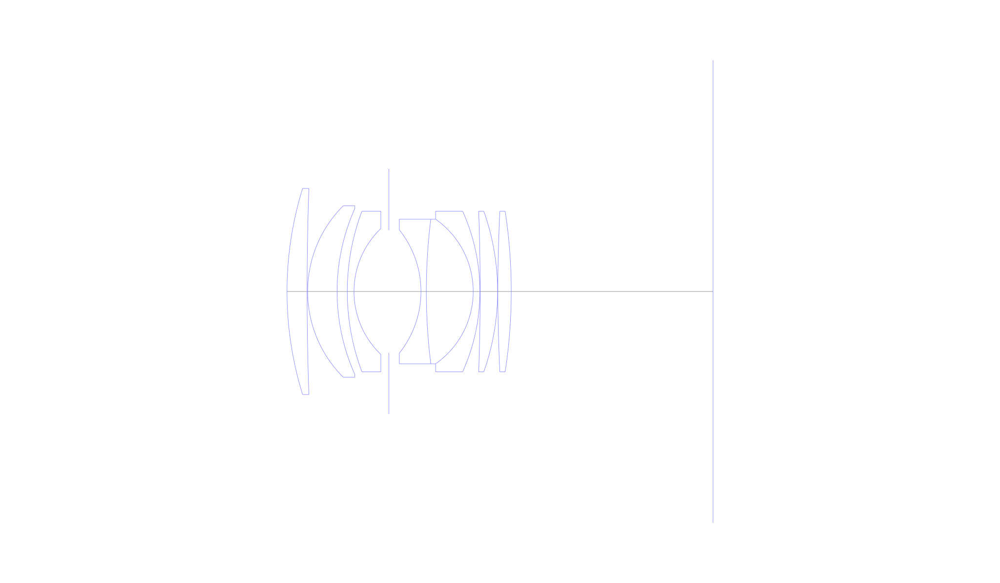
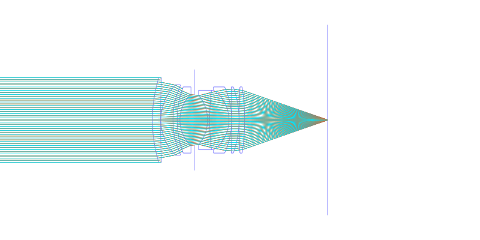
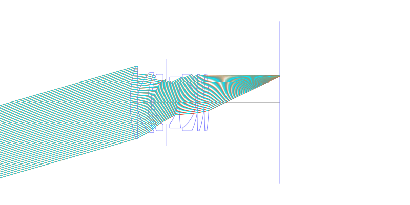
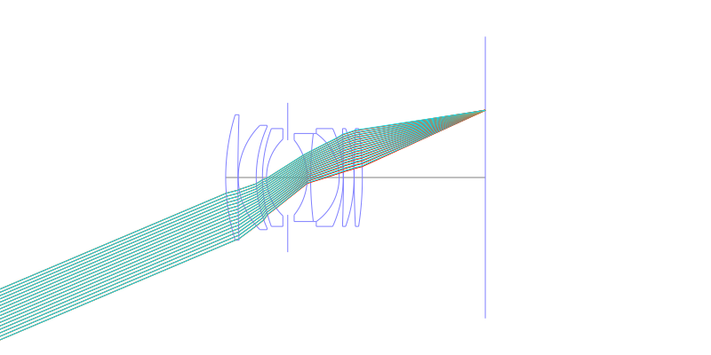
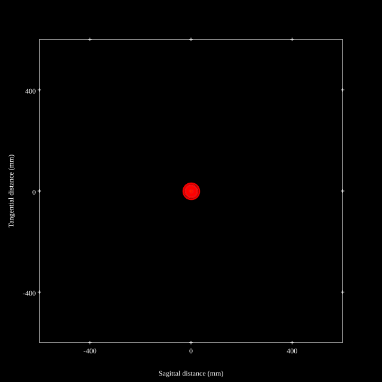
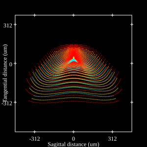
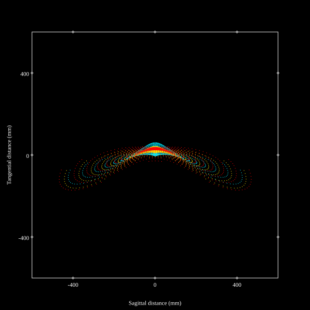
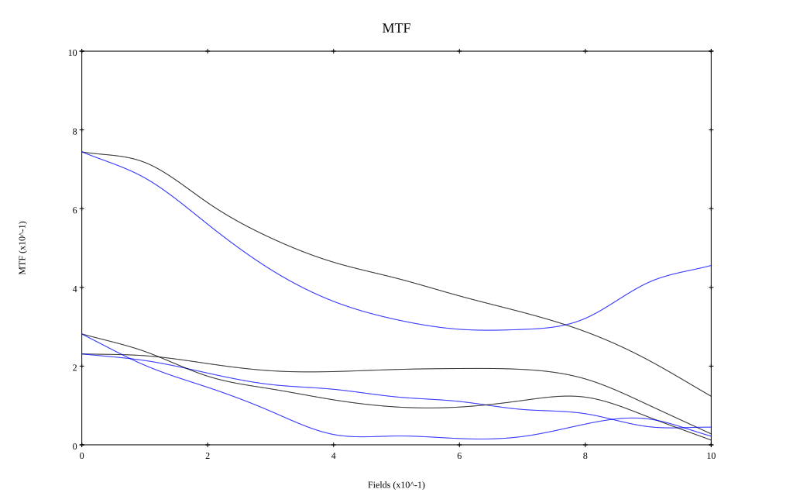

# Asahi Super Takumar 50mm f1.4 (8 elements)
## Patent Information
| Country | Patent Number | Example | Year of Application | Inventors | Organisation | Link |
| ---     | ---           | ---     | ---                 | ---       | ---          | ---  |
|JP | JP-S40-028384 | EX 1 | 1963 | Saburo Matsumoto | Asahi Optical | [link](https://www.j-platpat.inpit.go.jp/c1801/PU/JP-S40-028384/12/en) |
## Surface Data
Note that where glass types are shown the refractive index and abbe number is as per assigned glass type

| ID  | Radius | Thickness | Diameter | nd  | vd  | Glass Make | Glass |
| --- | ---    | ---       | ---      | --- | --- | ---        | ---   |
| 1 | 65.0 | 3.75 | 38.48 | 1.8061 | 40.73 | Hoya | NBFD13 |
| 2 | 560.365 | 0.1 | 38.48 |  |  |  |
| 3 | 22.6 | 5.5 | 32.0 | 1.8061 | 40.73 | Hoya | NBFD13 |
| 4 | 37.9305 | 1.9 | 31.0 |  |  |  |
| 5 | 42.5 | 1.25 | 30.0 | 1.74077 | 27.76 | Hoya | E-FD13 |
| 6 | 16.2885 | 6.5 | 23.5 |  |  |  |
| 7 | AS | 6.0 | 22.9 |  |  |  |
| 8 | -18.4 | 1.0 | 23.0 | 1.74077 | 27.76 | Hoya | E-FD13 |
| 9 | 110.0 | 8.75 | 27.0 | 1.7859 | 43.93 | Hoya | NBFD11 |
| 10 | -16.5 | 1.25 | 27.0 | 1.70154 | 41.15 | Hoya | BAFD7 |
| 11 | -36.4595 | 0.05 | 30.0 |  |  |  |
| 12 | -400.0 | 3.25 | 30.0 | 1.7859 | 43.93 | Hoya | NBFD11 |
| 13 | -44.939 | 0.05 | 30.0 |  |  |  |
| 14 | 300.0 | 2.5 | 30.0 | 1.7859 | 43.93 | Hoya | NBFD11 |
| 15 | -99.2345 | 37.65 | 30.0 |  |  |  |
## Layouts

## Spot Diagrams

## Paraxial Parameters
| parameter | value |
| ---       | ---   |
| effective_focal_length |49.998
| back_focal_length | 37.708
| optical_invariant | 7.58
| object_distance | 1.0E10
| image_distance | 37.708
| power | 0.02
| pp1_H | 36.941
| ppk_H' | -12.29
| ffl_F | -13.057
| fno | 1.4
| enp_dist_P | 22.454
| enp_radius | 17.856
| exp_dist_P' | -32.63
| exp_radius | 25.141
| m | -0
| red | -2.0000847578614724E8
| n_obj | 1
| n_img | 1
| img_ht | 21.223
| obj_ang | 23
| obj_na | 0
| img_na | -0.336|
## Spot Analysis
| Field | Spot Mean Radius | Spot Max Radius |
| ---   | ---              | ---             |
 | Field(x=0.0, y=0.0) | 15.822 | 33.194|
 | Field(x=0.0, y=0.1) | 18.62 | 67.026|
 | Field(x=0.0, y=0.2) | 31.746 | 132.554|
 | Field(x=0.0, y=0.3) | 54.068 | 232.093|
 | Field(x=0.0, y=0.4) | 82.591 | 351.481|
 | Field(x=0.0, y=0.5) | 94.163 | 385.437|
 | Field(x=0.0, y=0.6) | 116.157 | 431.418|
 | Field(x=0.0, y=0.7) | 124.012 | 454.118|
 | Field(x=0.0, y=0.8) | 130.492 | 485.444|
 | Field(x=0.0, y=0.9) | 137.067 | 502.825|
 | Field(x=0.0, y=1.0) | 139.064 | 485.022|
## Geometric MTF

* 10,30,50 cycles/mm
* Black lines represent sagittal, blue tangential
## Resources
* [OpticalBench Compatible Data File, tab delimited](./JP-S40-028384_Example01.txt)
* [Zemax file](./JP-S40-028384_Example01.zmx)
