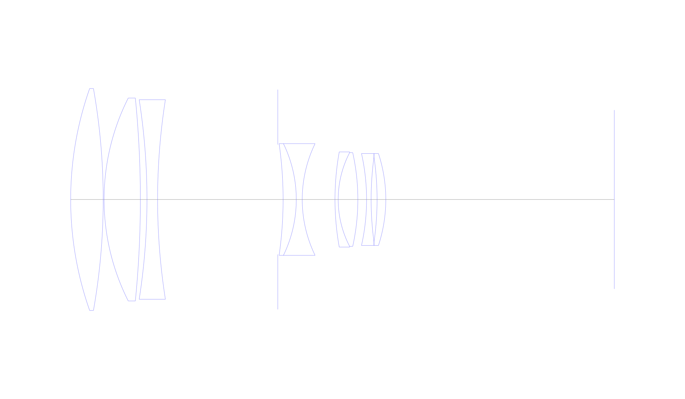
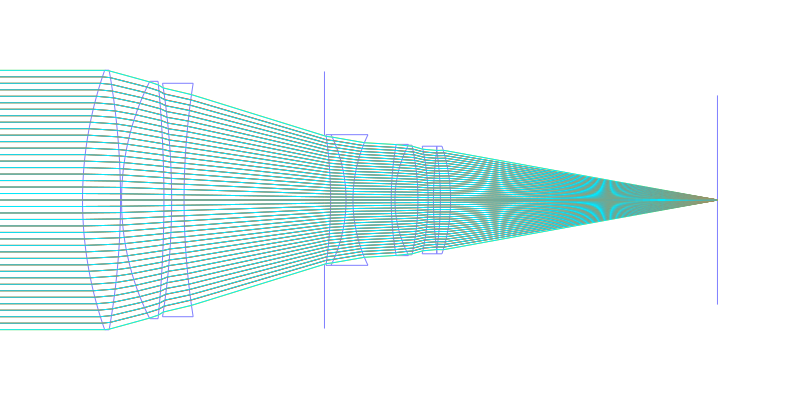
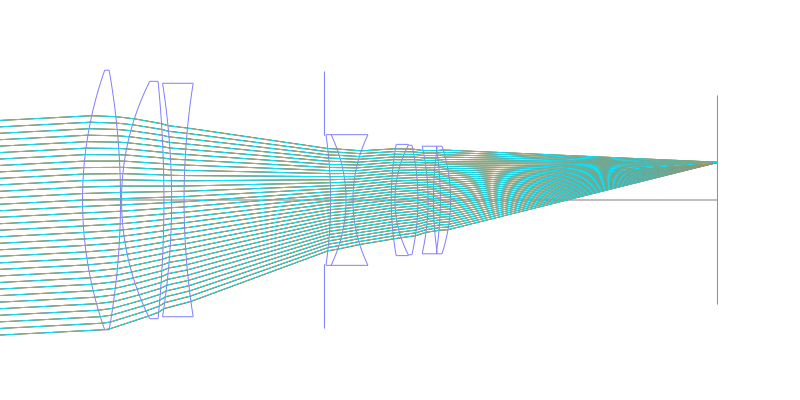
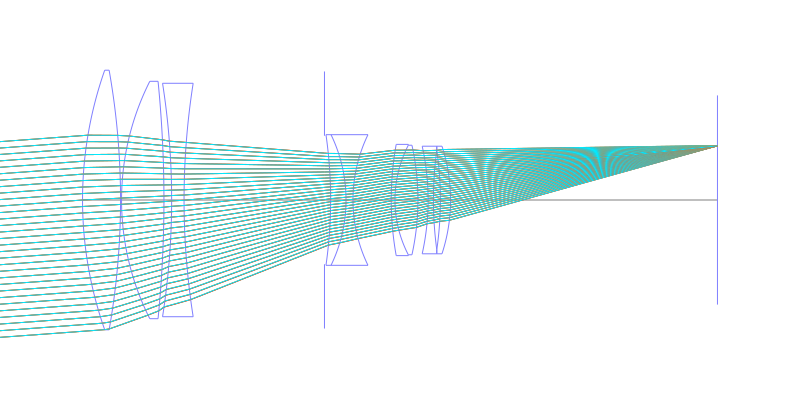
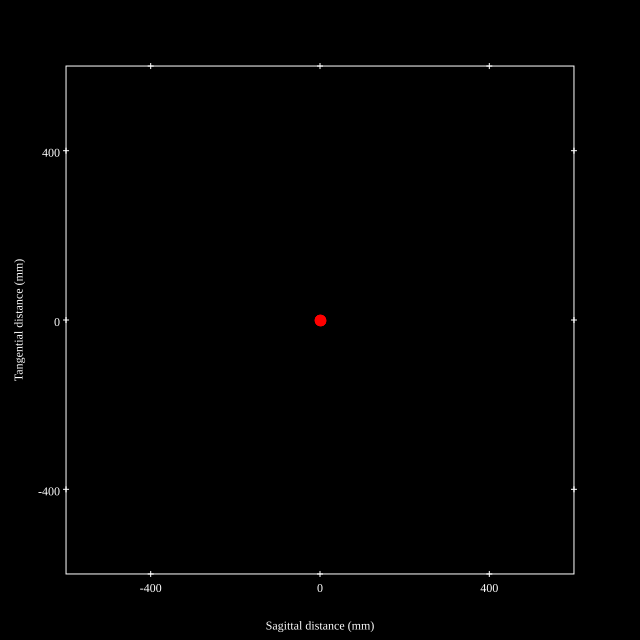
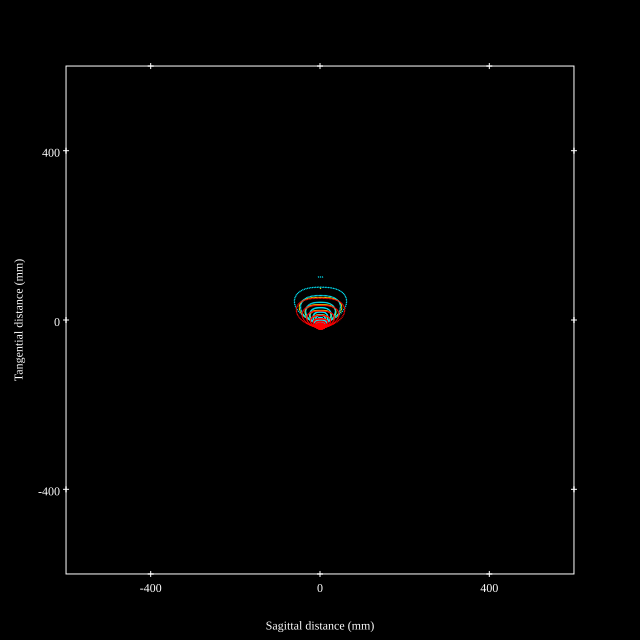
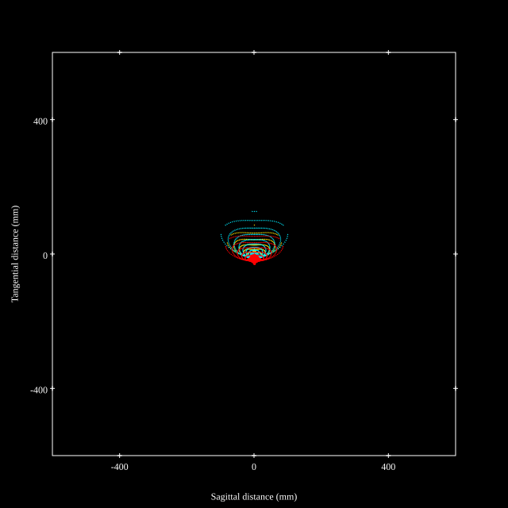
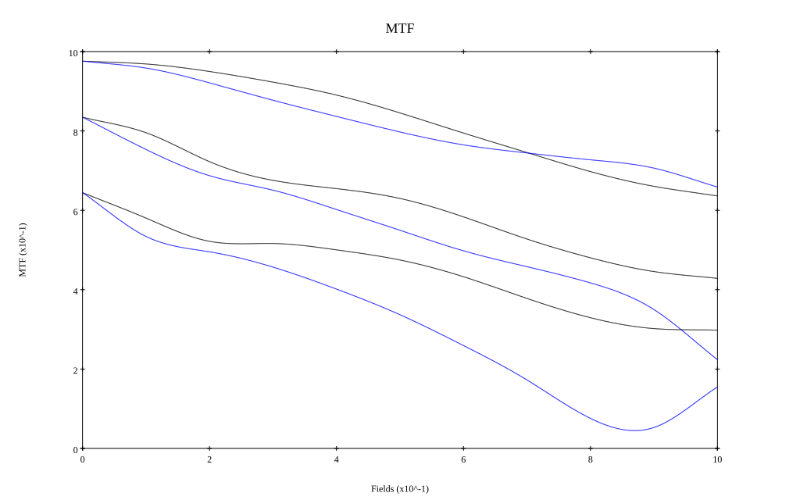
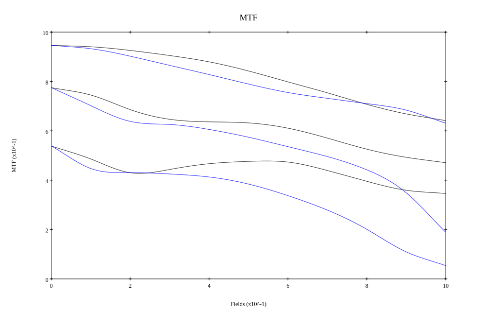

# Tokina AT-X 300mm f2.8 AF
## Patent Information
| Country | Patent Number | Example | Year of Application | Inventors | Organisation | Link |
| ---     | ---           | ---     | ---                 | ---       | ---          | ---  |
|JP | JPS61-215513 | 1 | 1985 | Kazumi Koike | Tokina Optical Co | [link](https://www.j-platpat.inpit.go.jp/c1801/PU/JP-S61-215513/11/en) |
## Surface Data
Note that where glass types are shown the refractive index and abbe number is as per assigned glass type

| ID  | Radius | Thickness | Diameter | nd  | vd  | Glass Make | Glass |
| --- | ---    | ---       | ---      | --- | --- | ---        | ---   |
| 1 | 161.538 | 15.693 | 107.22 | 1.497 | 81.61 | Ohara | FPL51 |
| 2 | -307.317 | 0.42 | 107.22 |  |  |  |
| 3 | 108.882 | 17.508 | 98.05 | 1.456 | 90.32 | Ohara | FPL52 |
| 4 | -495.234 | 3.18 | 98.05 |  |  |  |
| 5 | -311.487 | 5.127 | 96.42 | 1.72047 | 34.71 | Ohara | S-NBH8 |
| 6 | 310.656 | 58.0 | 96.42 |  |  |  |
| 7 | AS | 2.54 | 53.09 |  |  |  |
| 8 | -190.359 | 6.36 | 53.96 | 1.5927 | 35.31 | Ohara | S-FTM16 |
| 9 | -61.848 | 2.871 | 53.96 | 1.49831 | 65.03 | Ohara | BSL3 |
| 10 | 61.848 | 15.804 | 53.96 |  |  |  |
| 11 | 129.744 | 1.539 | 45.95 | 1.6727 | 32.1 | Ohara | S-TIM25 |
| 12 | 49.197 | 9.486 | 45.25 | 1.58913 | 61.14 | Ohara | S-BAL35 |
| 13 | -104.619 | 4.206 | 45.25 |  |  |  |
| 14 | -102.051 | 2.196 | 44.44 | 1.58913 | 61.14 | Ohara | S-BAL35 |
| 15 | 153.282 | 2.871 | 41.06 |  |  |  |
| 16 | -142.38 | 4.206 | 41.06 | 1.71736 | 29.52 | Ohara | S-TIH1 |
| 17 | -71.334 | 110.24 | 44.44 |  |  |  |
## Layouts

## Spot Diagrams

## Paraxial Parameters
| parameter | value |
| ---       | ---   |
| effective_focal_length |299.97
| back_focal_length | 110.239
| optical_invariant | 3.934
| object_distance | 1.0E10
| image_distance | 110.239
| power | 0.003
| pp1_H | -85.712
| ppk_H' | -189.731
| ffl_F | -385.682
| fno | 2.8
| enp_dist_P | 184.298
| enp_radius | 53.57
| exp_dist_P' | -47.631
| exp_radius | 28.193
| m | -0
| red | -3.333666272862284E7
| n_obj | 1
| n_img | 1
| img_ht | 22.028
| obj_ang | 4.2
| obj_na | 0
| img_na | -0.176|
## Spot Analysis
| Field | Spot Mean Radius | Spot Max Radius |
| ---   | ---              | ---             |
 | Field(x=0.0, y=0.0) | 4.409 | 11.957|
 | Field(x=0.0, y=0.1) | 5.471 | 19.766|
 | Field(x=0.0, y=0.2) | 7.354 | 35.646|
 | Field(x=0.0, y=0.3) | 9.611 | 51.756|
 | Field(x=0.0, y=0.4) | 12.268 | 66.363|
 | Field(x=0.0, y=0.5) | 15.119 | 79.705|
 | Field(x=0.0, y=0.6) | 18.266 | 91.87|
 | Field(x=0.0, y=0.7) | 21.512 | 102.858|
 | Field(x=0.0, y=0.8) | 24.787 | 112.584|
 | Field(x=0.0, y=0.9) | 28.097 | 120.889|
 | Field(x=0.0, y=1.0) | 30.275 | 127.975|
## Polychromatic Geometric MTF

* 10,30,50 cycles/mm
* Black lines represent sagittal, blue tangential
* To generate above, MTFs for wavelengths 587.5618(d), 486.1327(F), 656.2725(C) were calculated across 10 fields, and then averaged
## Polychromatic Geometric MTF (Weighted)

* 10,30,50 cycles/mm
* Black lines represent sagittal, blue tangential
* To generate above, MTFs for wavelengths 587.5618(d) wt(1.0), 656.2725(C) wt(0.475), 546.074(e) wt(0.98), 486.1327(F) wt(0.49), 435.8343(g) wt(0.15) were calculated across 10 fields, and then combined using weighted average
## Resources
* [OpticalBench Compatible Data File, tab delimited](./prescription.txt)
* [Zemax file](./JP1986-215513_Example01P.zmx)

Report / Zemax file generated using [Beam42](https://github.com/BeamFour/Beam42) on 2026-04-28
