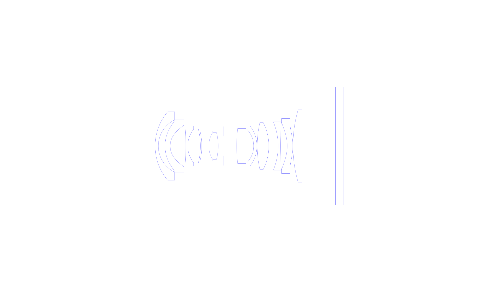
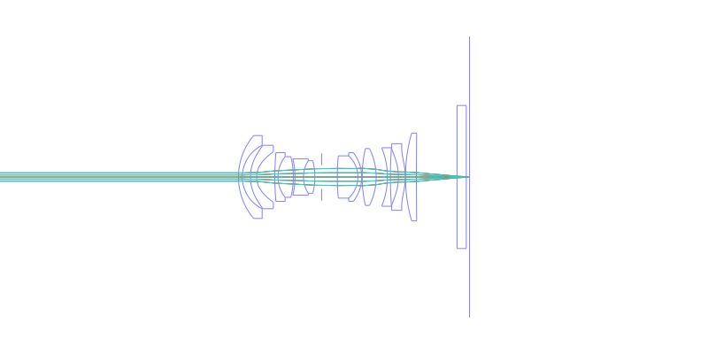
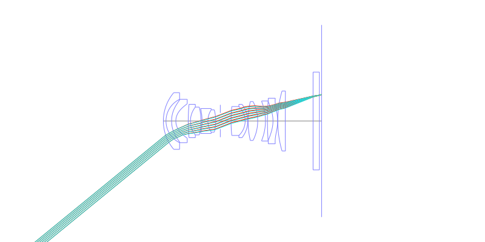
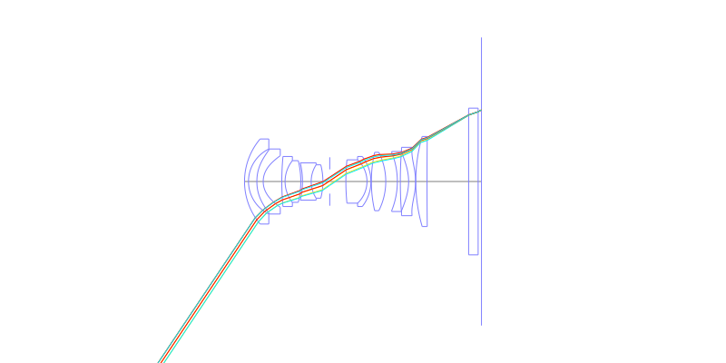
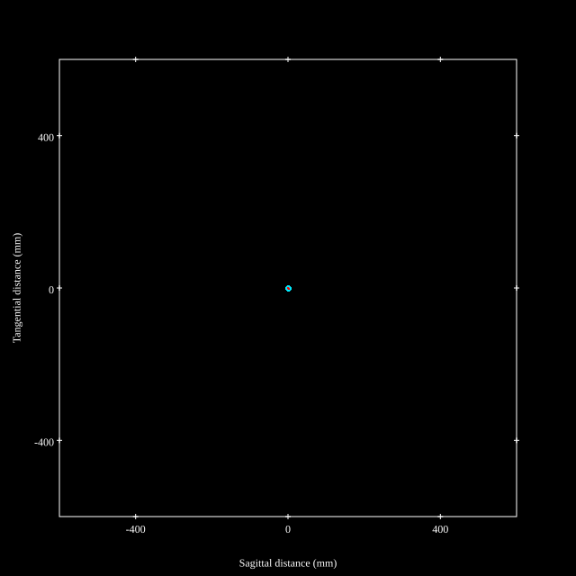
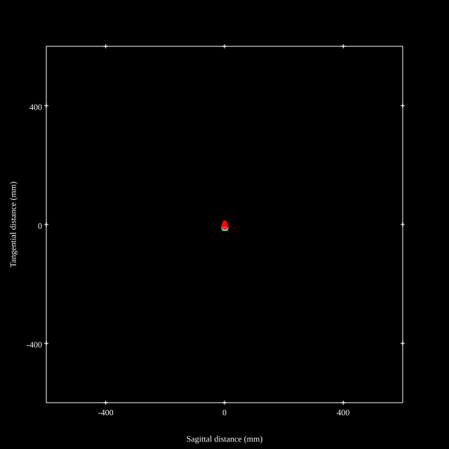
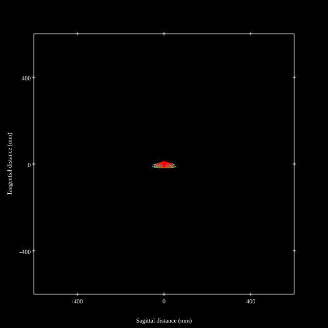
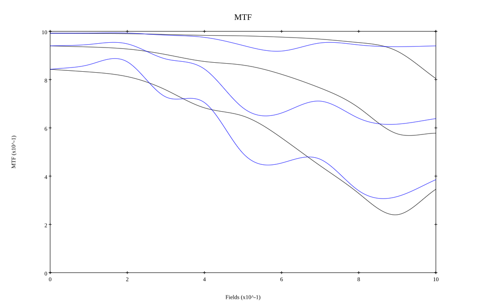
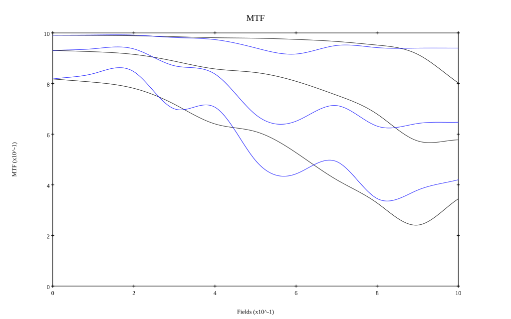

# Viltrox AF 14mm F4 Air by [Zhong Fu](https://www.zhihu.com/people/hui-shou-xiang-lai-xiao-se-chu-64-74)
## Patent Information
| Country | Patent Number | Example | Year of Application | Inventors | Organisation | Link |
| ---     | ---           | ---     | ---                 | ---       | ---          | ---  |
|CN | CN121091494 | 1 | 2024 | Liu Ruijun,Chen Baofeng | Shenzhen Weizhuoshi Technology Co ltd | [link](https://patents.google.com/patent/US3467462A/en) |
## Surface Data
Note that where glass types are shown the refractive index and abbe number is as per assigned glass type

| ID  | Radius | Thickness | Diameter | nd  | vd  | Glass Make | Glass |
| --- | ---    | ---       | ---      | --- | --- | ---        | ---   |
| 1 | 19.73955151272136 | 1.19 | 25.5 | 1.92286 | 20.88 | CDGM | H-ZF62 |
| 2 | 10.84895138501842 | 2.51 | 19.5 |  |  |  |
| 3 | 15.0 | 1.9 | 19.5 | 1.4971 | 81.56 | Hoya | M-FCD1 |
| 4 | 7.12206985313958 | 5.58 | 15.5 |  |  |  |
| 5 | 81.05915090650655 | 0.98 | 15.0 | 1.5928 | 68.34 | CDGM | H-ZPK5 |
| 6 | 10.0 | 4.71 | 12.5 | 1.60311 | 60.6 | CDGM | H-ZK14 |
| 7 | -26.21068696926685 | 0.51 | 12.5 |  |  |  |
| 8 | -24.08202069445009 | 2.61 | 11.2 | 1.6779 | 55.51 | CDGM | H-LAK5A |
| 9 | 9.185 | 3.51 | 10.0 | 1.66426 | 35.48 | CDGM | H-ZBAF4 |
| 10 | -20.04308412015544 | 2.06 | 10.0 |  |  |  |
| 11 | AS | 4.834 | 7.265 |  |  |  |
| 12 | 65.9096482135411 | 6.33 | 13.0 | 1.4565 | 90.27 | CDGM | H-FK71 |
| 13 | -8.896765347251586 | 1.18 | 13.0 | 2.00069 | 25.43 | CDGM | H-ZLAF90 |
| 14 | -12.15907230469094 | 0.13 | 15.0 |  |  |  |
| 15 | 39.0 | 4.32 | 17.5 | 1.4565 | 90.27 | CDGM | H-FK71 |
| 16 | -19.44203901306218 | 3.476 | 17.5 |  |  |  |
| 17 | -23.36501450930343 | 0.89 | 17.5 | 1.78472 | 25.72 | CDGM | H-ZF13 |
| 18 | 126.0 | 2.49 | 18.0 |  |  |  |
| 19 | -15.0 | 2.08 | 17.5 | 1.64 | 23.5 |  |
| 20 | -18.52440014314175 | 0.06 | 20.5 |  |  |  |
| 21 | 48.34758504739384 | 3.38 | 27.0 | 1.5928 | 68.34 | CDGM | H-ZPK5 |
| 22 | 1350.0 | 12.48 | 27.0 |  |  |  |
| 23 | 0.0 | 2.85 | 44.0 | 1.5168 | 64.2 | CDGM | H-K9L |
| 24 | 0.0 | 1.0 | 44.0 |  |  |  |
## Aspherical Data
| ID  | Type | k   | P1 | P2 | P3 | P4 | P5 | P6 | P7 | P8 |
| --- | --- | --- | --- | --- | --- | --- | --- | --- | --- | --- |
| 3| EVEN | -1.5 | 0.0 | 4.272658539519291E-4 | -1.07194338078611E-5 | 1.6098761039355446E-7 | -1.196085301282353E-9 | 7.488977600222982E-13 | 4.0143501679832655E-14 | -1.6526697377914136E-16 |
| 4| EVEN | -4.996170892503505 | 0.0 | 0.0019894999079160705 | -5.534307524924774E-5 | 1.1927186997984528E-6 | -1.436132942030806E-8 | 5.153845442503229E-11 | 4.922302068152039E-13 | -3.852409703353307E-15 |
| 19| EVEN | -1.0781777649700666 | 0.0 | 7.150649973726183E-5 | 4.0974341624808734E-7 | -1.2667528802070456E-8 | 2.7428320491594234E-10 | -4.8000311101372114E-12 | 4.459729083639308E-14 | -1.739090570307389E-16 |
| 20| EVEN | 1.1748774729834421 | 0.0 | 2.0411311608844695E-4 | 2.6907147783294424E-8 | 8.61644006938121E-9 | -1.2747661314763076E-10 | 9.465412648117338E-13 | -3.884508124608846E-15 | 8.284657474843437E-18 |
## Layouts

## Spot Diagrams

## Paraxial Parameters
| parameter | value |
| ---       | ---   |
| effective_focal_length |14.502
| back_focal_length | 0.984
| optical_invariant | 2.676
| object_distance | 1.0E10
| image_distance | 0.984
| power | 0.069
| pp1_H | 20.518
| ppk_H' | -13.519
| ffl_F | 6.015
| fno | 4.048
| enp_dist_P | 10.937
| enp_radius | 1.791
| exp_dist_P' | -41.765
| exp_radius | 5.279
| m | -0
| red | -6.895489376789422E8
| n_obj | 1
| n_img | 1
| img_ht | 21.663
| obj_ang | 56.2
| obj_na | 0
| img_na | -0.123|
## Spot Analysis
| Field | Spot Mean Radius | Spot Max Radius |
| ---   | ---              | ---             |
 | Field(x=0.0, y=0.0) | 2.515 | 5.606|
 | Field(x=0.0, y=0.1) | 2.551 | 8.065|
 | Field(x=0.0, y=0.2) | 2.694 | 10.015|
 | Field(x=0.0, y=0.3) | 3.53 | 12.013|
 | Field(x=0.0, y=0.4) | 4.216 | 18.879|
 | Field(x=0.0, y=0.5) | 6.096 | 22.827|
 | Field(x=0.0, y=0.6) | 7.334 | 28.908|
 | Field(x=0.0, y=0.7) | 6.208 | 19.864|
 | Field(x=0.0, y=0.8) | 6.939 | 20.35|
 | Field(x=0.0, y=0.9) | 8.595 | 30.89|
 | Field(x=0.0, y=1.0) | 13.005 | 55.398|
## Polychromatic Geometric MTF

* 10,30,50 cycles/mm
* Black lines represent sagittal, blue tangential
* To generate above, MTFs for wavelengths 587.5618(d), 486.1327(F), 656.2725(C) were calculated across 10 fields, and then averaged
## Polychromatic Geometric MTF (Weighted)

* 10,30,50 cycles/mm
* Black lines represent sagittal, blue tangential
* To generate above, MTFs for wavelengths 587.5618(d) wt(1.0), 656.2725(C) wt(0.475), 546.074(e) wt(0.98), 486.1327(F) wt(0.49), 435.8343(g) wt(0.15) were calculated across 10 fields, and then combined using weighted average
## Resources
* [OpticalBench Compatible Data File, tab delimited](./prescription.txt)
* [Zemax file](./CN121091494_Example01ZF.zmx)

Report / Zemax file generated using [Beam42](https://github.com/BeamFour/Beam42) on 2026-03-01
