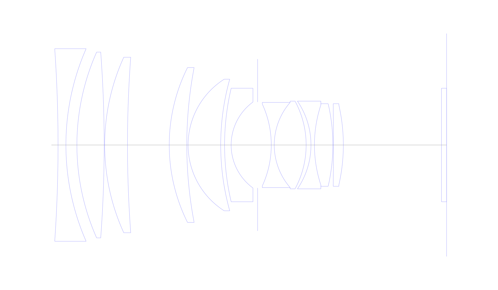
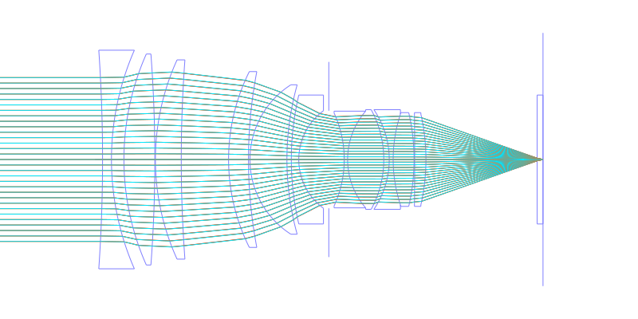
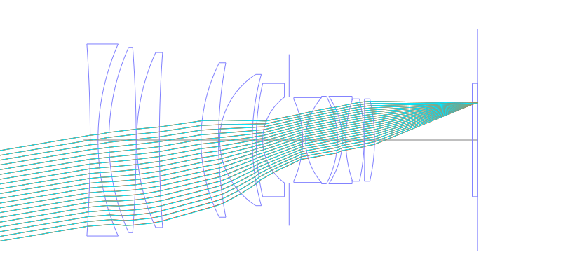
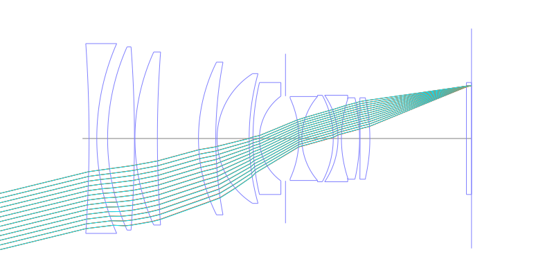
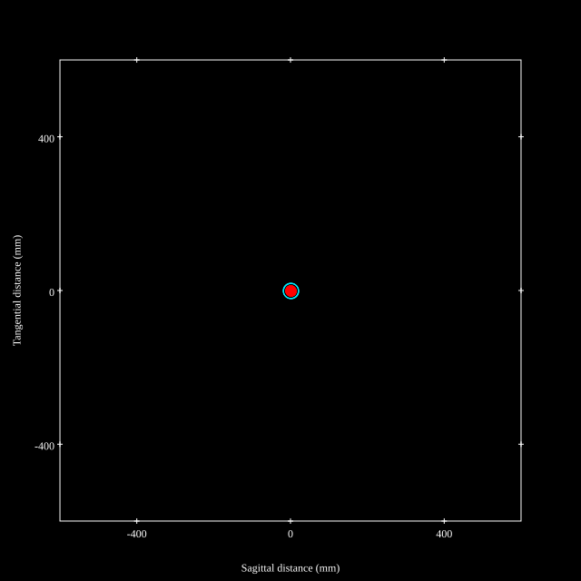
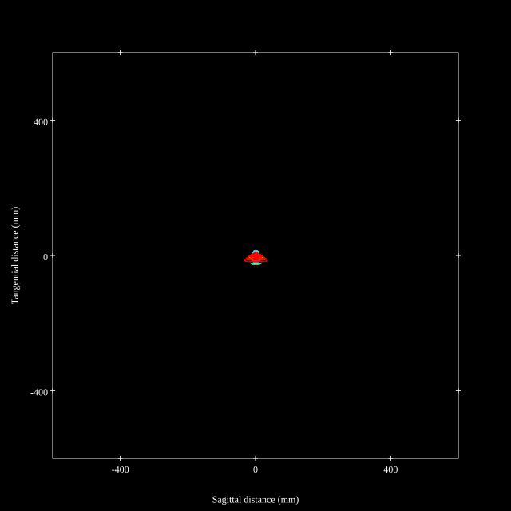
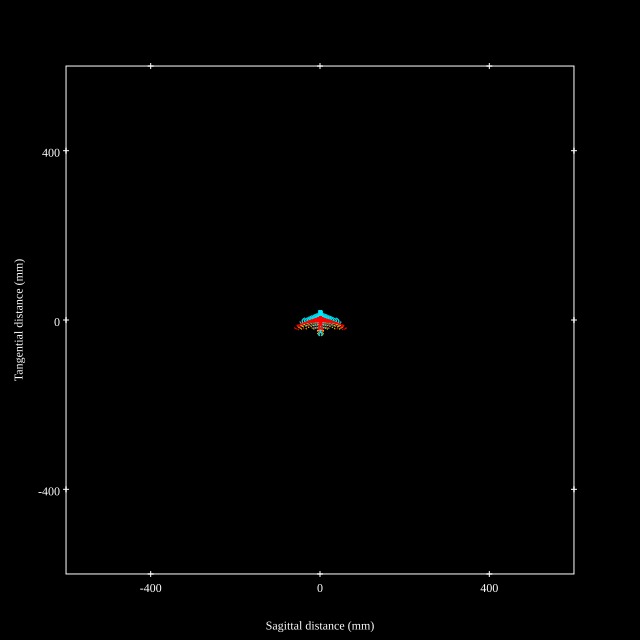
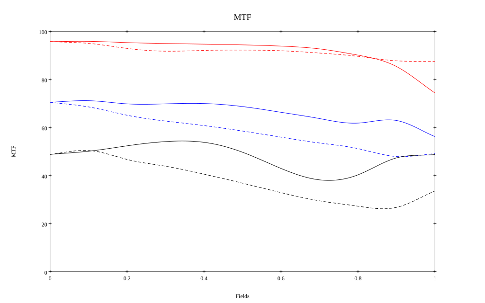
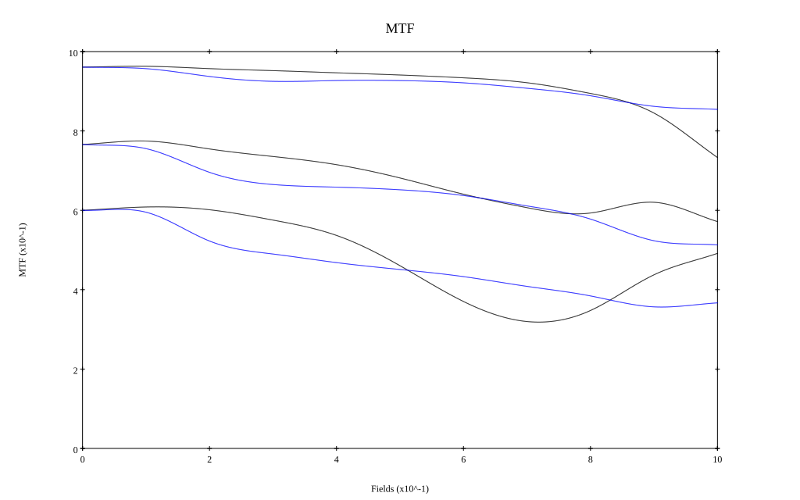

# Zeiss Otus 85mm f1.4 Reverse Engineered by [Zhong Fu](https://zhuanlan.zhihu.com/p/2005716764328219465)
## Surface Data
Note that where glass types are shown the refractive index and abbe number is as per assigned glass type

| ID  | Radius | Thickness | Diameter | nd  | vd  | Glass Make | Glass |
| --- | ---    | ---       | ---      | --- | --- | ---        | ---   |
| 1 | -540.59 | 3.04 | 74.6 | 1.6134 | 44.27 | Ohara | S-NBM51 |
| 2 | 92.96 | 4.25 | 74.6 |  |  |  |
| 3 | 88.6548 | 10.55 | 72.0 | 1.43875 | 94.95 | Ohara | S-FPL53 |
| 4 | -484.08 | 0.2 | 72.0 |  |  |  |
| 5 | 82.0 | 8.82 | 68.0 | 1.497 | 81.55 | Ohara | S-FPL51 |
| 6 | 464.0 | 16.15 | 68.0 |  |  |  |
| 7 | 67.15 | 6.79 | 60.0 | 1.90315 | 29.84 | Hoya | TAFD20 |
| 8 | 160.0 | 0.5 | 60.0 |  |  |  |
| 9 | 30.256 | 12.62 | 51.0 | 1.43875 | 94.95 | Ohara | S-FPL53 |
| 10 | 94.82 | 1.5 | 51.0 |  |  |  |
| 11 | 96.16 | 2.54 | 44.0 | 1.62004 | 36.26 | Ohara | S-TIM2 |
| 12 | 20.66 | 10.25 | 33.3 |  |  |  |
| 13 | AS | 5.269 | 33.3 |  |  |  |
| 14 | -38.0 | 1.15 | 31.712 | 1.65412 | 39.68 | Ohara | S-NBH5 |
| 15 | 25.22 | 12.34 | 33.0 | 1.72916 | 54.68 | Ohara | S-LAL18 |
| 16 | -35.79 | 1.87 | 34.0 |  |  |  |
| 17 | -30.19 | 1.34 | 34.0 | 1.673 | 38.26 | Ohara | S-NBH52V |
| 18 | 49.638 | 7.13 | 31.0 | 1.834 | 37.16 | Ohara | S-LAH60 |
| 19 | -70.935 | 0.2 | 32.0 |  |  |  |
| 20 | 0.0 | 3.85 | 32.0 | 1.76802 | 49.24 | Hoya | M-TAF101 |
| 21 | -70.0 | 37.95 | 31.0 |  |  |  |
| 22 | 0.0 | 2.0 | 44.0 | 1.51633 | 64.15 | Ohara | BSL7 |
| 23 | 0.0 | 0.0 | 44.0 |  |  |  |
## Aspherical Data
| ID  | Type | k   | P1 | P2 | P3 | P4 | P5 |
| --- | --- | --- | --- | --- | --- | --- | --- |
| 20| EVEN | 0.0 | 0.0 | -1.959168543441034E-6 | 3.6134295458306448E-9 | -1.7976536304808032E-11 | 6.74926516280178E-14 |
| 21| EVEN | 0.0 | 0.0 | -5.392035045844329E-7 | 2.618799037351245E-9 | -1.4532568956599672E-11 | 6.241701E-14 |
## Layouts

## Spot Diagrams

## Paraxial Parameters
| parameter | value |
| ---       | ---   |
| effective_focal_length |84.533
| back_focal_length | 0.016
| optical_invariant | 7.606
| object_distance | 1.0E10
| image_distance | 0.016
| power | 0.012
| pp1_H | 82.61
| ppk_H' | -84.516
| ffl_F | -1.923
| fno | 1.36
| enp_dist_P | 91.388
| enp_radius | 31.082
| exp_dist_P' | -76.548
| exp_radius | 28.158
| m | -0
| red | -1.182976352377385E8
| n_obj | 1
| n_img | 1
| img_ht | 20.685
| obj_ang | 13.75
| obj_na | 0
| img_na | -0.345|
## Spot Analysis
| Field | Spot Mean Radius | Spot Max Radius |
| ---   | ---              | ---             |
 | Field(x=0.0, y=0.0) | 7.158 | 19.731|
 | Field(x=0.0, y=0.1) | 6.96 | 22.192|
 | Field(x=0.0, y=0.2) | 7.982 | 29.815|
 | Field(x=0.0, y=0.3) | 8.706 | 35.779|
 | Field(x=0.0, y=0.4) | 8.34 | 34.873|
 | Field(x=0.0, y=0.5) | 8.296 | 31.399|
 | Field(x=0.0, y=0.6) | 8.793 | 32.018|
 | Field(x=0.0, y=0.7) | 9.455 | 35.663|
 | Field(x=0.0, y=0.8) | 10.829 | 40.438|
 | Field(x=0.0, y=0.9) | 12.935 | 51.153|
 | Field(x=0.0, y=1.0) | 16.727 | 63.425|
## Polychromatic Geometric MTF

* 10,30,50 cycles/mm
* Black lines represent sagittal, blue tangential
* To generate above, MTFs for wavelengths 587.5618(d), 486.1327(F), 656.2725(C) were calculated across 10 fields, and then averaged
## Polychromatic Geometric MTF (Weighted)

* 10,30,50 cycles/mm
* Black lines represent sagittal, blue tangential
* To generate above, MTFs for wavelengths 587.5618(d) wt(1.0), 656.2725(C) wt(0.475), 546.074(e) wt(0.98), 486.1327(F) wt(0.49), 435.8343(g) wt(0.15) were calculated across 10 fields, and then combined using weighted average
## Resources
* [OpticalBench Compatible Data File, tab delimited](./prescription.txt)
* [Zemax file](./Otus85.zmx)

Report / Zemax file generated using [Beam42](https://github.com/BeamFour/Beam42) on 2026-03-01
