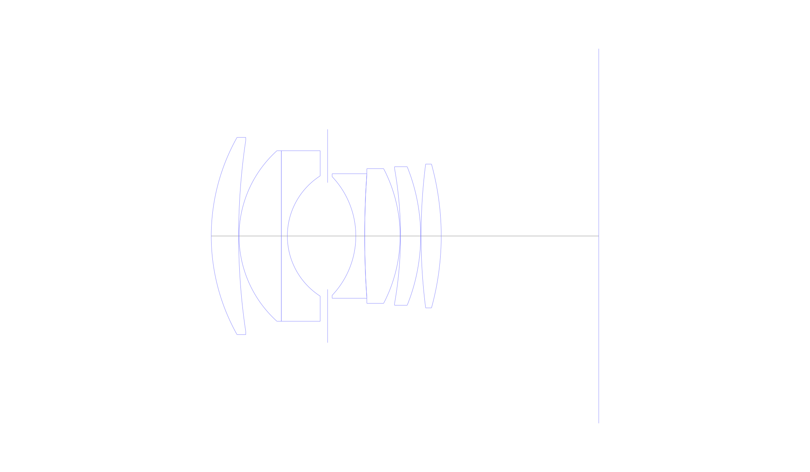
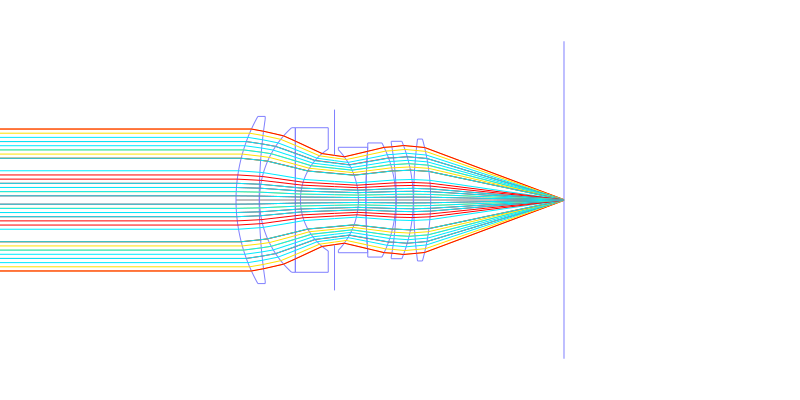
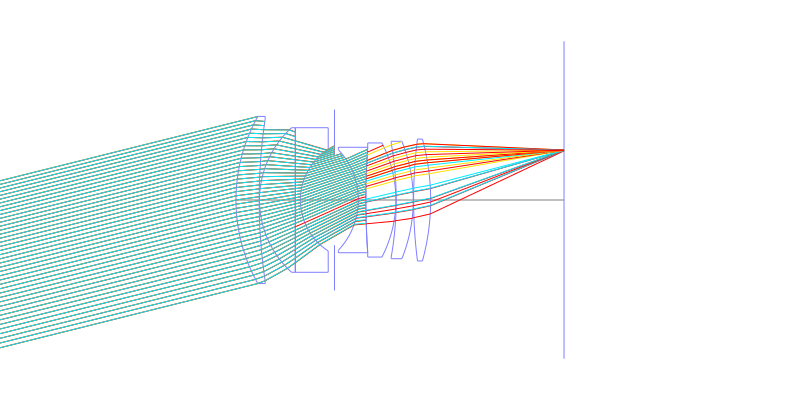
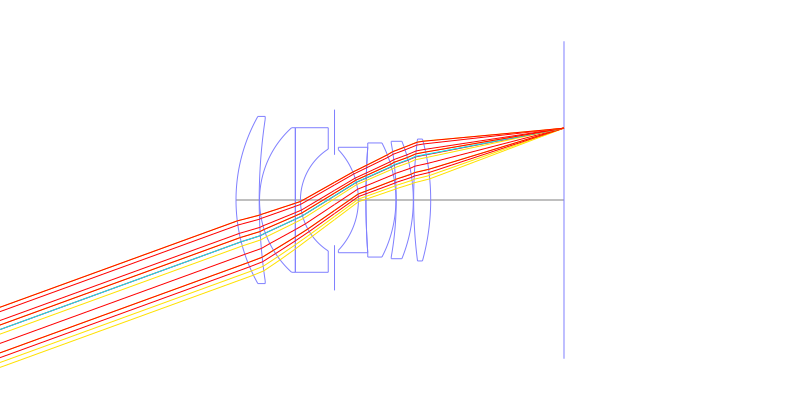
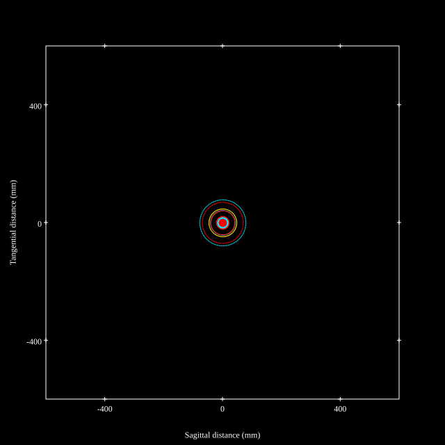
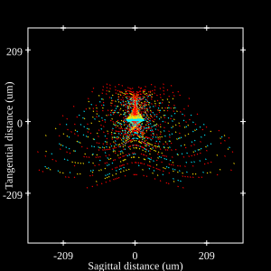
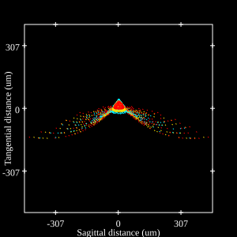
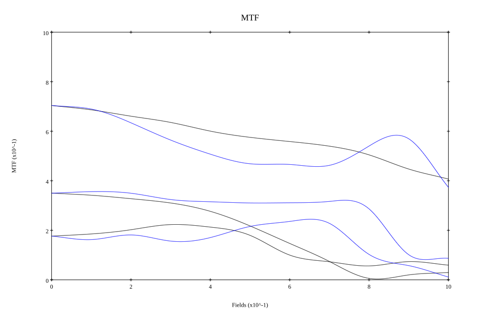
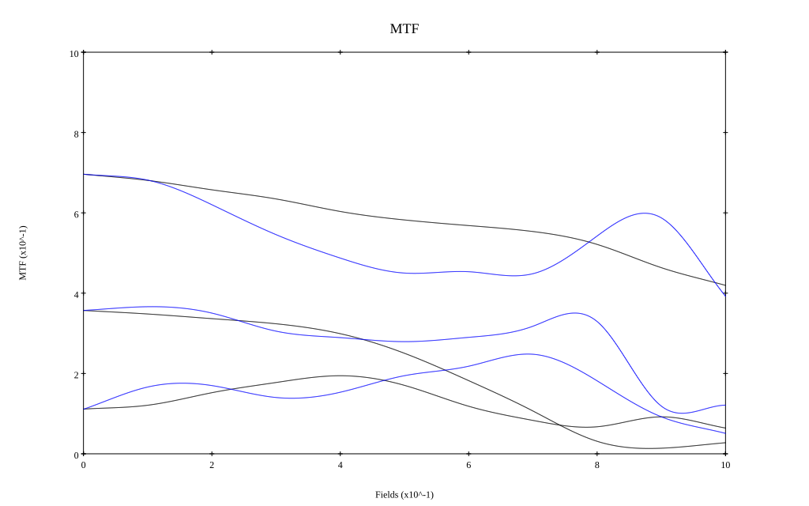
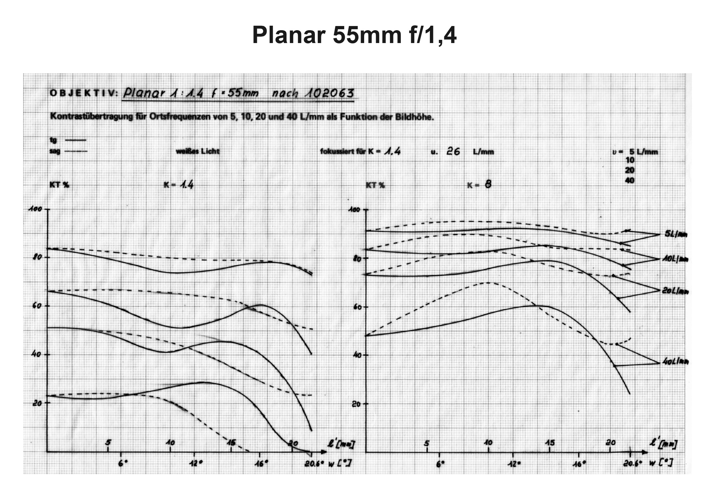

# Zeiss Planar 55mm f1.4 for Contarex
## Patent Information
| Country | Patent Number | Example | Year of Application | Inventors | Organisation | Link |
| ---     | ---           | ---     | ---                 | ---       | ---          | ---  |
|DE | DE 1170157 | EX 1 | 1959 | BERGER JOHANNES, LANGE DR. GUENTHER | Carl Zeiss | [link](https://worldwide.espacenet.com/patent/search?q=pn%3DDE1170157B) |
## Surface Data
Note that where glass types are shown the refractive index and abbe number is as per assigned glass type

| ID  | Radius | Thickness | Diameter | nd  | vd  | Glass Make | Glass |
| --- | ---    | ---       | ---      | --- | --- | ---        | ---   |
| 1 | 46.563 | 6.3195 | 45.56 | 1.717 | 47.96 | Schott | N-LAF3 |
| 2 | 149.38 | 0.0935 | 44.1 |  |  |  |
| 3 | 26.565 | 9.757 | 39.4 | 1.62299 | 58.06 | Schott | SK15 |
| 4 | 0.0 | 0.0 | 39.4 |  |  |  |
| 5 | 0.0 | 1.3915 | 39.4 | 1.57501 | 41.49 | Schott | LF7 |
| 6 | 16.522 | 9.287 | 27.78 |  |  |  |
| 7 | AS | 6.509 | 24.638 |  |  |  |
| 8 | -19.921 | 2.046 | 27.4 | 1.80518 | 25.39 | Schott | SFL6 |
| 9 | 204.996 | 0.0 | 28.74 |  |  |  |
| 10 | 204.996 | 8.173 | 28.74 | 1.78443 | 43.95 | Schott | LAFN10 |
| 11 | -33.6875 | 0.0935 | 31.1 |  |  |  |
| 12 | -88.979 | 4.6475 | 31.1 | 1.78443 | 43.95 | Schott | LAFN10 |
| 13 | -42.713 | 0.0935 | 32.0 |  |  |  |
| 14 | 131.23 | 4.6475 | 33.22 | 1.717 | 47.96 | Schott | N-LAF3 |
| 15 | -62.5405 | 36.33 | 33.22 |  |  |  |
## Layouts

## Spot Diagrams

## Paraxial Parameters
| parameter | value |
| ---       | ---   |
| effective_focal_length |55.004
| back_focal_length | 36.472
| optical_invariant | 7.15
| object_distance | 1.0E10
| image_distance | 36.472
| power | 0.018
| pp1_H | 50.146
| ppk_H' | -18.532
| ffl_F | -4.858
| fno | 1.4
| enp_dist_P | 34.541
| enp_radius | 19.644
| exp_dist_P' | -40.176
| exp_radius | 27.425
| m | -0
| red | -1.8180516420083755E8
| n_obj | 1
| n_img | 1
| img_ht | 20.02
| obj_ang | 20
| obj_na | 0
| img_na | -0.336|
## Spot Analysis
| Field | Spot Mean Radius | Spot Max Radius |
| ---   | ---              | ---             |
 | Field(x=0.0, y=0.0) | 27.532 | 85.672|
 | Field(x=0.0, y=0.1) | 33.756 | 112.158|
 | Field(x=0.0, y=0.2) | 46.477 | 167.576|
 | Field(x=0.0, y=0.3) | 59.911 | 258.815|
 | Field(x=0.0, y=0.4) | 72.9 | 295.039|
 | Field(x=0.0, y=0.5) | 77.493 | 281.316|
 | Field(x=0.0, y=0.6) | 73.451 | 308.694|
 | Field(x=0.0, y=0.7) | 72.135 | 336.13|
 | Field(x=0.0, y=0.8) | 72.284 | 353.401|
 | Field(x=0.0, y=0.9) | 73.765 | 377.556|
 | Field(x=0.0, y=1.0) | 71.752 | 344.51|
## Polychromatic Geometric MTF

* 10,30,50 cycles/mm
* Black lines represent sagittal, blue tangential
* To generate above, MTFs for wavelengths 587.5618(d), 486.1327(F), 656.2725(C) were calculated across 10 fields, and then averaged
## Polychromatic Geometric MTF (Weighted)

* 10,30,50 cycles/mm
* Black lines represent sagittal, blue tangential
* To generate above, MTFs for wavelengths 587.5618(d) wt(1.0), 656.2725(C) wt(0.475), 546.074(e) wt(0.98), 486.1327(F) wt(0.49), 435.8343(g) wt(0.15) were calculated across 10 fields, and then combined using weighted average
## Zeiss MTF
Courtesy Marco Cavina:

## Resources
* [OpticalBench Compatible Data File, tab delimited](./DE01170157_Example01.txt)
* [Zemax file](./DE01170157_Example01.zmx)
