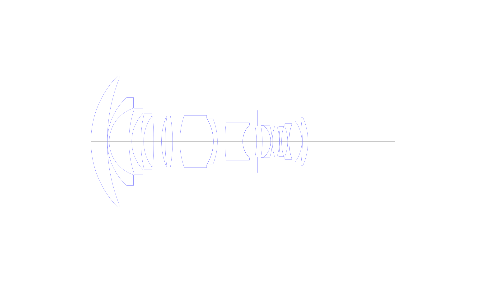
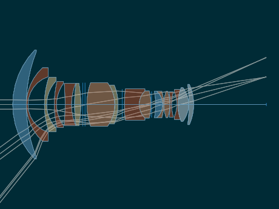
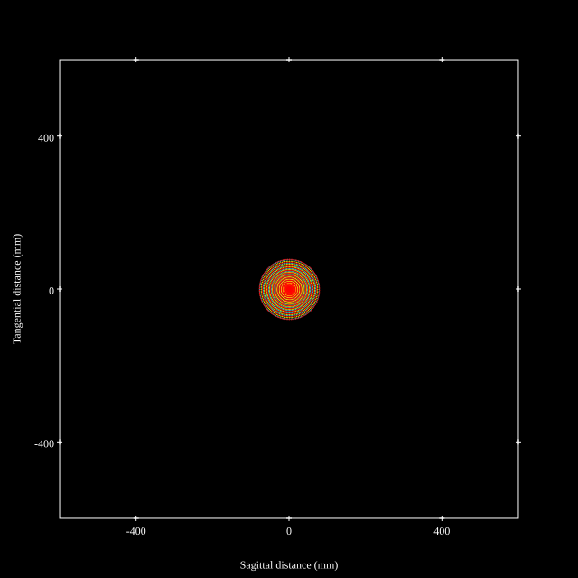
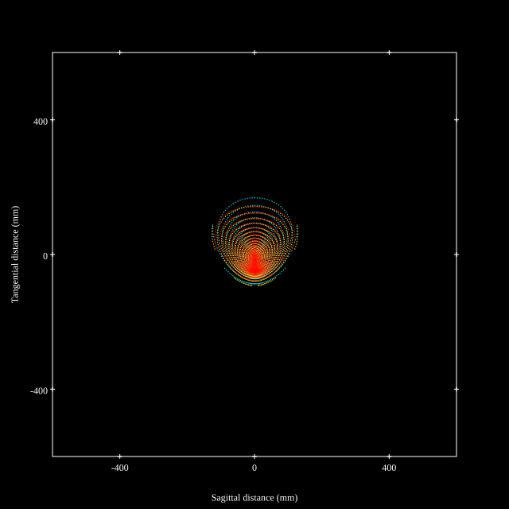
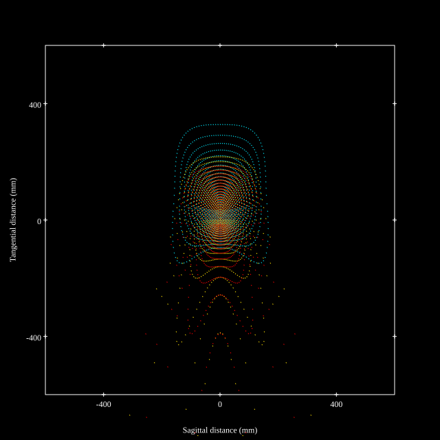
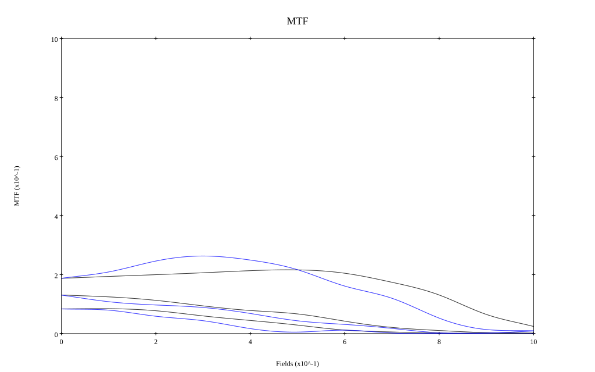

## Surface Data
Note that where glass types are shown the refractive index and abbe number is as per assigned glass type

| ID  | Radius | Thickness | Diameter | nd  | vd  | Glass Make | Glass |
| --- | ---    | ---       | ---      | --- | --- | ---        | ---   |
| 1 | 50.2529 | 8.7 | 69.88 | 1.62 | 62.19 | Hoya | ADC1 |
| 2 | 92.0163 | 0.05 | 67.5 |  |  |  |
| 3 | 32.0126 | 1.0 | 47.04 | 1.874 | 35.26 | Ohara | LAH75 |
| 4 | 18.6988 | 10.51 | 35.58 |  |  |  |
| 5 | 54.5994 | 1.5 | 35.0 | 1.92286 | 21.29 | Ohara | PBH71 |
| 6 | 21.9437 | 4.85 | 30.22 |  |  |  |
| 7 | 62.7726 | 1.5 | 29.62 | 1.883 | 40.81 | Hoya | TAFD30 |
| 8 | 23.1902 | 5.38 | 27.04 |  |  |  |
| 9 | -176.8511 | 4.15 | 26.98 | 1.757 | 47.82 | Ohara | S-LAM54 |
| 10 | 35.9626 | 1.92 | 26.98 |  |  |  |
| 11 | 97.3607 | 4.0 | 27.24 | 1.92286 | 21.29 | Ohara | PBH71 |
| 12 | -77.8342 | 1.18 | 27.24 |  |  |  |
| 13 | 0.0 | 1.5 | 27.86 |  |  |  |
| 14 | 0.0 | 1.18 | 27.86 |  |  |  |
| 15 | 42.2118 | 17.87 | 27.86 | 1.65016 | 39.39 | Ohara | BAH30 |
| 16 | -23.54 | 0.01 | 24.92 |  |  |  |
| 17 | -23.53 | 2.15 | 24.92 | 1.92286 | 21.29 | Ohara | PBH71 |
| 18 | -32.4246 | 2.51 | 24.92 |  |  |  |
| 19 | FS | 1.49 | 19.6 |  |  |  |
| 20 | 78.278 | 9.49 | 20.0 | 1.883 | 40.81 | Hoya | TAFD30 |
| 21 | 12.2811 | 0.0 | 17.44 |  |  |  |
| 22 | 12.2811 | 7.404 | 17.44 | 1.6445 | 40.82 | Ohara | BPH35 |
| 23 | -40.166 | 0.5 | 17.44 |  |  |  |
| 24 | AS | 2.56 | 16.666 |  |  |  |
| 25 | -45.2866 | 4.5 | 17.02 | 1.62 | 62.19 | Hoya | ADC1 |
| 26 | -11.543 | 0.0 | 17.02 |  |  |  |
| 27 | -11.543 | 0.74 | 16.92 | 1.7185 | 33.52 | Ohara | BPH45 |
| 28 | -29.6646 | 0.06 | 16.76 |  |  |  |
| 29 | 26.5153 | 3.84 | 16.76 | 1.65052 | 38.04 | Hoya | ATF2 |
| 30 | -25.9265 | 0.18 | 16.16 |  |  |  |
| 31 | -56.0023 | 0.96 | 16.16 | 1.874 | 35.26 | Ohara | LAH75 |
| 32 | 29.9968 | 3.25 | 16.16 |  |  |  |
| 33 | -21.5144 | 0.69 | 15.94 | 1.883 | 40.81 | Hoya | TAFD30 |
| 34 | 28.9861 | 0.01 | 19.16 |  |  |  |
| 35 | 29.0109 | 6.89 | 19.16 | 1.497 | 81.61 | Ohara | FPL51 |
| 36 | -18.0911 | 0.25 | 21.68 |  |  |  |
| 37 | -95.1794 | 3.0 | 24.5 | 1.497 | 81.61 | Ohara | FPL51 |
| 38 | -31.5296 | 46.43 | 25.84 |  |  |  |
## Layouts

## Spot Diagrams

## Paraxial Parameters
| parameter | value |
| ---       | ---   |
| effective_focal_length |24.417
| back_focal_length | 46.433
| optical_invariant | 4.204
| object_distance | 1.0E10
| image_distance | 46.433
| power | 0.041
| pp1_H | 48.188
| ppk_H' | 22.016
| ffl_F | 23.772
| fno | 3.65
| enp_dist_P | 31.918
| enp_radius | 3.345
| exp_dist_P' | -26.745
| exp_radius | 10.025
| m | -0
| red | -4.095547869061514E8
| n_obj | 1
| n_img | 1
| img_ht | 30.691
| obj_ang | 51.495
| obj_na | 0
| img_na | -0.136|
## Spot Analysis
| Field | Spot Mean Radius | Spot Max Radius |
| ---   | ---              | ---             |
 | Field(x=0.0, y=0.0) | 44.984 | 78.478|
 | Field(x=0.0, y=0.1) | 46.092 | 90.424|
 | Field(x=0.0, y=0.2) | 47.32 | 103.64|
 | Field(x=0.0, y=0.3) | 50.036 | 123.035|
 | Field(x=0.0, y=0.4) | 54.753 | 137.048|
 | Field(x=0.0, y=0.5) | 57.94 | 142.527|
 | Field(x=0.0, y=0.6) | 62.906 | 150.267|
 | Field(x=0.0, y=0.7) | 70.153 | 169.629|
 | Field(x=0.0, y=0.8) | 82.035 | 204.599|
 | Field(x=0.0, y=0.9) | 118.706 | 1368.371|
 | Field(x=0.0, y=1.0) | 158.658 | 1641.671|
## Geometric MTF

* 10,30,50 cycles/mm
* Black lines represent sagittal, blue tangential
## Resources
* [OpticalBench Compatible Data File, tab delimited](./US005742439_Example01.txt)
* [Zemax file](./US005742439_Example01.zmx)
