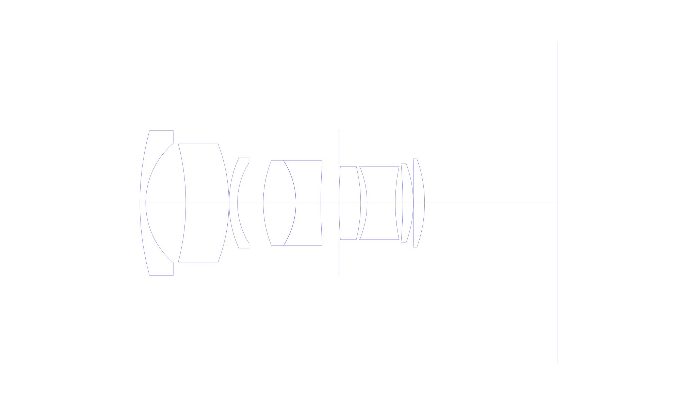
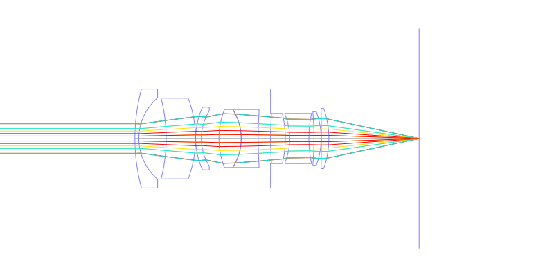
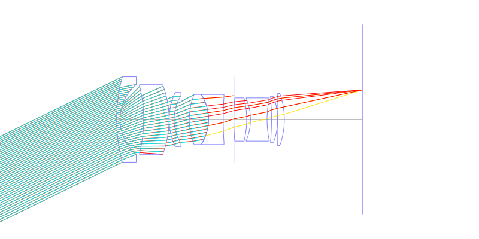
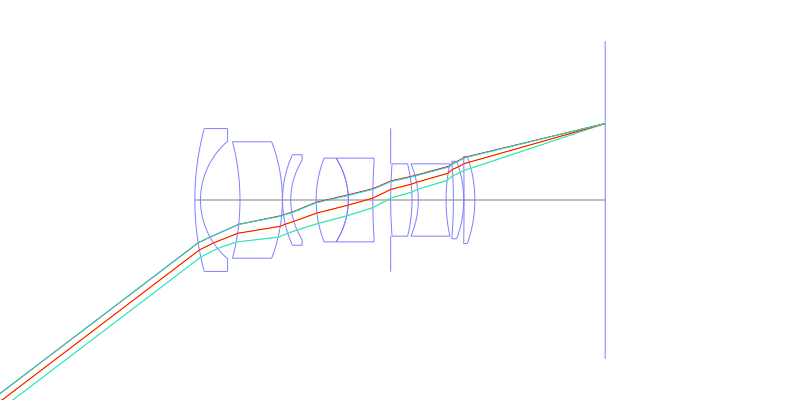
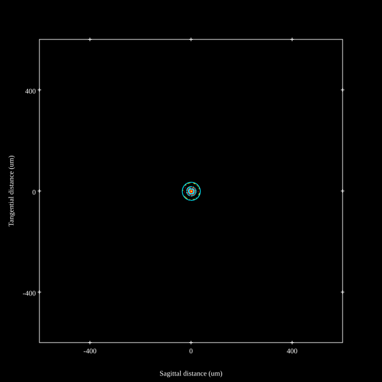
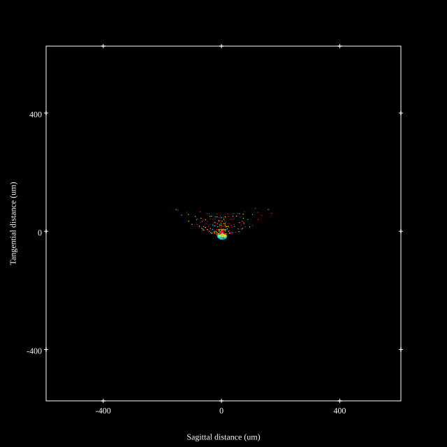
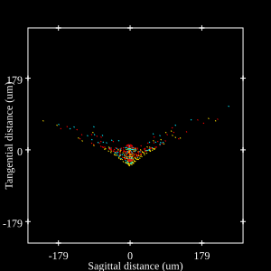

# Zeiss Contax Distagon 28mm f2 T* for Contax/Yashica
## Patent Information
| Country | Patent Number | Example | Year of Application | Inventors | Organisation | Link |
| ---     | ---           | ---     | ---                 | ---       | ---          | ---  |
|US | US3958864 | EX 12 | 1973 | Erhard Glatzel | Carl Zeiss AG | [link](https://patents.google.com/patent/US3958864A/en) |
## Surface Data
Note that where glass types are shown the refractive index and abbe number is as per assigned glass type

| ID  | Radius | Thickness | Diameter | nd  | vd  | Glass Make | Glass |
| --- | ---    | ---       | ---      | --- | --- | ---        | ---   |
| 1 | 74.49568 | 1.545796 | 38.86 | 1.63854 | 55.42 | Schott | N-SK18 |
| 2 | 20.99552 | 10.742788 | 31.96 |  |  |  |
| 3 | -63.13272 | 11.540004 | 31.7 | 1.66446 | 36.0 | Schott | N-BASF2 |
| 4 | -44.695 | 0.048608 | 31.7 |  |  |  |
| 5 | 29.44508 | 2.236052 | 24.62 | 1.744 | 44.72 | Schott | LAF2 |
| 6 | 20.39968 | 6.912332 | 21.64 |  |  |  |
| 7 | 30.96548 | 8.749776 | 22.8 | 1.744 | 44.72 | Schott | LAF2 |
| 8 | -21.14728 | 0.0 | 22.8 |  |  |  |
| 9 | -21.14728 | 6.669292 | 22.8 | 1.60562 | 43.93 | Schott | BAF4 |
| 10 | 158.585 | 4.860996 | 20.65 |  |  |  |
| 11 | AS | 0.0 | 19.49 |  |  |  |
| 12 | 131.52888 | 5.804036 | 19.68 | 1.72003 | 50.62 | Schott | N-LAK10 |
| 13 | -40.9976 | 1.71108 | 19.68 |  |  |  |
| 14 | -25.13336 | 7.55398 | 19.68 | 1.80518 | 25.36 | Schott | N-SF6 |
| 15 | 47.00388 | 2.002728 | 19.68 |  |  |  |
| 16 | -122.39024 | 2.79944 | 21.08 | 1.713 | 53.83 | Schott | N-LAK8 |
| 17 | -30.3044 | 0.097216 | 21.08 |  |  |  |
| 18 | -708.3636 | 2.945768 | 23.7 | 1.78831 | 47.47 | Schott | LAFN21 |
| 19 | -35.24808 | 35.47 | 23.7 |  |  |  |
## Layouts

## Spot Diagrams

## Paraxial Parameters
| parameter | value |
| ---       | ---   |
| effective_focal_length |27.999
| back_focal_length | 35.523
| optical_invariant | 5.069
| object_distance | 1.0E10
| image_distance | 35.47
| power | 0.036
| pp1_H | 38.303
| ppk_H' | -7.524
| ffl_F | 10.303
| fno | 2.1
| enp_dist_P | 23.358
| enp_radius | 6.667
| exp_dist_P' | -24.526
| exp_radius | 14.297
| m | 0.002
| red | -3.5715036628376687E8
| n_obj | 1
| n_img | 1
| img_ht | 21.291
| obj_ang | 37.25
| obj_na | 0
| img_na | -0.232|
## Spot Analysis
| Field | Spot Mean Radius | Spot Max Radius |
| ---   | ---              | ---             |
 | 0.0 | 15.329 | 35.776|
 | 0.7 | 36.634 | 179.205|
 | 1.0 | 59.839 | 268.965|
## Resources
* [OpticalBench Compatible Data File, tab delimited](./US3958864_Example12.txt)
* [Zemax file](./US3958864_Example12.zmx)
