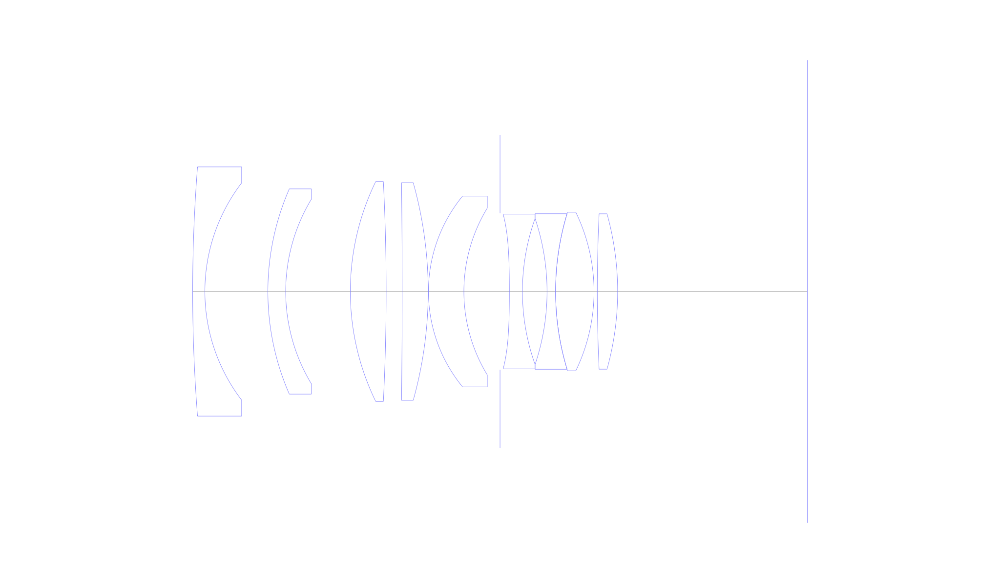
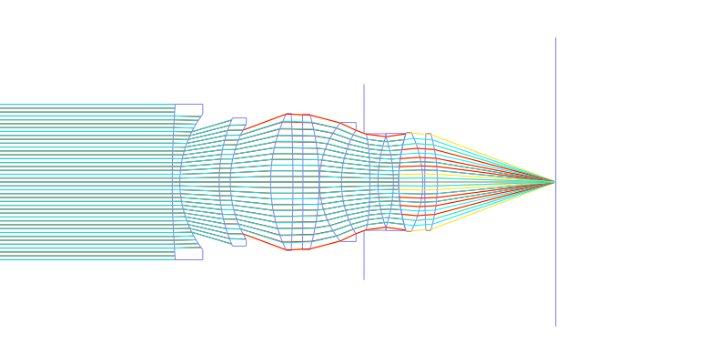
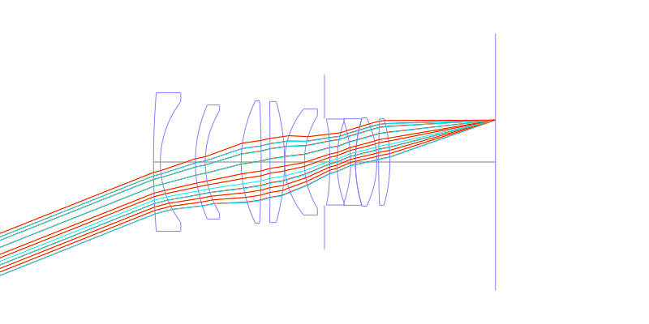
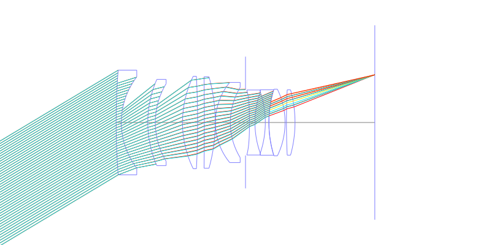
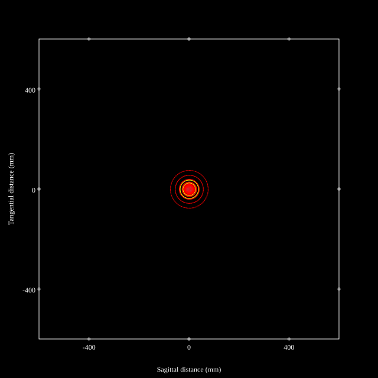
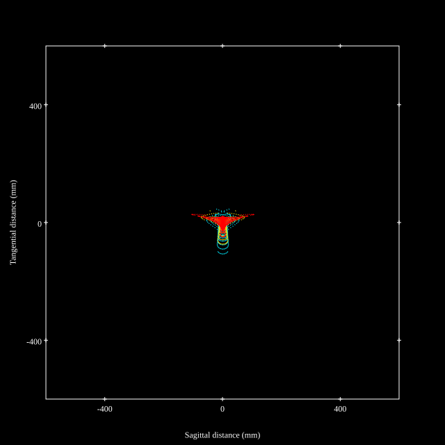
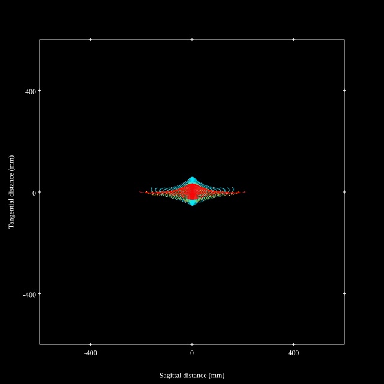
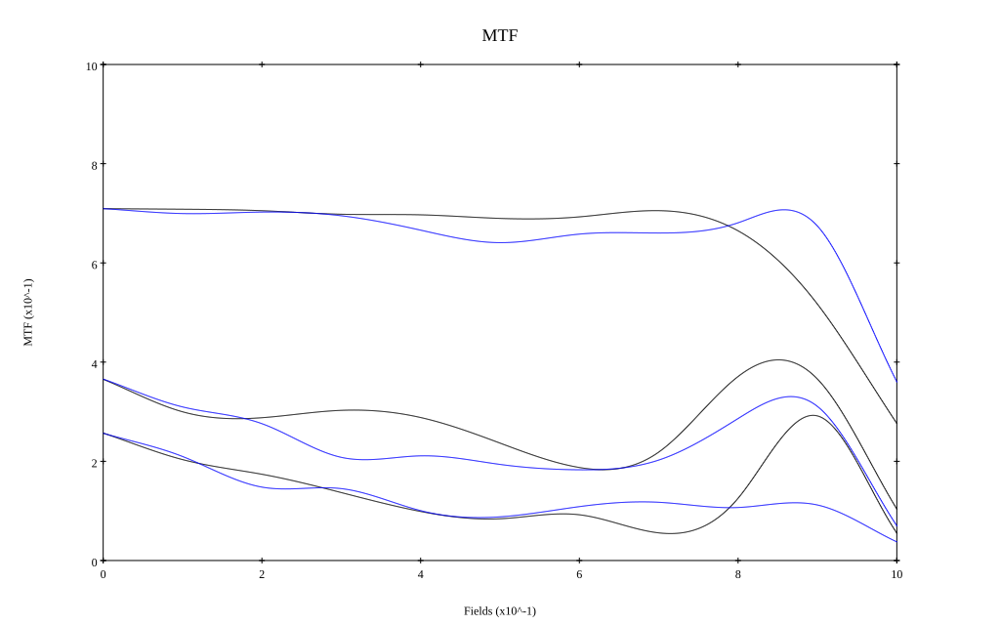

# Zeiss Contax Distagon 35mm f1.4 T* for Contax/Yashica
## Patent Information
| Country | Patent Number | Example | Year of Application | Inventors | Organisation | Link |
| ---     | ---           | ---     | ---                 | ---       | ---          | ---  |
|US | US3915558 | EX 8 | 1973 | Erhard Glatzel | Carl Zeiss AG | [link](https://patents.google.com/patent/US3915558A/en) |
## Surface Data
Note that where glass types are shown the refractive index and abbe number is as per assigned glass type

| ID  | Radius | Thickness | Diameter | nd  | vd  | Glass Make | Glass |
| --- | ---    | ---       | ---      | --- | --- | ---        | ---   |
| 1 | 291.6375 | 2.21445 | 45.24 | 1.58272 | 46.64 | Schott | N-BAF3 |
| 2 | 32.4835 | 11.4289 | 39.44 |  |  |  |
| 3 | 46.5535 | 3.23505 | 37.26 | 1.54814 | 45.85 | Schott | N-LLF1 |
| 4 | 32.4835 | 11.72745 | 33.54 |  |  |  |
| 5 | 45.556 | 6.49915 | 39.93 | 1.713 | 53.83 | Schott | N-LAK8 |
| 6 | -394.555 | 2.9078 | 39.93 |  |  |  |
| 7 | -1664.775 | 4.718 | 39.52 | 1.713 | 53.83 | Schott | N-LAK8 |
| 8 | -73.248 | 0.0483 | 39.52 |  |  |  |
| 9 | 27.3315 | 6.43195 | 34.62 | 1.713 | 53.83 | Schott | N-LAK8 |
| 10 | 29.162 | 6.5576 | 30.31 |  |  |  |
| 11 | AS | 1.694 | 28.454 |  |  |  |
| 12 | -241.85 | 2.3688 | 28.08 | 1.54814 | 45.85 | Schott | N-LLF1 |
| 13 | 39.4485 | 4.46775 | 26.49 |  |  |  |
| 14 | -41.489 | 1.55015 | 26.49 | 1.84666 | 23.78 | Schott | N-SF57 |
| 15 | 48.9545 | 0.0 | 28.24 |  |  |  |
| 16 | 48.9545 | 6.97095 | 28.78 | 1.78831 | 47.47 | Schott | LAFN21 |
| 17 | -32.956 | 0.5971 | 28.78 |  |  |  |
| 18 | 308.875 | 3.6876 | 28.21 | 1.78831 | 47.47 | Schott | LAFN21 |
| 19 | -52.60255 | 34.42 | 28.21 |  |  |  |
## Aspherical Data
| ID  | k   | P1  | P2  | P3  | P3 | P5 | P6 | P7 | P8 | P9 | P10 |
| --- | --- | --- | --- | --- | --- | --- | --- | --- | --- | --- | --- |
| 12 | -1.0 | 0.0 | -1.8505155E-5 | 0.0 | 0.0 | 0.0 | 0.0 | 0.0 | 0.0 | 0.0 | 0.0 |
## Layouts

## Spot Diagrams

## Paraxial Parameters
| parameter | value |
| ---       | ---   |
| effective_focal_length |34.998
| back_focal_length | 34.498
| optical_invariant | 7.51
| object_distance | 1.0E10
| image_distance | 34.498
| power | 0.029
| pp1_H | 46.052
| ppk_H' | -0.5
| ffl_F | 11.053
| fno | 1.4
| enp_dist_P | 31.334
| enp_radius | 12.499
| exp_dist_P' | -25.82
| exp_radius | 21.57
| m | -0
| red | -2.8572759869518363E8
| n_obj | 1
| n_img | 1
| img_ht | 21.029
| obj_ang | 31
| obj_na | 0
| img_na | -0.336|
## Spot Analysis
| Field | Spot Mean Radius | Spot Max Radius |
| ---   | ---              | ---             |
 | Field(x=0.0, y=0.0) | 22.224 | 75.389|
 | Field(x=0.0, y=0.1) | 21.288 | 83.653|
 | Field(x=0.0, y=0.2) | 21.118 | 88.765|
 | Field(x=0.0, y=0.3) | 22.413 | 93.189|
 | Field(x=0.0, y=0.4) | 22.324 | 89.983|
 | Field(x=0.0, y=0.5) | 22.971 | 87.208|
 | Field(x=0.0, y=0.6) | 24.239 | 97.62|
 | Field(x=0.0, y=0.7) | 25.591 | 108.837|
 | Field(x=0.0, y=0.8) | 30.225 | 129.715|
 | Field(x=0.0, y=0.9) | 40.641 | 170.044|
 | Field(x=0.0, y=1.0) | 59.676 | 206.312|
## Geometric MTF

* 10,30,50 cycles/mm
* Black lines represent sagittal, blue tangential
## Resources
* [OpticalBench Compatible Data File, tab delimited](./US003915558_Example08.txt)
* [Zemax file](./US003915558_Example08.zmx)
