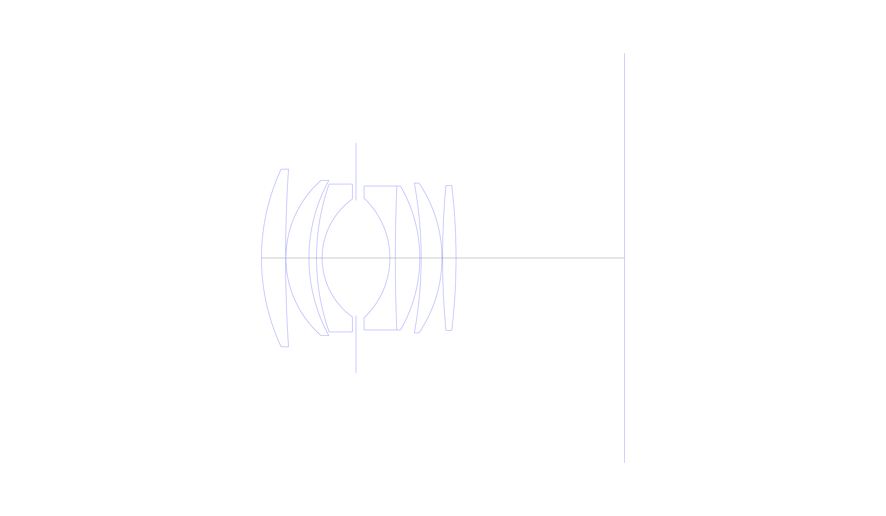
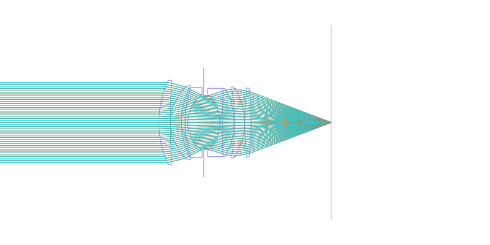
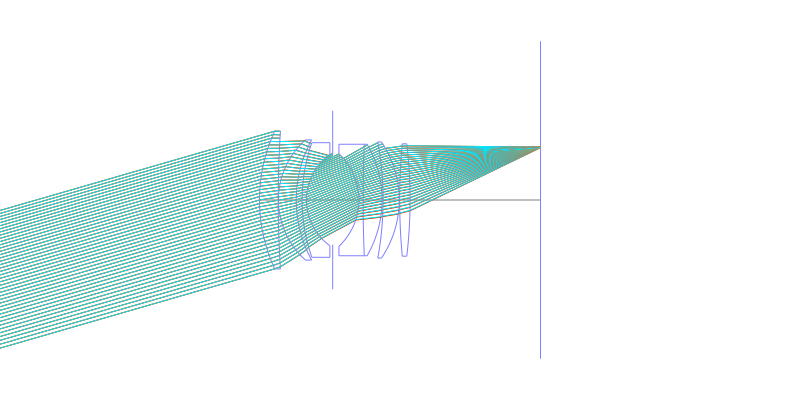
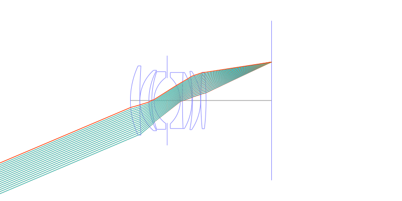
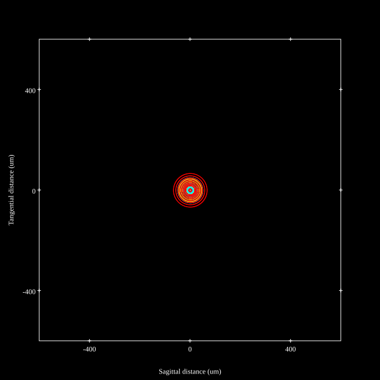
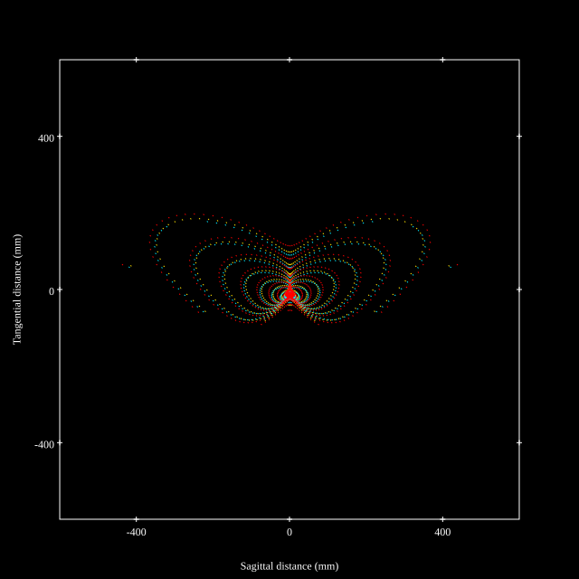
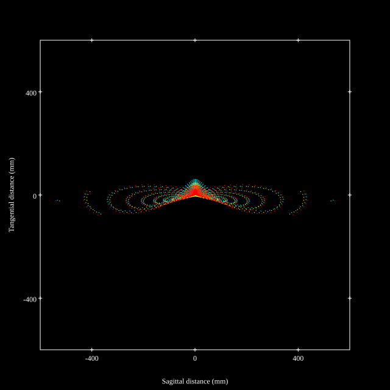

# Carl Zeiss Planar 50mm f1.4 T* for Contax/Yashica
## Patent Information
| Country | Patent Number | Example | Year of Application | Inventors | Organisation | Link |
| ---     | ---           | ---     | ---                 | ---       | ---          | ---  |
|US | US3874771 | EX 5 | 1972 | Karl-Heinrich Behrens, Erhard Glatzel | Carl Zeiss AG | [link](https://patents.google.com/patent/US3874771A/en) |
## Surface Data
Note that where glass types are shown the refractive index and abbe number is as per assigned glass type

| ID  | Radius | Thickness | Diameter | nd  | vd  | Glass Make | Glass |
| --- | ---    | ---       | ---      | --- | --- | ---        | ---   |
| 1 | 44.452 | 5.09105 | 37.5 | 1.717 | 47.96 | Schott | LAF3 |
| 2 | 288.6605 | 0.05885 | 37.5 |  |  |  |
| 3 | 21.8035 | 4.85565 | 32.71 | 1.788 | 47.49 | Schott | N-LAF21 |
| 4 | 34.062 | 1.5891 | 32.71 |  |  |  |
| 5 | 47.086 | 1.18695 | 31.19 | 1.68894 | 31.31 | Schott | N-SF8 |
| 6 | 15.324 | 7.136325 | 24.88 |  |  |  |
| 7 | AS | 7.136325 | 24.289 |  |  |  |
| 8 | -17.3185 | 1.1477 | 25.2 | 1.72828 | 28.53 | Schott | N-SF10 |
| 9 | 374.0215 | 5.1499 | 30.35 | 1.788 | 47.49 | Schott | N-LAF21 |
| 10 | -30.357 | 0.28445 | 30.35 |  |  |  |
| 11 | -87.426 | 4.3848 | 31.61 | 1.788 | 47.49 | Schott | N-LAF21 |
| 12 | -28.25 | 0.1275 | 31.61 |  |  |  |
| 13 | 164.6795 | 2.8349 | 30.57 | 1.74397 | 44.85 | Schott | N-LAF2 |
| 14 | -130.808 | 35.4965 | 30.57 |  |  |  |
## Layouts

## Spot Diagrams

## Paraxial Parameters
| parameter | value |
| ---       | ---   |
| effective_focal_length |50.035
| back_focal_length | 35.536
| optical_invariant | 7.585
| object_distance | 1.0E10
| image_distance | 35.496
| power | 0.02
| pp1_H | 35.726
| ppk_H' | 14.499
| ffl_F | -14.31
| fno | 1.4
| enp_dist_P | 24.121
| enp_radius | 17.87
| exp_dist_P' | -29.608
| exp_radius | 23.266
| m | 0.001
| red | -1.9985957835503936E8
| n_obj | 1
| n_img | 1
| img_ht | 21.239
| obj_ang | 23
| obj_na | 0
| img_na | -0.336|
## Spot Analysis
| Field | Spot Mean Radius | Spot Max Radius |
| ---   | ---              | ---             |
 | 0.0 | 20.115 | 66.784|
 | 0.7 | 94.461 | 459.739|
 | 1.0 | 108.543 | 562.332|
## Resources
* [OpticalBench Compatible Data File, tab delimited](./US003874771_Example05.txt)
* [Zemax file](./US003874771_Example05.zmx)
