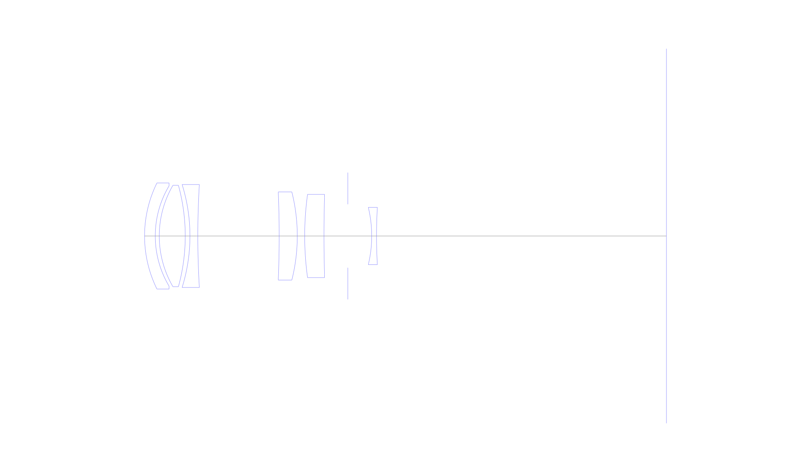
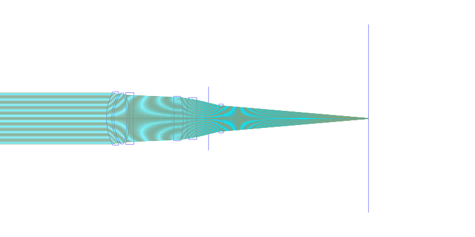
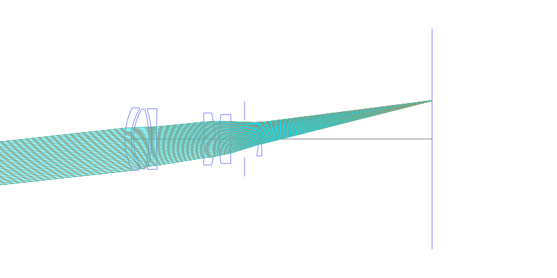
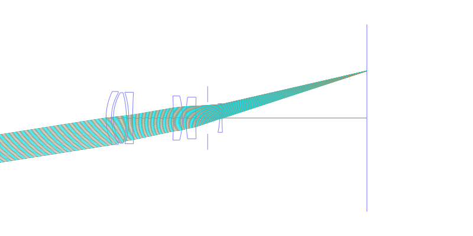
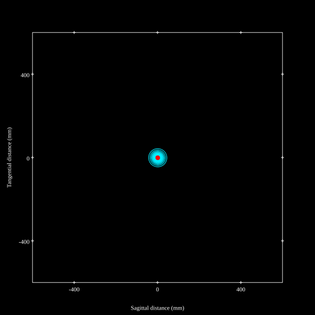
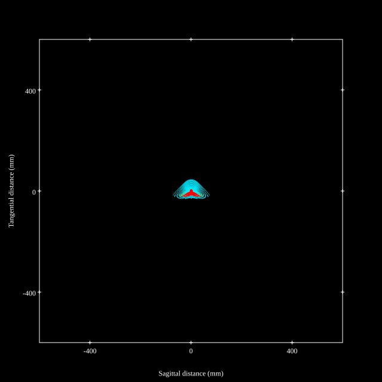
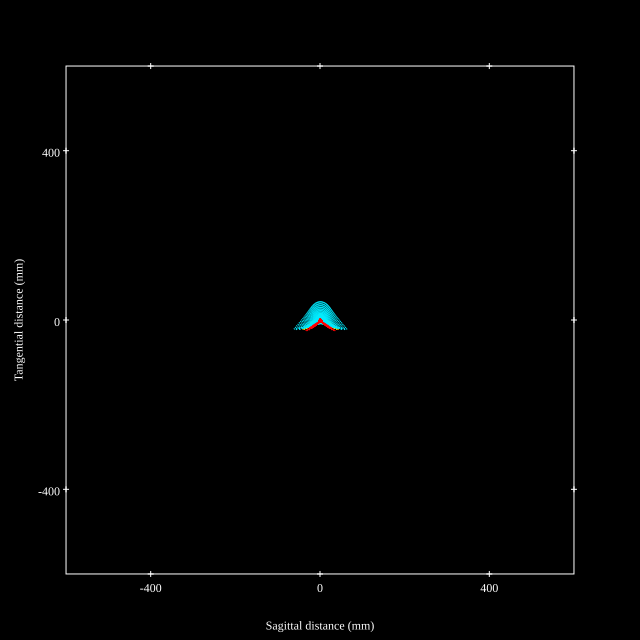
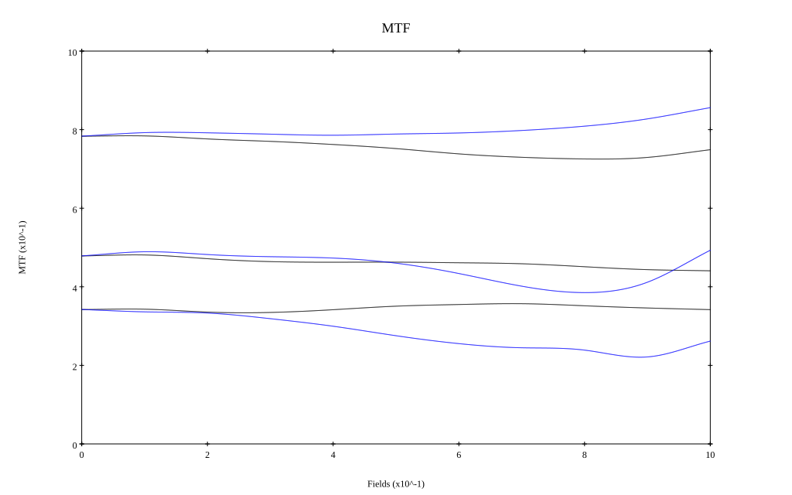
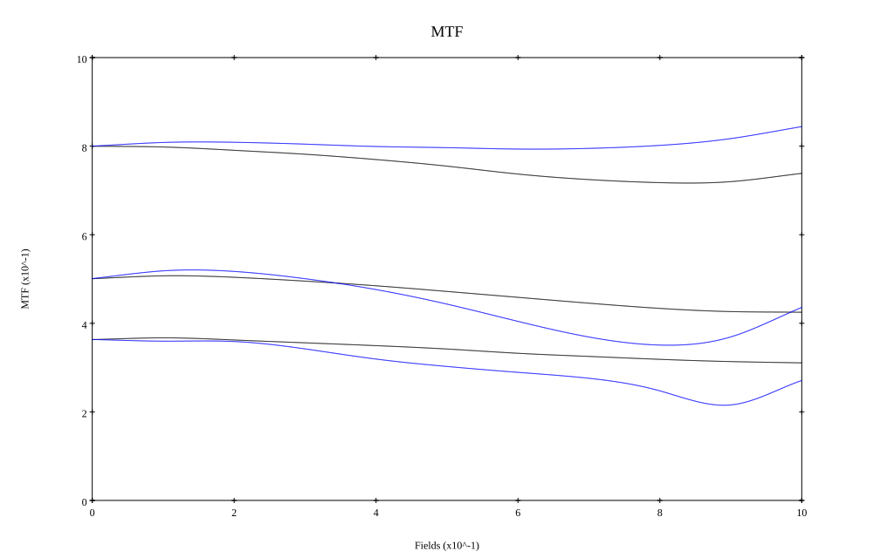

# Zeiss Sonnar Superachromat f5.6 250mm CFE
## Patent Information
| Country | Patent Number | Example | Year of Application | Inventors | Organisation | Link |
| ---     | ---           | ---     | ---                 | ---       | ---          | ---  |
|US | US3883229 | 2 | 1972 | Fritz Determann, Heinz Zajadatz | Carl Zeiss AG | [link](https://patents.google.com/patent/US3883229A/en) |
## Surface Data
Note that where glass types are shown the refractive index and abbe number is as per assigned glass type

| ID  | Radius | Thickness | Diameter | nd  | vd  | Glass Make | Glass |
| --- | ---    | ---       | ---      | --- | --- | ---        | ---   |
| 1 | 51.25 | 4.55325 | 45.24 | 1.7352 | 41.59 | Schott | LAFN8 |
| 2 | 41.8975 | 1.70125 | 42.78 |  |  |  |
| 3 | 43.1225 | 11.058 | 43.24 | 1.43385 | 95.23 | Schott | LITHOTEC-CAF2 |
| 4 | -81.8075 | 2.0015 | 43.24 |  |  |  |
| 5 | -73.97 | 3.3525 | 43.9 | 1.68248 | 48.2 | Schott | LAF20 |
| 6 | 370.82 | 34.62525 | 43.9 |  |  |  |
| 7 | -453.47 | 7.7055 | 37.19 | 1.62045 | 38.08 | Schott | F9 |
| 8 | -77.2375 | 3.15225 | 37.6 |  |  |  |
| 9 | 129.655 | 8.206 | 35.48 | 1.68248 | 48.2 | Schott | LAF20 |
| 10 | 554.705 | 10.14275 | 32.8 |  |  |  |
| 11 | AS | 10.172 | 27.054 |  |  |  |
| 12 | -52.37 | 2.0515 | 24.44 | 1.56444 | 43.75 | Schott | LF8 |
| 13 | 208.4625 | 123.389 | 24.44 |  |  |  |
## Layouts

## Spot Diagrams

## Paraxial Parameters
| parameter | value |
| ---       | ---   |
| effective_focal_length |250.542
| back_focal_length | 123.476
| optical_invariant | 3.517
| object_distance | 1.0E10
| image_distance | 123.476
| power | 0.004
| pp1_H | -107.179
| ppk_H' | -127.066
| ffl_F | -357.721
| fno | 5.642
| enp_dist_P | 111.895
| enp_radius | 22.204
| exp_dist_P' | -10.103
| exp_radius | 11.846
| m | -0
| red | -3.991351966842376E7
| n_obj | 1
| n_img | 1
| img_ht | 39.682
| obj_ang | 9
| obj_na | 0
| img_na | -0.088|
## Spot Analysis
| Field | Spot Mean Radius | Spot Max Radius |
| ---   | ---              | ---             |
 | Field(x=0.0, y=0.0) | 15.286 | 43.682|
 | Field(x=0.0, y=0.1) | 15.096 | 52.297|
 | Field(x=0.0, y=0.2) | 15.905 | 52.087|
 | Field(x=0.0, y=0.3) | 16.573 | 58.49|
 | Field(x=0.0, y=0.4) | 16.68 | 61.593|
 | Field(x=0.0, y=0.5) | 16.97 | 65.018|
 | Field(x=0.0, y=0.6) | 17.326 | 68.242|
 | Field(x=0.0, y=0.7) | 17.716 | 70.633|
 | Field(x=0.0, y=0.8) | 17.482 | 71.022|
 | Field(x=0.0, y=0.9) | 16.798 | 68.712|
 | Field(x=0.0, y=1.0) | 15.56 | 63.104|
## Polychromatic Geometric MTF

* 10,30,50 cycles/mm
* Black lines represent sagittal, blue tangential
* To generate above, MTFs for wavelengths 587.5618(d), 486.1327(F), 656.2725(C) were calculated across 10 fields, and then averaged
## Polychromatic Geometric MTF (Weighted)

* 10,30,50 cycles/mm
* Black lines represent sagittal, blue tangential
* To generate above, MTFs for wavelengths 587.5618(d) wt(1.0), 656.2725(C) wt(0.475), 546.074(e) wt(0.98), 486.1327(F) wt(0.49), 435.8343(g) wt(0.15) were calculated across 10 fields, and then combined using weighted average
## Resources
* [OpticalBench Compatible Data File, tab delimited](./prescription.txt)
* [Zemax file](./US003883229_Example02P.zmx)

Report / Zemax file generated using [Beam42](https://github.com/BeamFour/Beam42) on 2026-04-28
